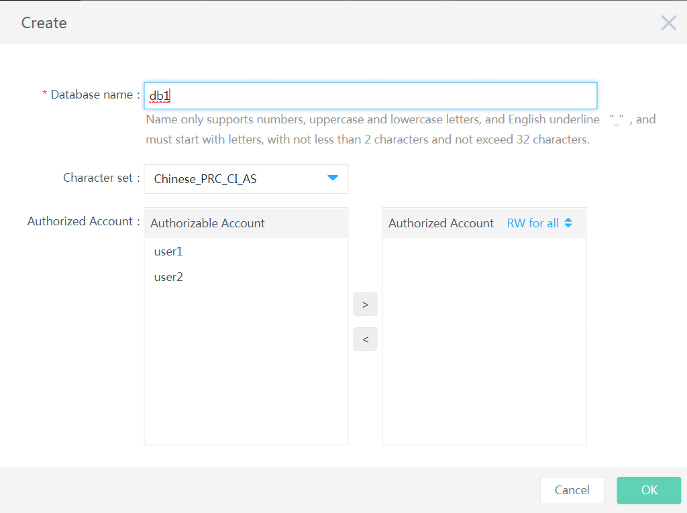

# Create Database
## Create  JCS for  MySQL/Pecona/MariaDB Service
Users can create databases through the JCS for MySQL/Pecona/MariaDB service  management console, each with a unique name. Different instances are not subject to this limit.

### Operation Steps
1. Login [RDS Management Console](https://rds-console.jdcloud.com/database).
2. Select the domain of the target instance.
3. Click the target instance, enter the instance detailed page, switch to the Tab page - ***Database Management*** and click ***Create Database***. The parameter description of the database creation pop-up box is as follows:
    * Database Name: Please refer to Q&A (https://www.jcloud.com/help/detail/75/isCatalog/1) for the keywords of database name we have reserved, and the length and characters of the database name are limited, which shall be subject to the console.
    * Character Set: In addition to the default `utf8`, more options are provided, including `gbk`, `latin1` and `utf8mb4`, which can be selected as per the demand.
    * Authorized Account: Select an account that requires the access to the authorized database from the authorized accounts, click ***>***, the account will be added to the authorized account list. The default account access to the database is ***read-only***, and it can be modified to ***read/write***.
    
    ![image] (../../../../../1109_12.jpg)

4. Click ***OK*** to complete the database creation and return to the list page for database management.

## Create JCS for SQL Server Database
Users can create databases through the JCS for SQL Server service management console, each with a unique name. Different instances are not subject to this limit.

### Operation Steps
1. Login [RDS Management Console](https://rds-console.jdcloud.com/database).
2. Select the domain of the target instance.
3. Click the target instance, enter the instance detailed page, switch to the Tab page - ***Database Management*** and click "Create Database". The parameter description of the database creation pop-up box is as follows:
    * Database Name: Please refer to [Q&A](https://www.jcloud.com/help/detail/75/isCatalog/1) for the keywords of database name we have reserved, and the length and characters of the database name are limited, which shall be subject to the console.
    * Character Set: With default of `Chinese_PRC_CI_AS`, more options are provided, including `Chinese_PRC_CS_AS`, `SQL_Latin1_General_CP1_CI_AS`, `SQL_Latin1_General_CP1_CS_AS` and `Chinese_PRC_BIN`, which can be selected as per the demand.
    * Authorized Account: Select an account that requires the access to the authorized database from the authorized accounts, click ***>***, the account will be added to the authorized account list. The default account access to the database is ***read-only***, and it can be modified to ***read/write***.
    

4. Click ***OK*** to complete the database creation and return to the list page for database management.

