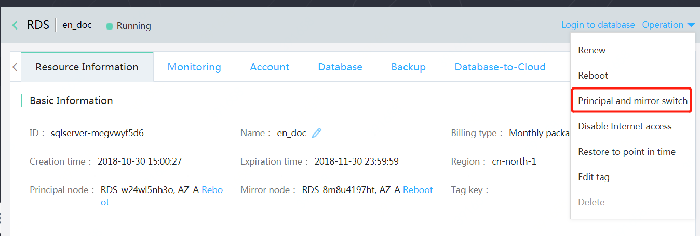
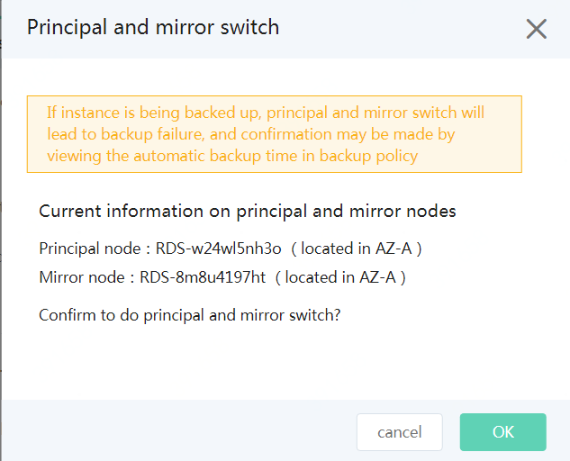

# Failover Instance

#### 1. Click ***Failover Instance***
Click ***Failover Instance*** under ***Operation*** in the instance list or ***Failover Instance*** under ***Operation*** at the upper right of the instance detailed list.

#### 2. Select ***OK*** in the pop-up dialog box.
The instance status changes to "Failover Instance", and the instance status changes to "running" again after the failover.
The IDs of the primary and secondary nodes before the failover can be recorded and compared with the primary and secondary node IDs after the failover to confirm that the failover is successful.

**Note: Both failover instances and rebooting instances will interrupt the ongoing backup, so users shall avoid to carry out these operation as far as possible when the backup is in progress.**
The start time of the backup can be viewed on the backup strategy page of the backup management. It is recommended to perform a full backup manually after the operation is completed, if it is necessary to operate while the backup is in progress.

