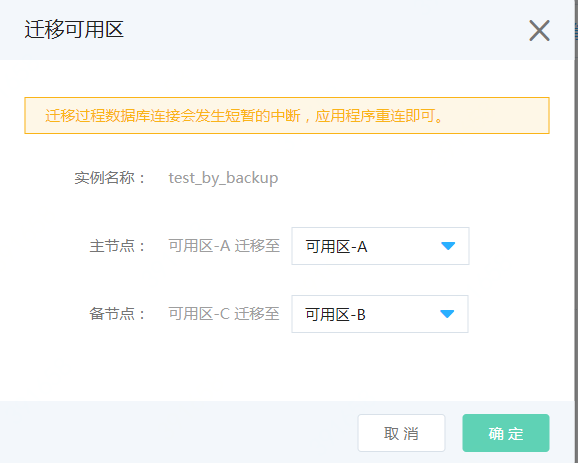

# Migrate the availability zone
The availability zone of RDS instance can be modified. For example, the locations of the primary and standby nodes of the RDS instance can be modified from both Availability Zone A to respectively Availability Zone A and Availability Zone B.

The migrating user can normally connect to the database instance, and read and write the data. After migration is completed, there is a transient flash, and it is only necessary to reconnect the application.

> **Description: Only SQL Server is supported currently**

**1. Operation entry**
- Instance list page: At the right of instance, [More] --> [Migrate the Availability Zone]
- Instance details: [Migrate the Availability Zone] in the "Basic Information" in the [Instance Information] page
- Instance details: At the top right, [Operation] --> [Migrate the Availability Zone]

**2. Select a new Availability Zone**

Select a new Availability Zone for instance primary and standby nodes

**3. Re-confirm after information in the dialog box is checked as correct**

**4. Instance status**

During the change of Availability Zone, the instance status is changed to "Migrating the Availability Zone", and the user can normally connect to the database instance and read and write the data. After migration is completed, there is a transient flash, and it is only necessary to reconnect the application.
