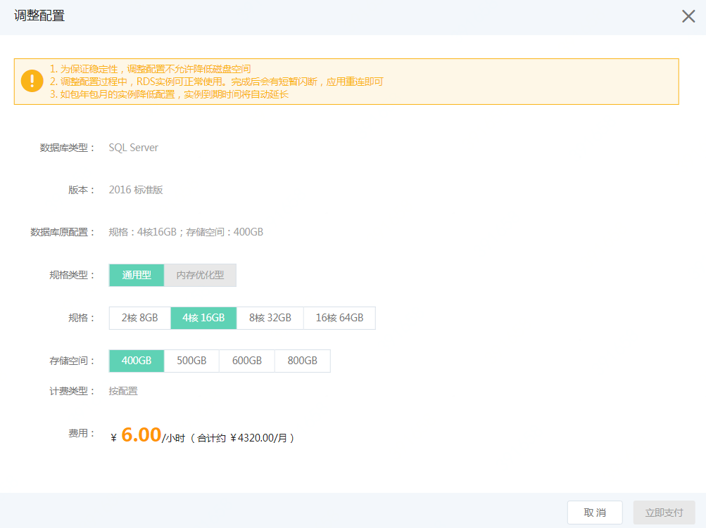

# Resize

The RDS instance can dynamically adjust instance CPU, memory and disk size. During the configuration adjustment, RDS instance can be normally used. After completion of adjustment, there is only a short flash. Therefore, a database reconnection mechanism shall be provided in the application development process.

- MySQL、Percona、MariaDB
  - Expansion and shrinkage are supported at the same time
  - Only primary and backup instances are supported and real-only instances are not supported for now
  
- SQL Server
  - Expansion and shrinkage are supported at the same time
  - To guarantee system stability, the disk size shall be greater than or equal to the original size after adjustment
  
- PostgreSQL 
  - Expansion and shrinkage are supported at the same time
  - In order to ensure the stability of the system, the size of the adjusted disk can only be greater than or equal to the space used by the original disk, and some extra bucket shall be additionally reserved to prevent the instance from becoming read-only after the shrinkage is completed
  
## Operation Steps
1. There are to entries, including
    * List page: Select the target instance and click **More** -> **Change Configuration/Resize** in the Actions column
    * Instance Details: Enter the Instance Details, click **Operation** -> **Change Configuration/Resize** on the upper right corner
2. Select the adjusted configuration and click **OK** to make the adjustment
    

