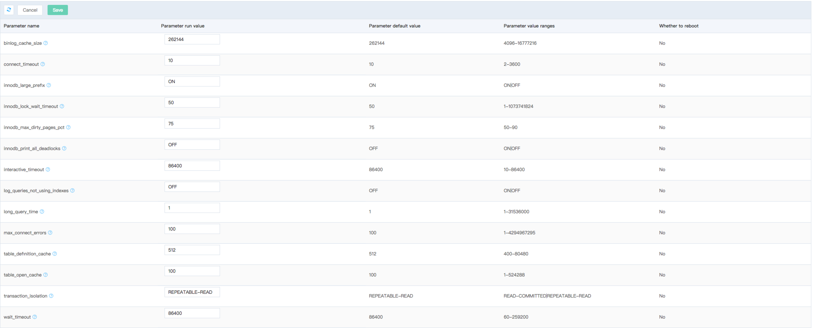

# Modify Parameter
The default value of all parameters in the parameter list is the value optimized by JD Cloud. The running values in the new parameter group and the parameter list are consistent with the default values. The default running value can meet the needs of most application scenarios, and you can modify the parameter running values as needed by your business scenarios.

## Precautions
* The running value of parameters must be within the parameter value ranges.
* If the parameters you modify do not require restart, the parameters modified will be automatically applied to the associated database instance.
* A parameter group can be associated with multiple different instances.

## Parameter Description
* [MySQL 5.6 Parameter Definition](https://dev.mysql.com/doc/refman/5.6/en/server-system-variables.html)
* [MySQL 5.7 Parameter Definition](https://dev.mysql.com/doc/refman/5.7/en/server-system-variables.html)
* [Percona 5.7 Parameter Definition](https://dev.mysql.com/doc/refman/5.7/en/server-system-variables.html)
* [MariaDB 10.2 Parameter Definition](https://mariadb.com/kb/en/library/server-system-variables/)

## Action Steps
1. Log in [Parameter group Console](https://rds-console.jdcloud.com/paramgroup/list)
2. Select the target parameter group requiring parameter modification and click the target parameter group to enter the Details Parameter group.
3. Select tab ***Parameter***. The meaning of each field in the parameter list is as follows:
    * Parameter name: The name of every parameter is unique.
    * Parameter running value: Current valid value of parameter.
    * Parameter default value: Parameter value recommended by JD Cloud.
    * Parameter value ranges: Range or list supported by parameter for modification.
    * Restart or not: Indicate that, after the parameter running value is modified, whether restart or parameter group binding is needed or not to take effect.
4. Click ***Edit Parameter*** to make the column of parameter running value in the parameter list editable. At this time, the parameter running value can be modified to the expected one. Please make sure that the value filled is within the parameter value ranges.
5. Click ***Save*** after all parameter running values are modified, and then a pop-up box will be popped up for confirming the modification of parameter running values. The pop-up box will list the parameter list in which the parameter running values have been modified.

    

6. Click ***OK*** after careful confirmation to complete the parameter modification, and return to the parameter list page.
7. Select tab ***Cloud Database***. You may find that the status of the values in the column of ***Parameter group Validation*** have been changed to ***In Sync*** from ***Valid***, which means that the parameter modification just saved is being synchronized to database instances; and status value changing to ***Valid*** from ***In Sync*** means that parameters modified have been applied to database instances.

