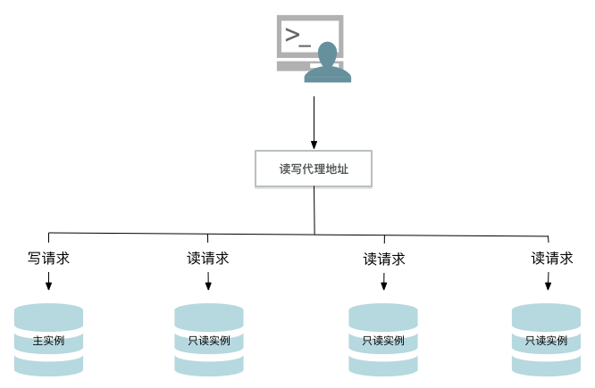

# Read-write separation proxy
Read-write separation proxy means the realization of automatic forwarding of read-write requests through the proxy address (read-write separation address).

When your business has a large amount of read requests, a single instance may not be able to meet the business demands. To offload pressure on the primary database to meet the business demands for read requests, you can [Create Read-only Instance](https://docs.jdcloud.com/en/rds/create-readonly-instance);

After successfully creating a read-only instance, you can enable the read-only proxy, and configure the read-write proxy address in the program, and thereby automatically forwarding the read request to the read-only instance, the write request to the primary instance by the read-write proxy.

## Restrictions
* Only one read-write proxy can be created for a single instance
* Before enabling the read-write proxy, the read-only instance must be created
* Currently, JCS for MySQL, MariaDB and Percona support enabling of the read-write proxy

## Operation Steps
1. Log in [Cloud Database RDS Console](https://rds-console.jdcloud.com/database).
2. Select the target instance of which the read-only proxy needs to be enabled, click the name of the target instance, and enter the Details of the instance.
3. Select the ***Read-write Proxy*** tag, open the read-write proxy management page, click the ***Enable Read-write Separation Proxy*** button, and enter the read-write separation proxy configuration page.
    **Note**: If there is no read-only instance under the target instance, the ***Enable Read-write Separation Proxy*** button shall be set ash and cannot be operated. You are required to [Create Read-only Instance](https://docs.jdcloud.com/en/rds/create-readonly-instance).
4. Interface parameters of read-write separation proxy
    * Delay threshold of read-only instance: Once the delay of read-only instance and primary instance exceeds the threshold, the read-only instance will be removed from the read-write proxy backend.
    * Load Balancer policies: The Load Balancer to which read-write requests are distributed by the read-write proxy supports minimum active connections, minimum connections, minimum synchronization time delay, and average response delay.
    * Connection time-out period: Method of health check for read-only instance. Upon timeout, the read-only instance will be removed from the read-write proxy backend.
    * Repeat times: Method of health check for read-only instance. The repeat times exceed the designated times, the health check for read-only instance fails, and will be removed from the read-write proxy backend.
    * Check time interval: By the method of health check for read-only instance, the health check shall be carried out for the read-only instance in the read-write proxy backend at intervals.
    

5. Click the ***OK*** button, and submit the request of creating read-write proxy.

