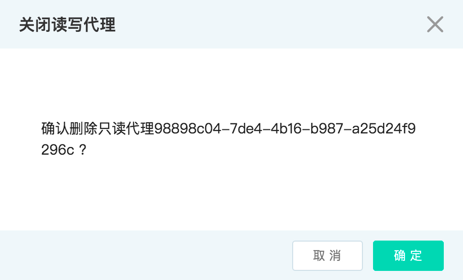

# Delete read-write separation proxy

When your business no longer needs to use the read-write separation proxy, you can delete the read-write separation proxy. Deleting the read-write separation proxy does not affect the functionality of the current primary instance and the read-only instance, but the domain of the read-write separation proxy will become invalid, so you need to reconfigure the addresses of the primary instance and the read-only instance in the program.

## Operation Steps
1. Log in [Cloud Database RDS Console](https://rds-console.jdcloud.com/database).
2. Select the target instance of which the read-only proxy needs to be enabled, click the name of the target instance, and enter the Details of the instance.
3. Select the ***Read-write Proxy*** tag, and open the read-write proxy management page.
4. Click the ***Enable Read-write Separation Proxy*** button, and enter the page that prompts to close the read-write separation proxy.
    

5. Click the ***OK*** button, and submit the request of deleting the read-write separation proxy.

