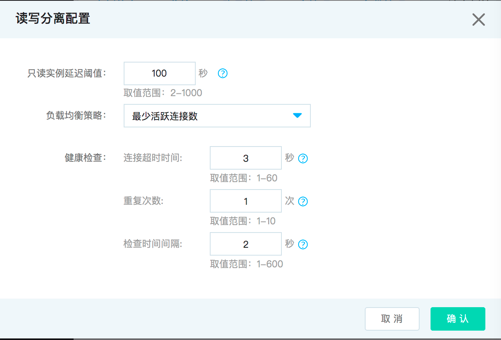

# Reset read-write separation proxy

Upon successfully enabling the read-write separation proxy, you can reconfigure the read-write separation proxy on the read-write proxy management page.

After the request of reconfiguring the read-write proxy is submitted, to ensure that the entire load is re-balanced, the instance at the read-write separation proxy backend will be transiently disconnected once. Please make sure the application can be disconnected to the database.

## Operation Steps
1. Log in [Cloud Database RDS Console](https://rds-console.jdcloud.com/database).
2. Select the target instance of which the read-only proxy needs to be enabled, click the name of the target instance, and enter the Details of the instance.
3. Select the ***Read-write Proxy*** tag, and open the read-write proxy management page.
4. Click the ***Reconfigure Read-write Separation Proxy*** button, and enter the page that prompts to close the read-write separation proxy.
5. Enter the read-write separation proxy page, the parameters displayed are the parameters currently configured to the read-write by default. You can re-edit the parameters of the read-write separation proxy as required
    

6. Click the **OK** button, and submit the request of reconfiguring the read-write separation proxy.

