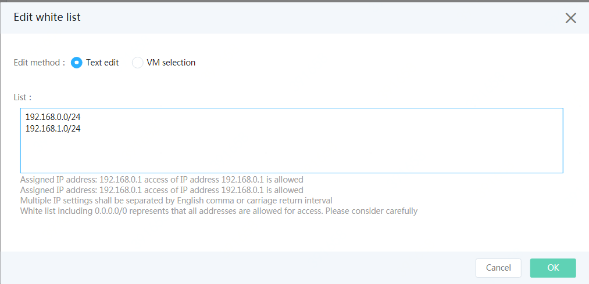

# Set White List
The White List determines the IP addresses able to access the RDS instance. By default, the VPC segment where the instance exists is in the White List, which means all IPs in the VPC can access the RDS instance. Users shall add the IP address of the internet to be accessed to the White List to enable the internet access. It is recommended to add only the IP address to be accessed from the internet, to ensure the data security of the instance. The modified White List will take effect immediately, with no need for reboot.

## Precautions
* The VPC segment where the instance exists is in the White List by default.
* The White List shall reserve one access rule at least and cannot be empty.

## Operation Steps
1. Login [RDS Console](https://rds-console.jcloud.com/database).
2. Select the instance that requires White List setting, click the target instance, and enter the instance detailed page.
3. Select the tag of ***Security Management***, click the tag of ***List Settings*** to enter the detailed page of ***White List*** and click ***Edit***. The parameters of the pop-up box are as follows:
- Two edit modes, namely: ***text editing*** and ***Secondary Virtual Machine Selection***.
- For text editing, it is required to manually enter an IP address or IP segment, multiple IP addresses or IP segments separated by commas or carriage returns. All addresses are allowed to access if the IP address is 0.0.0.0/0.
- The secondary virtual machine selection method displays all VM instances that are in the same VPC as the JCS for SQL Server Service instance. You only need to select the VM that requires to access the cloud instance to add its intranet IP address to the White List rule.

4. Click ***OK*** and the White Listing rules will take effect immediately.
