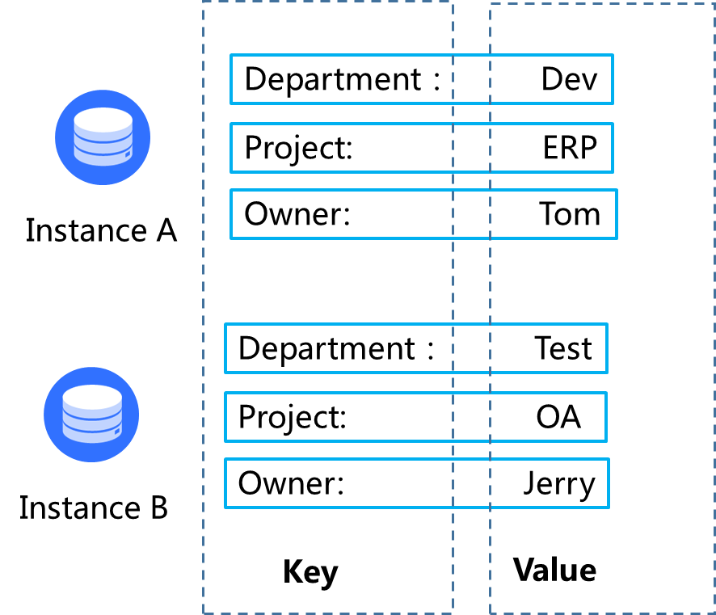

# Function Introduction
**"Resource Tag"** provides a method for resource classification conforming to multiple classification specifications (e.g., the Owner, purpose, etc.), allowing users to quickly locate specific resources based on tags in case of a large number of similar resources. A tag consists of a pair of key-value, both defined by users. For example, users can identify their VM resources based on the owner of VM. In addition, it is recommended to use the same batch of tags for different types of resources, such as VM and cloud databases, more convenient for users to manage resources on JD Cloud.

The figure above shows the tag implementation. Three tags are associated to the "cloud database instance A" and the "cloud database instance B", and the corresponding keys are "Department", "Purpose" and "Project". Wherein
- The department of the instance A is the R&D Department, with the purpose of ERP development and of xx project
- The department of the instance B is the R&D Department with the purpose of website development and of yy project.

## Remarks
1. JCS for SQL Server supported only for temporary
2. The function of the resource tag is in the close beta test period and only open to the invited customers.

## Function Supported
- Filter RDS based on tags
- Edit tag

## Usage Restrictions
- 10 tags can be associated at most in each cloud database instance.
- The maximum length of the Key (Key) is 127 characters (UTF-8)
- The maximum value of the tag value (Value) is 255 characters (UTF-8).
- The tag key/value cannot be used with the prefix "jrn: ". it only supports Chinese, numbers, capital and lowercase letters, spaces and special symbols, such as _.:/=+-@, and it is case sensitive and cannot begin with a space.
- The tag key (Key) of any tags for each resource shall be unique, and the tag of the same tag key (Key) will be replaced;
- When unbinding a tag, if the tag has no bound resources after unbinding, the tag will be automatically deleted.
