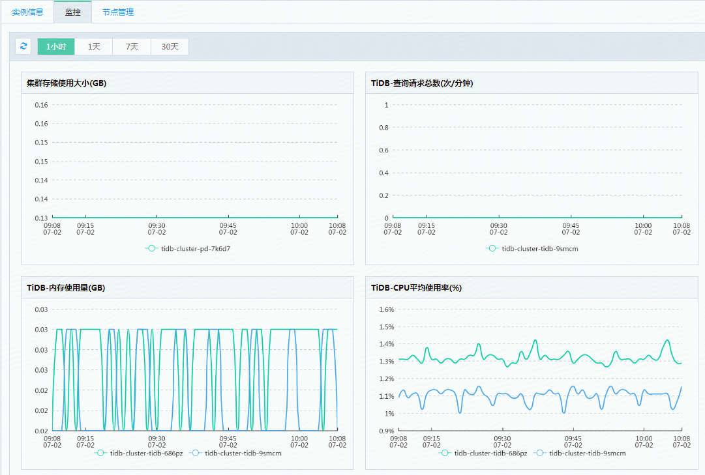

# View the Monitoring
At console of TiDB Service, you can view multiple database indicators. Through the data of database indicators, you can locate the problem of the system and perform corresponding system optimization.

## Operation Steps
1. Log on management console of TiDB Service.
2. Select the target instance whose monitoring information is required to be viewed; click the **target instance**; go to the Instance Details page.
3. Select the tag of "Monitoring" to view the monitoring items of TIDB Service.
4. By default, the monitoring data for the dimension of 1 hour will be displayed. You can also select the dimension of 6 hours, 12 hours, 1 day, 3 day, 7 days and 14 days.

## Monitoring Item
|	Monitoring Item	|	Unit of Indicator	|	Monitoring Frequency	|	Monitoring Cycle	|
|:-|:-|:-|:-|
|	Size of Used Bucket	|	Unit: GB	|	60 Seconds/Time	|	30 Days	|
|	Size of Used Bucket	|	Unit: GB	|	60 Seconds/Time	|	30 Days	|
|	Transaction OPS	|	Unit: Nr.	|	60 Seconds/Time	|	30 Days	|
|	SQL Execution Quantity	|	Unit: Nr./s	|	60 Seconds/Time	|	30 Days	|
|	Queries per Second	|	Unit: Nr.	|	60 Seconds/Time	|	30 Days	| 
