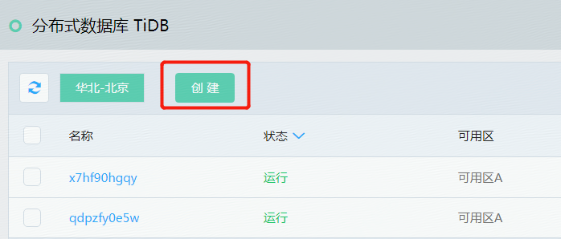
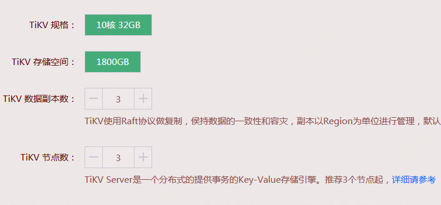

# Create Instance

You can quickly create the TiDB Service instances through the console

## Operation Steps
1. Log in to the distributed database TiDB management console.
2. On the Instance List page, click - **Create** - to go to **Create Page**.

3. Billing method during the period of public beta shall be pay by configuration by default. For the billing standard, please refer to the billing method.
4. Parameter description of instance configuration is as follows:
- **Region**: Select the region where the instance is located. The intranets of different regional resources are not interoperable and cannot be changed after creation.
- **Version**: Refer to version of TiDB database, with details of version supported subject to the Console.
- **Configuration template**: The configuration template fits to most application scenarios and suits for TiDBs of different scales; users can make direct configuration with the template or make adjustment on the basis of the template.

- TiDB Node
  - Function: Responsible for receiving requests, processing SQL logics, interacting obtained data with TiKV and finally returning processing results. The TiDB node is not used for storing any data. 
  - Node number: Support 1-5 nodes, and it is suggested that at least 2 nodes shall be applied for the production environment

- TiKV Node
  - Function: TiKV node is a Key-Value distributed type storage engine used for storing user data
  - Node number: 3-16 nodes are supported during the Beta. The node number depends on the data scale. There are at least 3 nodes. Subsequently, more nodes are supported. Please refer to specific information on the Console for details.
  - Remark: TiKV has 3 replicas, thus 3 times buckets are required for the same data volume. At present, the data volume for actual storage is 300 GB.
  

- PD Node
  - Function: The PD node is the management module of the whole cluster, which is mainly responsible for storing meta-information of the cluster, making scheduling and load balance for TiKV and distribution transaction IDs.
  - Node number: It is suggested at least 3 nodes shall be adopted by the production environment. 1, 3 or 5 nodes are supported and more nodes will be supported subsequently. Please refer to specific information on the Console for details.

- Monitor Node
  - Function: Responsible for management of monitoring data,
  - Node number: One cluster has only one Monitor node

- Network: Select VPC where the instance is created and a subnet. Please be noted that the subnet shall have sufficient IPs and the required IP number is TiDB node number plus 5.

- Availability Zone: Select the Availability Zone where instances are to be created and only single availability zone deployment is supported now

- Instance name: Enter the name of an instance to be created. For name rules, please refer to description on the Console

5. Click **Buy Now** to go to the Oder Confirmation page. 

6. Read and check the Service Terms of TiDB Service and complete subsequent operations according to hints. 
