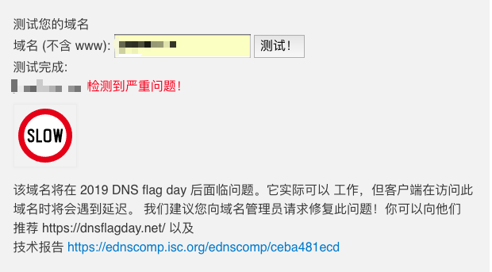
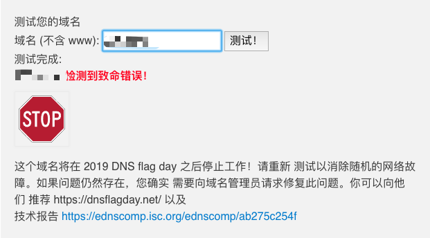

## Description of DNS Flag Day

### What is a DNS Flag Day?

 [DNS Flag Day](https://dnsflagday.net/) is a consensus global update for authoritative DNS, with the purpose to ensure that all major DNS basic architectures follow the new EDNS standard (DNS extension mechanism).
 From February 1, 2019, authoritative DNS servers that do not support EDNS protocols may be marked as Service Unavailable by public DNS and recursive DNS, such as Google, Cloudflare, Cisco/OpenDNS and ISC/BIND, resulting in domain names being unable to resolve normally.
 
### JD Cloud's support for DNS Flag Day

1. From February 1, JD Cloud DNS service will be implemented in full compliance with the DNS specification, supporting EDNS extension
2. From February 1, the domains that use JD Cloud DNS service can be resolved in any part of the world without any influence 
 
### How to test
You can use the test website [https://dnsflagday.net/index-zh-CN.html] to check whether the domains hosted in JD Cloud DNS is in compliance with the EDNS standard specification.

There are three resolution results:

1. The resolution is normal:

As can be seen from the example, JD's domain has passed all standard item detection of EDNS. The domains that use JD Cloud resolution service can be resolved normally.

2. The resolution is slow

As in the example, your domain may face a problem after the DNS flag Day in 2019. There may be access delay. Please request the domain administrator to restore the problem as soon as possible.

3. The resolution is stopped

As in the example, your domain will stop working after the DNS flag Day in 2019. This problem is quite severe. Please request the domain administrator to restore the problem as soon as possible.
