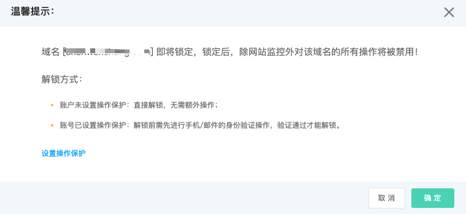

## **Domain Locking:**

 With the domain locking function, unexpected misoperation can be relieved by locking domains of key protection.

Log in the Domain Resolution Page of JD Cloud DNS and domains in the protection scope are listed here. Domains of concern can be locked and unlocked in the operation bar.

### 1. Locking

Find the domain to be locked and click **Lock** in the operation bar.

Select to enable or disable operation protection according to the notification.

If operation protection is set, identity verification shall be made at the time of unlocking and unlocking can be made only when the identity verification is passed.

After locking, any modification operation will be disabled in operation bars of pages such as Domain Resolution, Load Balancer and Customized ISP Line.

### 2. Unlocking

Find the domain to be unlocked and click **Unlock** in the operation bar.

- Control for Un-added Operation 

Domain locking will be relieved when unlocking is confirmed.

- Control for Added Operation

Locking will be relieved when identity verification is made. Taking cellphone verification for example, unlocking can be enabled only when the verification code received by the account-associated phone number is entered.

