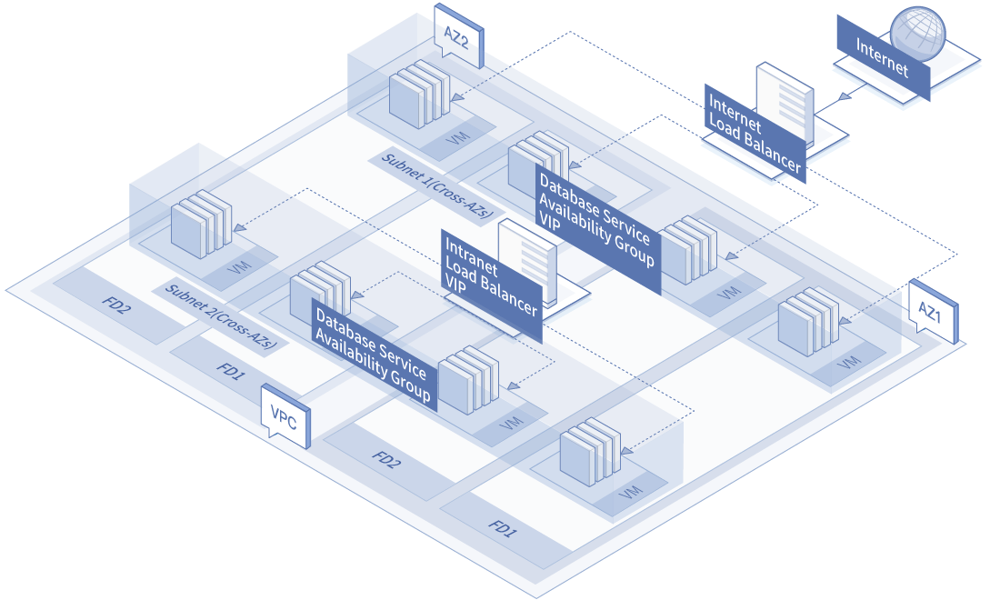

# Optimal Configuration Recommended

* It is required to assign one Availability Group for different services independently. One failure may affect all the instances with one function, resulting in unavailability of the overall business, if the instances with two functions are mixed in one Availability Group.
* The Availability Group is configured with multiple Availability Zones, to deal with the fault at the data center level.
* Create multiple instances (no less than two) in Availability Group, avoiding single-point faults in services.
* The Availability Group is attached to the Load Balancer to distribute business flow as its backend service group.
* Enable Auto Scaling (optional) to deal with the fluctuations in business loading.

In the following diagram, by taking the configuration of one available Web service as an example, the Web service and Database service respectively belong to two different Availability Groups, and the two Availability Groups have been configured with two Availability Zones. Multiple instances are deployed in the single Availability Group, and they have been attached to the corresponding Load Balancer. The instances in the Web service Availability Group will receive business flow from the Internet Load Balancer. When an FD breaks down, only the instances in the FD will be affected, rather than the Web instances in other FDs and the database instance.

	Each Availability Zone in the single Availability Group in the diagram shows 2 FDs only, and actually, there are 5 FDs in each Availability Zone.

