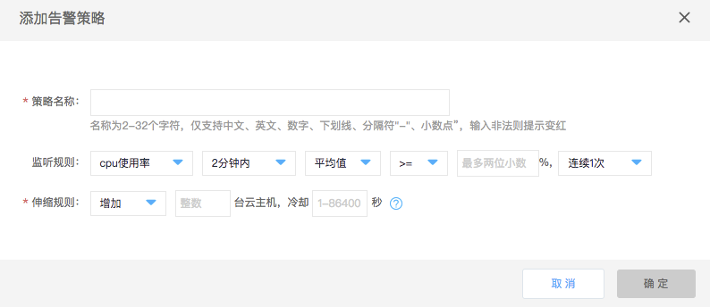
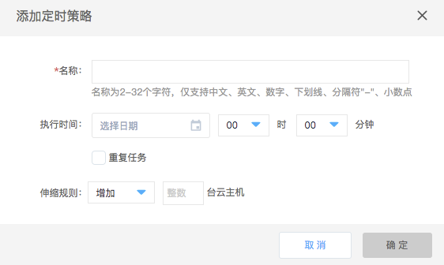

# Auto Scaling Policy Added

After the automatic scaling is started, you can configure the automatic scaling policy as demanded, including the alarm policy and periodic policy.

## Alarm Policy

The alarm policy is based on the alarm policy configured for the monitoring indicators (like CPU, memory utilization rate) and the number of instances in the dynamic expansion auto scaling group, and applies to the situation when the business fluctuation cannot be estimated.

### Operation Steps

1. Access [Availability Group Console](https://cns-console.jdcloud.com/availabilitygroup/list) to log in the Availability Group list page. Or access [JD Cloud Console](https://console.jdcloud.com) and log in the Availability Group list page by clicking **Elastic Compute** - **Availability Group** on the left navigation bar. 
2. Find the corresponding Availability Group, click the name to log in the details.
3. Click the **Automatic Scaling Tab** - **Alarm Policy** - **Add** buttons.
4. Set the alarm policy in the popped-up popup, and automatically increase or decrease the Virtual Machines in the designated number for Availability Group, based on the monitoring performance indicators (like CPU, memory, etc.).	

The current statistical period supports 2 minutes, 5 minutes, 15 minutes, 30 minutes and 1 hour. The statistical method supports the average value, minimum value and maximum value.

## Fixed-time Policy

The periodic policy requires your setting the specific time and cycle, and periodically increasing and deleting the number of instances in Availability Group, it applies to the load boding of predictable business.
		
### Operation Steps

1. Access [Availability Group Console](https://cns-console.jdcloud.com/availabilitygroup/list) to log in the Availability Group list page. Or access [JD Cloud Console](https://console.jdcloud.com) and log in the Availability Group list page by clicking **Elastic Compute** - **Availability Group** on the left navigation bar. 
2. Find the corresponding Availability Group, click the name to log in the details.
3. Click the **Automatic Scaling Tab** - **Periodic Policy** - **Add** buttons.
4. Set the name, execution time, scaling rules and other information of periodic policy in the popped-up popup. You can also tick [Repeated Task] to periodically implement tasks within the defined cycle.	
5. You need to designate the implementation time and specific implementation operation of periodic tasks, for instance, add the number of Virtual Machines or remove the count of removed instances. Besides, your setting of the repeat period and end time of repeated implementation for the policy is supported. Currently, the repeatedly daily, weekly and monthly implemented periodic operations from the implementation time to the end time of repeat is supported.

