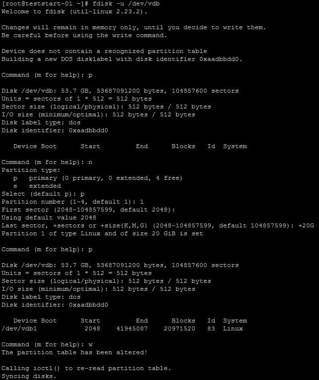

# Linux Data Disk Partition

The newly created Cloud Disk Service does not contain any partition and file system. You can select to create a file system on a raw disk or create a file system after the cloud disk is partitioned. The document specifies how to create the partition on the data disk under the Linux system (taking CentOS system for example).

## Preparatory Work

- The Cloud Disk Service, which is solely purchased, must be attached to the Virtual Machines and then partitioned in the Virtual Machines. You can view "status" of each Cloud Disk Service in the "Elastic Compute" - "Cloud Disk Service" - "Hard Disk Instance" page on the Console, so as to confirm if the Cloud Disk Service is "attached". For details about attaching Cloud Disk Service, please see [Attach Cloud Disk](https://docs.jdcloud.com/cn/cloud-disk-service/attach-cloud-disk).
- Partition formats supported by Cloud Disk Service include: MBR (Master Boot Record) and GPT (Globally Unique Identifier Partition Table). MBR has the maxim processing capacity up to 2 TB and only support partition of 4 master partitions. GPT can support the Cloud Disk Service with capacity greater than 2 TB. As data cannot be saved due to switch of MBR and GPT partition format (the data shall be copied to another cloud disk), you are suggested to adopt the GPT partition when the expected data bulk per cloud disk is greater than 2TB.
- After a partition is directly created on the Cloud Disk Service, if you need to expand the Cloud Disk Service, you must suspend partition expansion and file system expansion to io of cloud disk. If your business on cloud disk cannot be suspended, you are suggested to set up LVM or RAID with multiple cloud disks to realize dynamic expansion.

## Create MBR Partition

How to create cloud disk partition with fdisk is introduced below and the Cloud Disk Service **not greater than 2TB is supported.**

1. Virtual Machines attached to Cloud Disk Service can be logged in via remote connection or ssh.

2. Run the command lsblk to confirm if the data disk is attached.

3. Crete a partition with fdisk, executing:

   1) Execute `fdisk -u /dev/vdb` to partition the /dev/vdb disk.

   2) Enter `p` to display partition condition of this data disk and confirm if the cloud disk already has any partition.

   3) Enter `n` to create a new partition.

   4) Enter `p` to appoint the newly created partition as the "main partition". If you need to expand the partition, please enter `e` (extended) in this step.

   5) Enter the partition number and press the enter key. Directly enter `1` to create one partition.

   6) Enter the starting sector number of this partition and the value listed in the bracket refers to the range available. Press the enter key to adopt the default 2048.

   7) Enter the end sector number of this partition, press the enter key to adopt the maximum value by default. Or, the form of `+20G` can be used for defining partition size. (Note: The partition size shall not exceed the remaining space assigned to the disk)

   8) Enter p to verify division of last step is successful or not;

   9) Enter w to start partition. fdisk will quit after partition is completed.

   


## Create GPT Partition

When your Cloud Disk Service is greater than 2TB or expected to be greater than 2TB, you need to create GPTfen

fdisk tool does not support GPT partition creation, thus such creation shall be realized with the parted tool.

You can execute

```
yum install -y parted
```

by installing the parted tool. The parted tool has been installed by default for the operation steps below.

1. Virtual Machines attached to Cloud Disk Service can be logged in via remote connection or ssh.

2. Run the command lsblk to confirm if the data disk is attached.

3. Execute `parted` and open the parted tool.

   1) Execute `select /dev/vdb and select a cloud disk device to be partitioned;

   2) Execute `mklabel gpt` and set partition format as GPT;

   3) Execute `mkpart primary 1 100%` to divide the entire disk from 1 MB to the entire disk capacity as 1 master partition.

   Note: The complete form of the command mkpart is **mkpart** *[part-type name fs-type] start end*, when value of start reaches the partition alignment, the disk has the best performance.
   
   4) Execute `align-check optimal 1` to check if the partition is aligned. If the return value is 1 **not** aligned, the partition is not aligned.
   
   Note: Partition alignment can be guaranteed by calculating the starting sector value of the optimal partition mode, and the calculation formula is ([optimal_io_size]+[alignment_offset]) / [physical_block_size]. Corresponding parameter value in the formula is:
   
   ```
   cat /sys/block/vdb/queue/optimal_io_size
   
   cat /sys/block/vdb/alignment_offset
   
   cat /sys/block/vdb/queue/physical_block_size
   
   cat /sys/block/vdb/queue/minimum_io_size
   ```
   
   When the raw disk is directly operated, the partition can be aligned when start value is "1", "2048s" or "1040kb".
   
   5) Execute `p` to view detailed information of the newly created partition.
   
   6) Execute q to quit from the parted partition.


	7) At this time, execute `lsblk and you can find that the new partition "/dev/vdb1" has been added under /dev/vdb.


