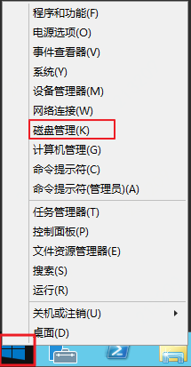
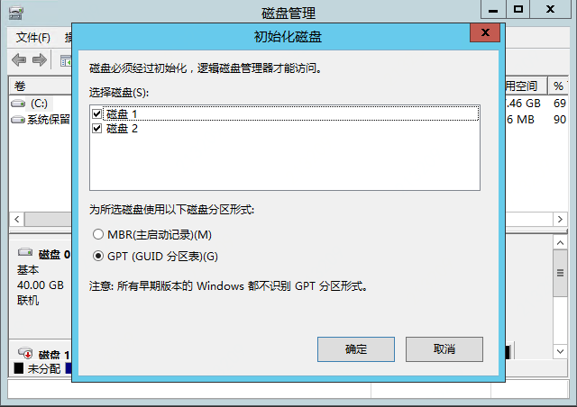
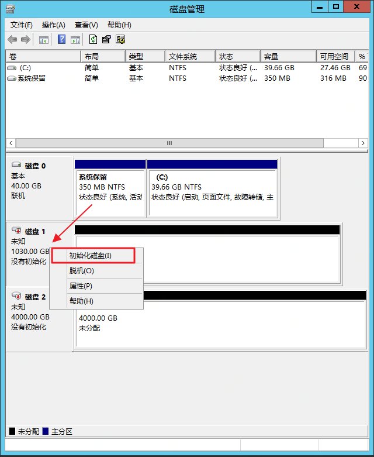
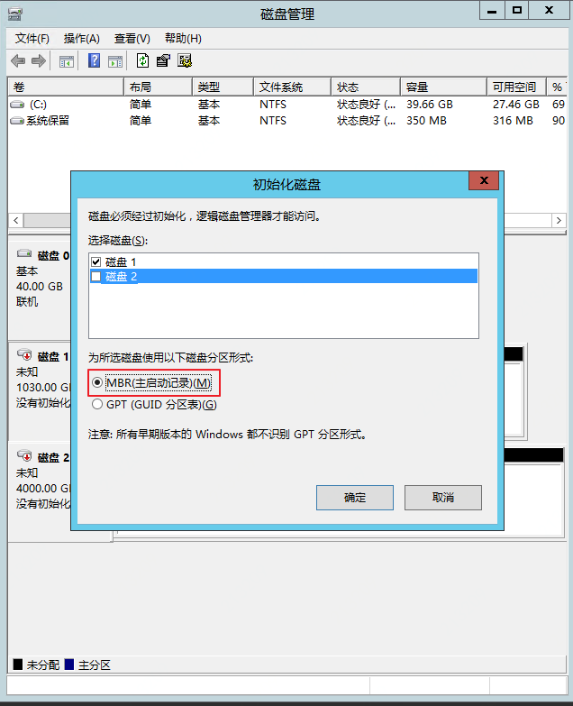
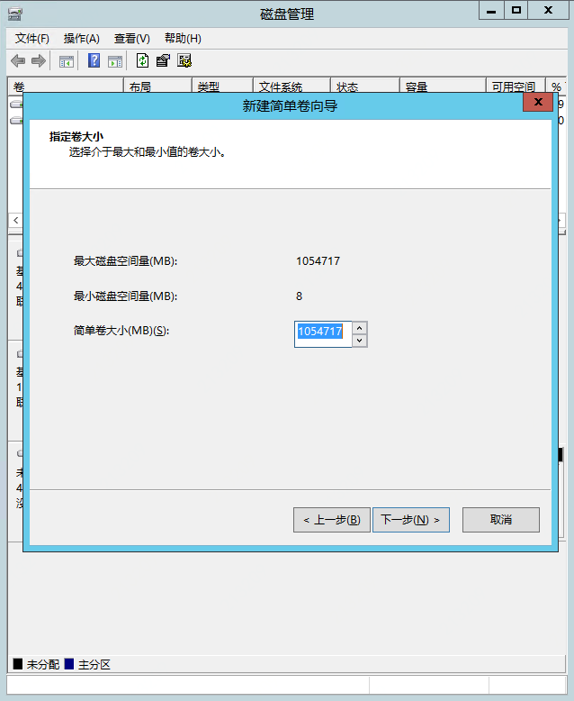
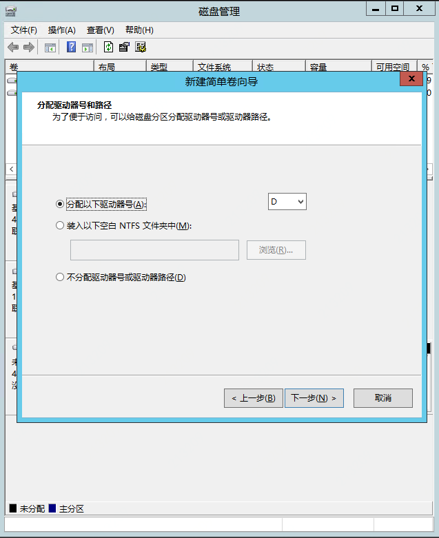
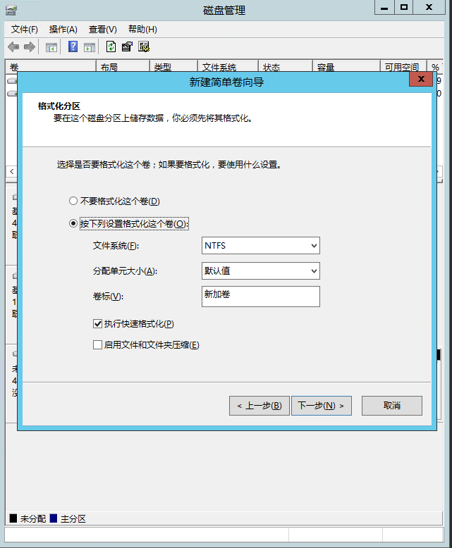
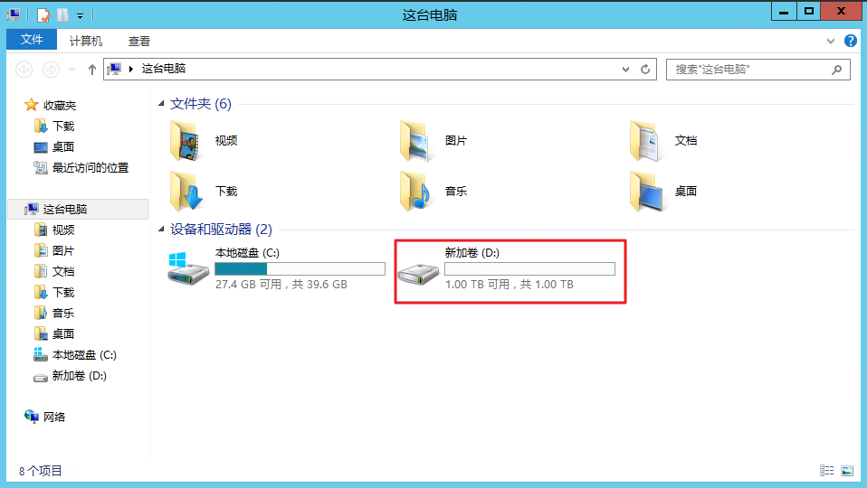

# Windows Data Disk Partition

The newly created Cloud Disk Service does not contain any partition and file system. You can select to create a file system on a raw disk or create a file system after the cloud disk is partitioned. The document specifies how to create the partition on the data disk under the Windows System (taking Standard 64-bit Chinese Version of Windows Service 2012 R2 for example).

## Preparatory Work

- The Cloud Disk Service, which is solely purchased, must be attached to the Virtual Machines and then partitioned in the Virtual Machines. You can view "status" of each Cloud Disk Service in the "Elastic Compute" - "Cloud Disk Service" - "Hard Disk Instance" page on the Console, so as to confirm if the Cloud Disk Service is "attached". For details about attaching Cloud Disk Service, please see [Attach Cloud Disk](https://docs.jdcloud.com/cn/cloud-disk-service/attach-cloud-disk).
- Partition formats supported by Cloud Disk Service include: MBR (Master Boot Record) and GPT (Globally Unique Identifier Partition Table). MBR has the maxim processing capacity up to 2 TB and only support partition of 4 master partitions. GPT can support the Cloud Disk Service with capacity greater than 2 TB. As data cannot be saved due to switch of MBR and GPT partition format (the data shall be copied to another cloud disk), you are suggested to adopt the GPT partition when the expected data bulk per cloud disk is greater than 2TB.
- After a partition is directly created on the Cloud Disk Service, if you need to expand the Cloud Disk Service, you must suspend partition expansion and file system expansion to io of cloud disk. If your business on cloud disk cannot be suspended, you are suggested to switch Cloud Disk Service to "dynamic disk" of windows to realize dynamic expansion. "Dynamic disk" cannot be used as the system disk.

## Create Disk Partition

How to partition Cloud Disk Service with the "Disk Management" tool of windows is introduced below.

1. Remotely connect Windows Virtual Machines;

2. On the Windows Server desktop, right click the **Start** menu and select **Disk Management**.

   

3. After entering "Disk Management", the system will automatically identify un-initialized disk.

   

   You can right click the disk requiring initialization and select **Initialize Disk**.

   

4. Select the disk to be initialized and partition format in the pop-up box. Select MBR partition format in this example.

   Note: The available disk partition comprises MBR and GPT. For Cloud Disk Service less than 2TB, the MBR partition can be selected. It is suggested that for the Cloud Disk Service greater than 2TB or expected to be greater than 2TB in future expansion, THE GPT partition is suggested.

   

5. Click **OK** and then the disk status is changed from "Un-initialized" to "On-line". At this time, right click the "Un-assigned" region of the disk and select the "Create a Single Volume" to enter the creation guide. Define volume size, drive area number and file system format according to the guide notification and click **Complete** to finish the partition operation of this disk.

   

   

   

   6. After completion, you can see the added partition and formatted Cloud Disk Service in "This Computer".

      
