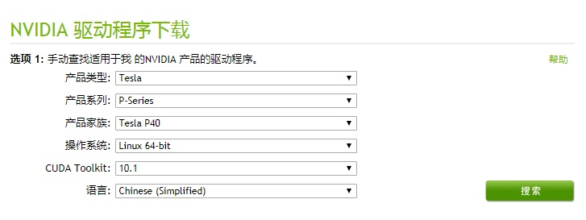
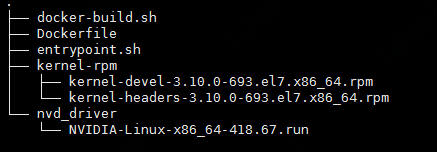

# Deploy NVIDIA GPU driver of customized version

After [Adding GPU Nodes](https://docs.jdcloud.com/en/jcs-for-kubernetes/add-gpu) in JCS for Kubernetes, you need to install the driver for GPU nodes. JD Cloud provides the GPU driver image which is built on the basis of NVIDIA-Linux-x86_64-410.104.run. You may also deploy the NVIDIA GPU driver of customized version by referring to this document.

 ## I. Download NVDIA GPU Driver
 
 1. Access [NVIDIA Official Website](https://www.nvidia.com/Download/index.aspx?lang=cn), and select appropriate driver version according to [GPU Model](https://docs.jdcloud.com/en/virtual-machines/instance-type-family#user-content-6) corresponding to working nodes of JCS for Kubernetes;

 

 2. Click **Search**, search designated GPU card driver and click "Download" to download the driver to the local directory; the GPU driver download in this instance is NVIDIA-Linux-x86_64-410.104.run.

## II. Preparation for Kernel Installation Package Relied by GPU Driver

Installation of NVIDIA GPU driver relies on two installation packages, kernel-devel and kernel-headers. You need to download kernel-devel and kernel-headers of corresponding versions according to kernel version of GPU node. For details, please refer to the following instruction.

1. The current Kernal Version of working nodes of JCS for Kubernetes of JD Cloud is 3.10.0-693.el7.x86_64;

2. Select installation package version of kernel-devel and kernel-headers according to the kernal version; taking 3.10.0-693.el7.x86_64 kernal version for example, download installation packages of kernel-devel and kernel-headers for corresponding version to local directory;

```

wget http://vault.centos.org/7.4.1708/os/x86_64/Packages/kernel-devel-3.10.0-693.el7.x86_64.rpm         # download kernel-devel

wget http://vault.centos.org/7.4.1708/os/x86_64/Packages/kernel-headers-3.10.0-693.el7.x86_64.rpm       #kernel-headers

```

3. You may also view kernal version of cluster Node by using the "uname -r" command and download the kernel-devel package and the kernel-headers package of corresponding version directly on [centos Official Website](http://vault.centos.org/) according to the kernal version.

## III. Building docker Image of NVDIA GPU Driver

1. JD Cloud provides the automatic deployment toolkit for building GPU drivers, which can be downloaded to the local directory via the commands below:

`
wget https://jke-component-cn-north-1.s3.cn-north-1.jdcloud-oss.com/apps/gpu/distribute/docker-image-build.tgz
`

2. Decompress toolkits to designated directory:

```
mkdir GPUDriver/image
tar   zxvf    docker-image-build.tgz  -C GPUDriver/image            #wherein, GPUDriver/image can be replaced with other existing directory

```

3. Create the kernel-rpm directory under the GPUDriver/image directory, and copy kernel-devel-3.10.0-693.el7.x86_64.rpm and kernel-headers-3.10.0-693.el7.x86_64.rpm, downloaded in step 2 to the kernel-rpm directory:

```
mkdir GPUDriver/image/kernel-rpm          #create the kernel-rpm directory under the GPUDriver/image directory

cp kernel-devel-3.10.0-693.el7.x86_64.rpm GPUDriver/image/kernel-rpm            
cp kernel-headers-3.10.0-693.el7.x86_64.rpm GPUDriver/image/kernel-rpm
```

4. Create the nvd_driver directory under GPUDriver/image and copy NVIDIA-Linux-x86_64-410.104.run, downloaded in step 1, to the nvd_driver directory:

```
mkdir GPUDriver/image/nvd_driver          #Create the nvd_driver directory under the directory GPUDriver/image

cp NVIDIA-Linux-x86_64-410.104.run GPUDriver/image/nvd_driver      
```

5. After the above steps are executed, please refer to the figure below for the GPUDriver/image directory structure:



6. Run docker-build.sh under the GPUDriver/image directory:

```

cd GPUDriver/image            # enter GPUDriver/image directory

sh docker-build.sh            # run docker-build.sh
```
**Note**: Before executing the script, please ensure the local docker environment is installed well

7. After the script is successfully executed, please execute docker images to view the generated images

```
docker images

REPOSITORY      TAG                 IMAGE ID            CREATED             SIZE
nvidia-installer    v1                  fe07b1c60916        2 days ago          665MB

```
8. Push nvidia-installer images to [JD Cloud Repository](https://docs.jdcloud.com/en/container-registry/benefits) or any other Repositories accessible via public network access.

## IV. Deploying NVIDIA GPU Drive by Using Customized docker Image

You can deploy the NVIDIA GPU drive by using the customized docker image built in the last step. For Yaml file for deploying NVIDIA GPU driver, please refer to the Help Documentation of [Add GPU Working Node Group], and the file instructions are as follows:

```
apiVersion: apps/v1
kind: DaemonSet
metadata:
  name: nvidia-driver-installer
  namespace: kube-system
  labels:
    k8s-app: nvidia-driver-installer
spec:
  selector:
    matchLabels:
      k8s-app: nvidia-driver-installer
  updateStrategy:
    type: RollingUpdate
  template:
    metadata:
      labels:
        name: nvidia-driver-installer
        k8s-app: nvidia-driver-installer
    spec:
      affinity:
        nodeAffinity:
          requiredDuringSchedulingIgnoredDuringExecution:
            nodeSelectorTerms: 
            - matchExpressions:
              - key: jdcloud.com/jke-accelerator                #label key added by JD Cloud for GPU Node by default
                operator: In
                values: 
                - nvidia-tesla-p40              # Modify corresponding label value according to GPU Node used when building nvidia-installer images in step 3
      tolerations:
      - operator: "Exists"
      hostNetwork: true
      hostPID: true
      volumes:
      - name: dev
        hostPath:
          path: /dev
      - name: nvidia-install-dir-host
        hostPath:
          path: /home/kubernetes/bin/nvidia
      - name: root-mount
        hostPath:
          path: /
      initContainers:
      - image: ************/nvidia-installer:**               #Please replace it with Repository uri of the nvidia-installer image built in step 3 
        name: nvidia-driver-installer
        securityContext:
          privileged: true
        env:
          - name: NVIDIA_INSTALL_DIR_HOST
            value: /home/kubernetes/bin/nvidia
          - name: NVIDIA_INSTALL_DIR_CONTAINER
            value: /usr/local/nvidia
          - name: ROOT_MOUNT_DIR
            value: /root
        volumeMounts:
        - name: nvidia-install-dir-host
          mountPath: /usr/local/nvidia
        - name: dev
          mountPath: /dev
        - name: root-mount
          mountPath: /root
      containers:
      - image: "jdcloud.com/pause-amd64:3.0"
        name: pause
```

Deploy the NVIDIA driver to the working nodes of JCS for Kubernetes with the Daemonset method by using the aforesaid Yaml file
