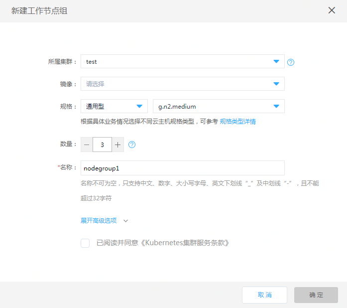

# Create Working Node Group

**Steps of Create Working Node Group:**

 1. Open the console and select [Elastic Compute>>JCS for Kubernetes>>Cluster Service>>Work Node Group](https://cns-console.jdcloud.com/host/nodeGroup/list) and click the Create button.  

  

 2. Select cluster, and all clusters at running status in current region will be listed in the drop-down list.

 3. Select working node group version: It is recommended that you select a default working node group version matching the current management node version; click the drop-down list to show all working node group versions supported by current management node version.

 4. Specification: Select different VM instance types according to specific business situations and the Virtual Machines support Generation II specification and GPU instance type. You can refer to [Instance Type](https://docs.jdcloud.com/en/virtual-machines/instance-type-family).

 5. Count: The default count is 3; you can click **Increase**, **Decrease** or enter the expected node count directly according to needs; the maximum count of working nodes is subject to the quota of Virtual Machines in current region and assignable count of Private IP of working node CIDR.

 6. Name: The default name is nodegroup1, which cannot be empty and supports only Chinese text, numbers, uppercase and lowercase letters, English text with underline "_" and hyphen "-", and should not exceed 32 characters. Working node groups under the same cluster cannot be in an identical name.

 7. The followings are the advanced options without mandatory demand:  
    * Description: Description should consist of no more than 256 characters  
    * System disk: The default capacity of the local disk is 100G, which can not be modified.  
    * Automatic repair: When it is enabled, the working node of non-running or ready status will be repaired automatically. For more details, please refer to [Automatic Repair Instruction](https://docs.jdcloud.com/en/jcs-for-kubernetes/auto-repair);  
    * Tag: Set keys and values of tags added on the working nodes; a key is composed of a prefix and a name; the prefix cannot exceed 253 characters, consisting of DNS sub-domain; each sub-domain cannot exceed 63 characters, must be started and ended with lowercase letters or numbers and may contain "-", ".", uppercase and lowercase letters and numbers; the name and value cannot exceed 63 characters respectively, must be started and ended with uppercase and lowercase letters or numbers respectively and may contain "-", " _ ", ".", uppercase and lowercase letters and numbers; and at most five groups of tags can be added.

 8.After completing relevant settings, click OK to enter the Elastic Compute>>JCS for Kubernetes>>Cluster Service>>Working node group for the sake of viewing the created working node group.
