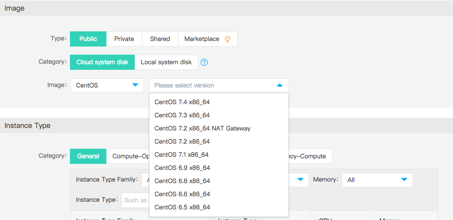
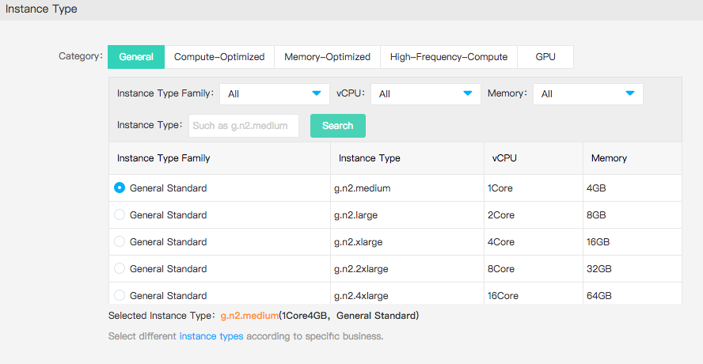
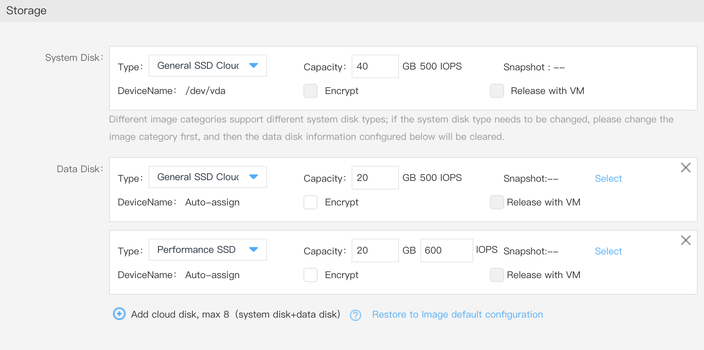
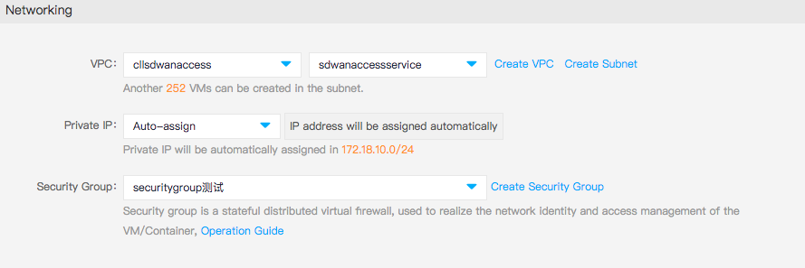
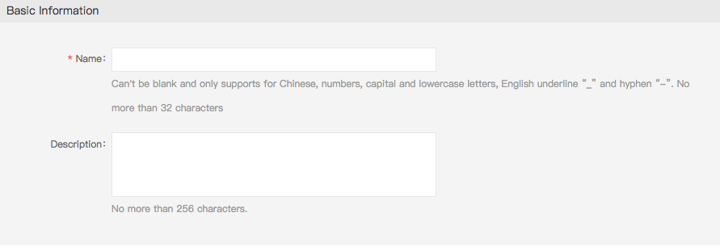
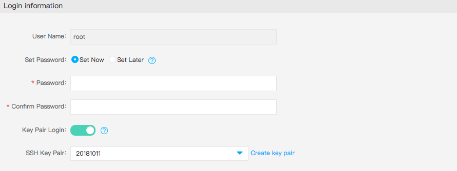

# Create Linux Instance
1. Access [Instance Console](https://cns-console.jdcloud.com/host/compute/list), or access [JD Cloud Console](https://console.jdcloud.com)Click navigation bar on the left **Elastic Compute** - **Virtual Machines** - **Instance** to enter the instance list page.

2. Select the region where the instance belongs and click **Create** to enter the VM purchase page. You are suggested to select the region of the instance according to the business condition. Fore more information about the region of JD Cloud, please refer to [Region and Availability Zone](../Introduction/Regions-and-AvailabilityZones.md).

3. Select the Billing Method: User can choose monthly package or pay by configuration. Monthly package is purchased and charged as per entire month, while paying by configuration is charged according to the actual using time (accurate to the second) with fee deducted per hour. For the difference between the two billing methods, please see [Billing Rules](../Pricing/Billing-Rules.md).

4. Select the Region and Availability Zone: In this step, you can still select the region corresponding to the instance (cn-north-1, cn-south-1, cn-east-1 and cn-east-2) and the available zones. Please note that the resource intranets of different regions are not accessible and cannot be changed after creation. If quota of the selected region is full, you can increase it via [Open Ticket](https://ticket.jdcloud.com/myorder/submit).

5. Creation Method Selection: Three creation methods are provided, i.e. **Create Customized Instance**, **Create Instance by Instance Template** and **Create Instance in Availability Group**. The latter two methods need you to create the instance template and Availability Group in advance. For the first one, please keep the default option "Create Customized Instance".

6. Select Image: The image is divided into cloud system disk image and local system disk image. The former only supports the creation of instance with Cloud Disk as the system disk; and the latter only supports the creation of instance with the local disk as the system disk.
	
	In addition, the images are of following types: **Public Image**, **Private Image**, **Shared Image** and **Image in Marketplace**. Please refer to [Image Overview](../Operation-Guide/Image/Overview.md) for division details.
    
    Users first using JD Cloud can choose the "Public Image" provided by JD Cloud. You can choose the corresponding system and the appropriate version as required.
    
    If you have created your own instance and configured the appropriate environment, you can create a private image for this instance, create a batch of hots based on this image with the same system and environment configuration, and share this private image with other JD Cloud users. 

7. Select Instance Type: The instance type supports customized selection of users, from minimum 1-core 1GB (such as g.s1.micro) to the maximum 72C576GB (such as m.n2.18xlarge). Users can select the instance type and corresponding configuration according to different business scenarios. For details, please see [Instance Type](../Introduction/Instance-Type-Family.md).

8. Configure Instance Storage:

  * Virtual Machines System Disk: Support local disk and Cloud Disk, where the local disk has 40GB for free, and the capacity cannot be changed. The cloud disk supports 40GB~500GB.                
  * Virtual Machines Data Disk: If the system disk is a local disk, 8 data disks can be attached. If the system disk is a cloud disk, 7 cloud disks can be attached as data disks. You may select general SSD Cloud Disk, performance-oriented SSD Cloud Disk, capacity-oriented HDD Cloud Disk, SSD Cloud Disk and Premium Hdd Cloud Disk (where the first three are only provided in cn-east-2 region and the latter two are only provided in cn-north-1, cn-east-1 and cn-south-1 regions). After the cloud disk is attached to a VM, it needs to access the Virtual Machines operating system to attach cloud disk.     
   
    You can create an empty disk of the specified type and capacity with the instance, or you can create a data disk based on an existing Cloud Disk Snapshot. For the assignment rules of data disk device name, please refer to [Assignment Rules](../Operation-Guide/Cloud-Disk/Assign-Device-Name.md).      
    
    It supports the attachment of encrypted cloud disks to Virtual Machines (which is not supported by the first generation of instance specification). The cloud disk encryption attribute may be specified at the time of creating a null disk. If the disk is created from snapshot, the cloud disk encryption attribute is inherited from the snapshot side. After the creation of a cloud disk, its encryption attribute cannot be modified. For details, please refer to [Cloud Disk Service Encryption](../Operation-Guide/Cloud-Disk/Encryption-of-Cloud-Disk.md). 
    
    It supports Pay By Configuration, and the attribute of deletion on instance termination may be set for the non-multi-point attached cloud disk. If the attribute is checked, the disk will be deleted when the instance is deleted.
    
	The cost of the Cloud Disk is independent of the instance. For the specific price information, please refer to [Cloud Disk Price](http://docs.jdcloud.com/cn/cloud-disk-service/billing-rules).

9. Configure Instance Network:  
  * Select VPC and Subnet:Select VPC and Subnet: You need to create a VPC and a subnet in the VPC first. After the subnet is selected, the system will judge the number of Virtual Machines that can be created under the subnet. If there is no subnet temporarily, a new subnet can be created through the quick access and selected under "Virtual Machines Network". For details, please see [VPC](http://docs.jdcloud.com/virtual-private-cloud/product-overview) and [Subnet](http://docs.jdcloud.com/virtual-private-cloud/subnet-features).
  * Select Private IP Assignment Method: If there is no special requirement for the private IP address, you may not specify but let the system automatically assign within the available network segment in the subnet. If you need to specify it, please enter it in the prompt range and the system will verify whether the IP is available. It should be noted that if you choose to customize private IP address, you cannot create instance in batches.
  * Select Security Group: Association with a security group is required when an instance is being created. If no customized security group is created in current region, you can select one from the three default security groups created by the system for association (three default security groups are automatically created after each VPC is created successfully). Or, you can, through the quick access, go to the security group page to [Create Security Group](http://docs.jdcloud.com/virtual-private-cloud/security-group-configuration). Because the firewall in the public image system is disabled by default, it is recommended to bind with a security group with only 22 port (Linux) or 3389 port (Windows) opened. After the instance is created, create a new security group and associate with it according to the access requirements.    

10. Configure EIP Bandwidth:
  * Billing by Bandwidth: JD Cloud provides elastic IP charged by fixed bandwidth and by traffic, the former is charged according to the bandwidth cap set when purchasing, which is not related to the actual access to the public network bandwidth, and the latter is charged according to the actual traffic of your real-time access to the public network.
  * IP Provider: Elastic IP provider is divided into BGP and non-BGP, and BGP is provided for a faster and more efficient network access.                
  * Bandwidth Range: 1Mbps~200Mbps.
You may not purchase the public IP during the process of creating a host. After the host is created, you can associate it. The Elastic IP bandwidth cost is independent of the instance cost. For specific price information, please refer to [Elastic IP Price](../../../Networking/Elastic-IP/Pricing/Price-Overview.md).      

11. Set Instance Name and Description:
You need to set machine name, and the name cannot be blank. It only supports Chinese, numbers, uppercase and lowercase letters, English underscore "_" and hyphen "-", and cannot exceed 32 characters. If the instances are created and purchased in batch, the names will be displayed as "xxx1" and "xxx2" in sequence. Meanwhile, it supports adding description to the instance. The description is allowed to be blank, but if added, the length cannot exceed 256 characters.

12. Set Password and Key Pair:
	For setting the password, you can select "Set Now", or you can also select "Set Later" (the system will send the default password by SMS and email). It is the password used for SSH to login instance and also the password for the console to login the instance via VNC.                

	For Linux system, you can choose the key pair to login and associate the created key pair to conduct safer instance login verification. Please refer to [Key Pair](../Operation-Guide/Key-Pair/KeyPair-Overview.md) for detailed key pair creation and login hep.  

13. Confirm Virtual Machine Quantity and Purchase Duration:
	The purchase quantity is limited to your Virtual Machines, Cloud Disk and EIP quota as well as the remaining IP quantity of the subnet you have selected. If the quota is not enough, you can increase it via
[Open Ticket](https://ticket.jdcloud.com/myorder/submit).
	
	If to purchase a monthly package instance, you need to set the purchase duration, which shall be at least one month and three years at most. If you need a longer service, please operate as follows: [Open Ticket](https://ticket.jdcloud.com/myorder/submit
).

## Related Reference

[Region and Availability Zone](../Introduction/Regions-and-AvailabilityZones.md)

[Billing Rules](../Pricing/Billing-Rules.md)

[Image Overview](../Operation-Guide/Image/Overview.md)

[Instance Type](../Introduction/Instance-Type-Family.md)

[Device Name Assignment Rule](../Operation-Guide/Cloud-Disk/Assign-Device-Name.md)

[Cloud Disk Service Encryption](../Operation-Guide/Cloud-Disk/Encryption-of-Cloud-Disk.md)

[Cloud Disk Price](http://docs.jdcloud.com/cn/cloud-disk-service/billing-rules)

[VPC](http://docs.jdcloud.com/cn/virtual-private-cloud/product-overview)

[Subnet](http://docs.jdcloud.com/cn/virtual-private-cloud/subnet-features)

[Create Security Group](http://docs.jdcloud.com/cn/virtual-private-cloud/security-group-configuration)

[Elastic IP Price](../../../Networking/Elastic-IP/Pricing/Price-Overview.md)

[Key Pair](../Operation-Guide/Key-Pair/KeyPair-Overview.md)

