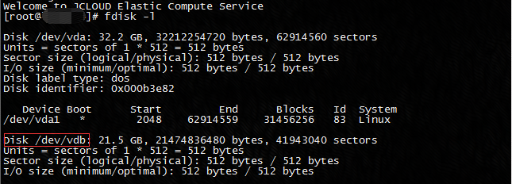
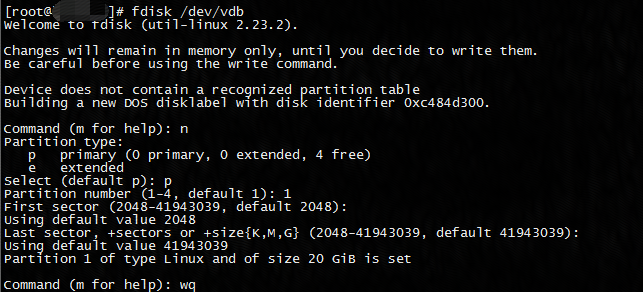
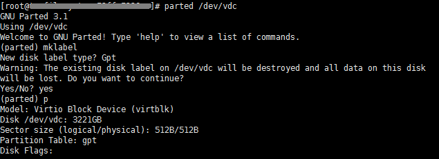
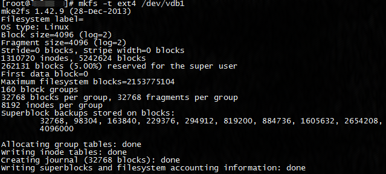

# Attach Data Disk
After the console attaches the data disk for the Linux instance, you need to login the instance to partition and format the data disk, and attach a file system before you can use it normally.

How to complete attaching using script and manually are described respectively in the following.

## Use Script to Complete Partitioning, Formatting and Attaching of Data Disk
Under Linux, you can use the script provided by JD Cloud & AI to detect whether there is a data disk that has not been partitioned, and automatically complete formatting and attaching of the data disk, which will leave out the complicated commands and steps you need to enter.
Attach Script: [MountDataDisk][1].

You can use the script in the following two ways:

1. Without Any Parameter: The script will automatically partition, format and mount all your un-partitioned devices (the default attaching points are /jddata1, /jddata2.../jddatan) and realize automatic attaching of the Cloud Disk in /etc/fstab file via UUID.
```
sh auto_fdisk.sh
```
2. With a Device Name (such as /dev/vdc, etc.), Attaching Point and File System Parameter: The script will automatically complete partitioning, formatting, and attaching based on the parameters you entered.
```
sh auto_fdisk.sh /dev/vdb /jddata1 ext4
```

**Note:**

1. Data loss may occur due to related operations. Therefore, before executing the operation, please make sure that the data has been effectively backed up by the means of snapshots, etc., or please confirm that no effect will be caused due to the data loss;

2. This script is only applicable to the un-partitioned and un-attached Cloud Disk. Therefore, it will not operate on hard disks that have been partitioned or attached;

3. This script creates a partition for the hard disk by default and cannot be modified;

4. This script will realize the automatic attaching of cloud disk by writing the UUID and attaching information of the disk in the /etc/fstab file. If you need to detach the cloud disk, please delete the information corresponding to this file. Otherwise, the Virtual Machines may be unable to start normally.

## Manually Complete Partitioning, Formatting and Attaching of Data Disk
If you need to manually partition, format and create a file system, we take the Centos operating system as an example, as follows:

1. After attaching at the console is completed, you can see a disk without partitioning and formatting in the Virtual Machines. You can view the disk partition information via the following commands:
	
	```
	fdisk -l
	```
	

2. You can complete the partition by the following commands, /dev/vdb, please modify /dev/vdb into the device name to be partitioned.

	```
	fdisk /dev/vdb
	```
	After entering the command, enter n, p, 1, and then press Enter twice, then wq to complete saving. In this way, you can see the newly created partition /dev/vdb1. <br> via fdisk -l.
	
	Note: If the hard disk capacity you created is greater than 2T, please do not use the partition or refer to the following steps to use parted to partition:

	1) Create a partition table and select GPT format: <br><br>
	2) Create a partition <br><br>
	3) Re-run the fdisk -l command and confirm the partition <br>

3. Then you need to format the hard disk after the partition, and the command is as follows:

	```
	mkfs -t ext4 /dev/vdb1
	```
	

	Note: This example creates a file system in ext4 format, and you can choose to create other file systems. In order to ensure data integrity and availability from the file system level, it is not recommended to use a format such as ext2 that does not provide a jounral mechanism.

4. Create a vdb1 directory in the mnt directory and attach the disk to this directory for convenient management.

	```
	mkdir -p /mnt/vdb1 && mount -t ext4 /dev/vdb1 /mnt/vdb1
	```

5. View UUID of the disk
	
	```
	blkid /dev/vdb1
	```

6. Write in /etc/fstab file to realize attaching of the Cloud Disk.
	

 **Please note that if the system is Centos 7 or above, you must use the nofail parameter when writing in fstab. Otherwise, if you create a private image for the current Virtual Machines, the new Virtual Machines created based on this private image will not start normally.** 

  [1]: https://iaas-cns-download.oss.cn-north-1.jcloudcs.com/DOCS/auto_fdisk.sh