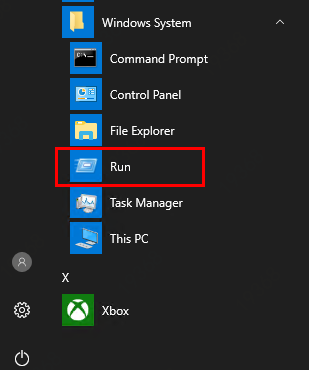
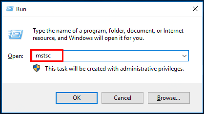
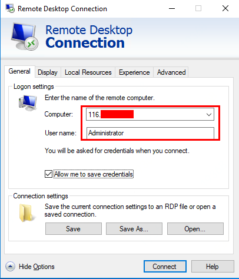
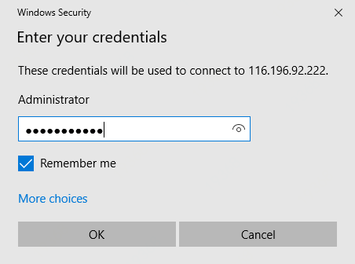
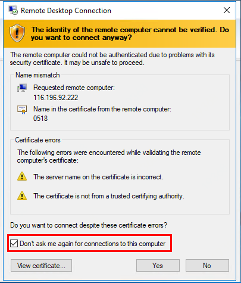

# Login Windows Instance
After purchasing and launching an instance of Windows type, you can choose to login the instance for relevant management. Depending on whether your local operating system and instance are accessible by the Internet, different login methods can be adopted in different situations. For details, please refer to the table below.

<table>
   <tr>
      <td> Type of Local Operating System </td>
      <td> Linux Instance Associated to Public IP  </td>
      <td> Linux Instance Not Associated to Public IP </td>
   </tr>
   <tr>
      <td> Wndows </td>
      <td> VNC Login<br>Remote Desktop Connection  </td>
      <td rowspan="3"> VNC Login </td>
   </tr>
   <tr>     
      <td> Linux </td>
      <td>VNC Login<br>rdesktop Login   </td>
   </tr>
   <tr>  
      <td> Mac OS    </td>
      <td> VNC Login<br>rdesktop Login </td>
   </tr>
</table>

## Login Preparation
Create an instance and acquire the account number and corresponding password.

* Administrator Account: Administrator
* Password: JD Cloud instance can obtain password in two ways.
  * When creating an instance, select **Set Later** and the system will send a default password by SMS and email. You can use the default password to verify when you login to the instance.
  * Select **Set Now**, and then you should enter a customized password in the password setting text box. If you forget the password, you can reset the password by [Reset Password](../Operation-Guide/Instance/Reset-Password.md). This function is only available for the "Running" instance.

## Use VNC to Login Instance
VNC login is a way provided by JD Cloud for remote connection to instance for users via Web browser. In the case that a remote login client is not installed or the client remote login is not available, the user can connect to the instance through VNC login, observe the instance status, and perform basic instance management operations through the instance user.
The scenarios of VNC login include at least the following:
* View the starting progress of the instance
* When logging in via client SSH or mstsc is unavailable, log in the instance via VNC login.

1. Click **Remote Connect** In the operation column of the Instance List to connect to the Windows instance via VNC.


2. Enter the system login interface by clicking the Ctrl+Alt+Del command in the upper left corner:
* Default Username: administrator        
* Password: The instance password set when you created the instance 


Please note:

* Under a same browser, only one instance can be logged in using VNC at the same time.
* To use VNC login normally, it is recommended to use a higher version of browser, such as: Chrome, Firefox, IE10 and above.
* Copy and paste are not supported yet.
* File upload and download are not supported yet.

## If the local system is Windows, login the Windows instance using remote desktop.
Before connecting the Windows instance using MSTSC remote desktop, user must first ensure that the instance is associated to the EIP, and such access is allowed in the security group and network ACL rules. You can create a Windows instance on the JD Cloud console and acquire the EIP: XXX.XXX.XXX.XXX.
1. Click **Start** on the computer and find **Run**. <br>
<br>
2. Enter mstsc command in Running and click **OK** to open the remote desktop connection dialog. <br>
<br>
3. Connect the instance according to the EIP associated when creating the instance, and then enter the username: Administrator, and select **Allow me to save the credentials**. <br>

4. After clicking **Connect**, enter the password and connect to the instance. <br>

5. Select **Do not ask me again if to connect to this computer** and click **Yes**. <br>

6. Connect to the Windows instance you created on JD Cloud Successfully. <br>

7. If the login fails, please confirm whether the EIP address is entered correctly, and check the instance association [Security Group](../Operation-Guide/Security-Group/Overview.md) and the [Network ACL](../../../Networking/Virtual-Private-Cloud/Introduction/Functions/Network-ACL.md) configuration of the subnet to confirm whether the instance allows the incoming traffic at port 3389.


## If the local system is Linux, login the Windows instance using rdesktop.
When the local system is Linux and you need to login the Window instance remotely, you need to install the corresponding remote desktop connection program, usually using the rdesktop client.

Before logging in, please check the [Security Group](http://docs.jdcloud.com/cn/virtual-private-cloud/security-group-features) of the instance and the [Network ACL](http://docs.jdcloud.com/cn/virtual-private-cloud/network-acl-features)
configuration of the subnet to ensure that the port 3389 of instance is open. After installing rdesktop, run the following commands to login the instance:

```
rdesktop -u administrator -p <Instance login password> <Instance EIP address>
```

## Related Reference

[Reset Password](../Operation-Guide/Instance/Reset-Password.md)

[Security Group](http://docs.jdcloud.com/cn/virtual-private-cloud/security-group-features)

[Network ACL](http://docs.jdcloud.com/cn/virtual-private-cloud/network-acl-features)


  [1]: ./images/Getting-Start-Linux-Connect-console.png "Getting-Start-Linux-Connect-console.png"
  [2]: ./images/Getting-Start-Linux-Connect-Windows-VNC.png "Getting-Start-Linux-Connect-Windows-VNC.png"
  [3]: ./images/Getting-Start-Linux-Connect-Windows-menu.png "Getting-Start-Linux-Connect-Windows-menu.png"
  [4]: ./images/Getting-Start-Linux-Connect-Windows-mstsc.png "Getting-Start-Linux-Connect-Windows-mstsc.png"
  [5]: ./images/Getting-Start-Linux-Connect-Windows-mstsc1.png "Getting-Start-Linux-Connect-Windows-mstsc1.png"
  [6]: ./images/Getting-Start-Linux-Connect-Windows-mstsc2.png "Getting-Start-Linux-Connect-Windows-mstsc2.png"
  [7]: ./images/Getting-Start-Linux-Connect-Windows-mstsc3.png "Getting-Start-Linux-Connect-Windows-mstsc3.png"

  [8]: ./images/Getting-Start-Linux-Connect-Windows-mstsc4.png "Getting-Start-Linux-Connect-Windows-mstsc4.png"