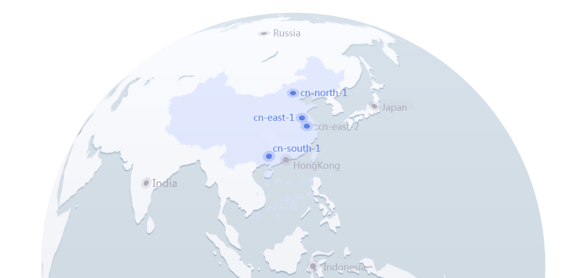

# Region and Availability Zone
JD Cloud Virtual Machines datacenters are distributed in multiple locations globally, and these locations become regions. Each region is an independent geographical region, and each region is completely independent. JD Cloud supports users to deploy cloud services in different regions. In order to avoid the single-point risks that may arise from single-region deployment, it is recommended to consider multi-regional deployment in the deployment scheme design phase. After creation of a VM instance, region changing is not supported.

JD Cloud supports you to deploy cloud services in different regions, and in order to avoid the single-point risks that may arise from single-region deployment, it is recommended to consider deployment in multiple regions and multiple availability zones in the deployment scheme design phase. After the instance is created, it does not support to change the region or AZ.

The availability zone is a physical zone that is independent from each other between the power and the network. Network delay between instances in the same availability zone is smaller than that between instances in different availability zones in the same region. A mutual private network accessible environment is provided between different availability zones in the same region, and fault isolation can be achieved between these availability zones.

* If your business requires high disaster tolerance, it is recommended to deploy the instances in different availability zones in the same region;
* If your business requires a smaller network delay, it is recommended to deploy the instances in the same availability zone.

## JD Cloud Region and Availability Zone Distribution
<table>
	<thead>
	<tr>
		<th colspan="2">Region Name and Code</th>
      	<th>Availability Zone Name and Code</th>
      	<th>City</th>
   	</tr>
		</thead>
	<tbody>
   	<tr>
      	<td rowspan="8">Chinese Mainland Region</td>
      	<td rowspan="3">cn-north-1 cn-north-1</td>
     	<td> Availability Zone A cn-north-1a</td>
	   	<td> Beijing</td>
   </tr>
		
   <tr>
     	<td> Availability Zone B cn-north-1b</td>
	   	<td> Beijing</td>
   </tr>
   <tr>
     	<td> Availability Zone C cn-north-1c</td>
	   	<td> Beijing</td>
   </tr>
   <tr>
     	<td>cn-east-1 cn-east-1</td>
     	<td>Availability Zone A cn-east-1a</td>
	   	<td>Suqian</td>
   </tr>
   </tr>
    	<tr>
     	<td rowspan="3">cn-east-2 cn-east-2</td>
     	<td>Availability Zone A cn-east-2a</td>
	   	<td>Shanghai</td>
   </tr>
      </tr>
    	<tr>
     	<td>Availability Zone B cn-east-2b</td>
	   	<td>Shanghai</td>
   </tr>
       	<tr>
     	<td>Availability Zone C cn-east-2c</td>
	   	<td>Shanghai</td>
   </tr>
  <tr>
     	<td>cn-south-1 cn-south-1</td>
     	<td>Availability Zone A cn-south-1a</td>
	   	<td>Guangzhou</td>
   </tr>
   </tbody>
</table>

