# Conversion of Images in ISO Format
iso is in the optical disk format, for which created virtual machines cannot be directly used. The following text will introduce how to create virtual machines with virt-manager and iso and how to make images of virtual machines.

### 1. Install and run the virt-manager
Prepare a Linux system machine supporting virtual technology (both physical machines and virtual machines are OK) to execute the following instruction for installation.
```
sudo yum install virt-manager qemu-* libvirt
```
Enable the libvirt service.
```
systemctl start libvirtd
```
Run virt-manager.
```
virt-manager
```
If you find that the virt-manager interface fails to show, after you log in the linux server through such clients as Xshell under the local windows system, you can try to allow X11 forwarding by configuring server sshd, and at the same time try to solve the problem by installing Xming under the local windows to start X server. This step isn’t introduced in details here.

### 2. Configure the virt-manager software, and set the virtual hardware configuration of virtual machines.
On the virt-manager interface, open the virtual machine creation interface by clicking the icon in the red frame on the upper left corner, choose to install the operating system with iso images, and then choose the iso image file (taking CentOS 7 as an example).

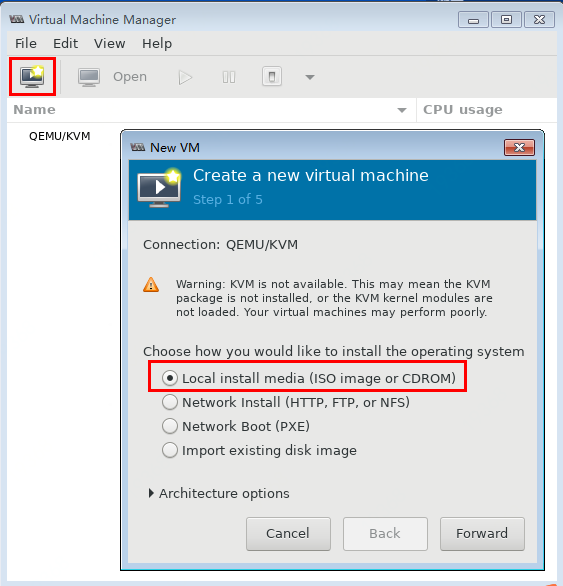<br>
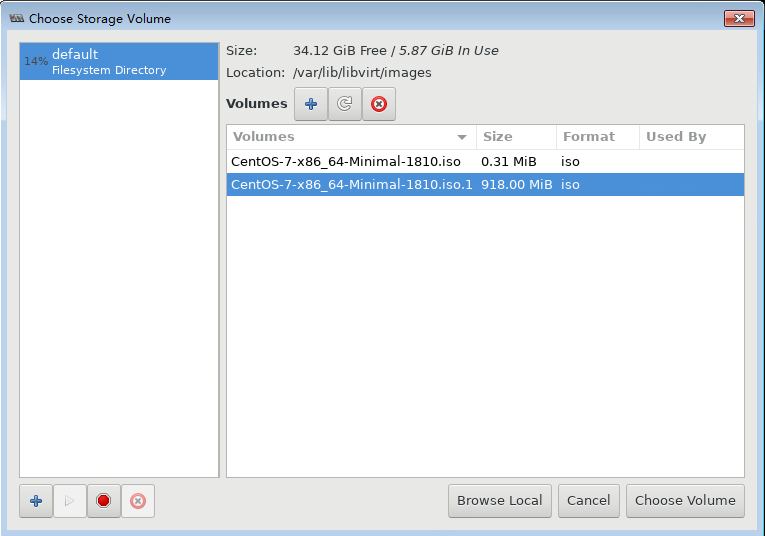<br>

Set the capacities of CPU and memory and choose the disk capacity. The capacity cap allowed depends on the current configuration of all the servers creating virtual machines. Wait for completion of operating system installation after such configuration.

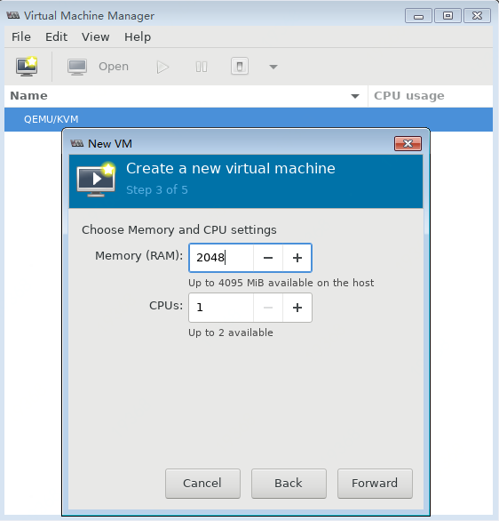<br>
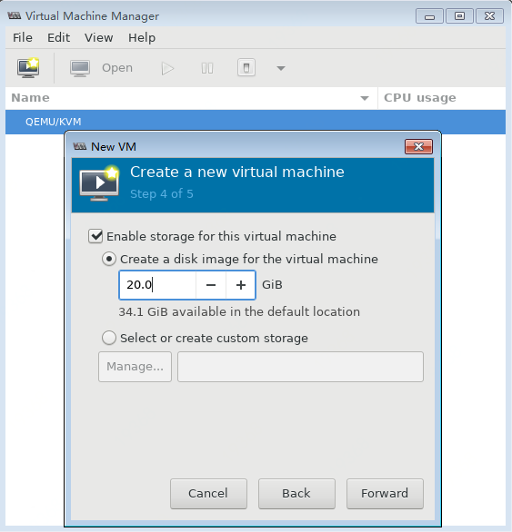<br>
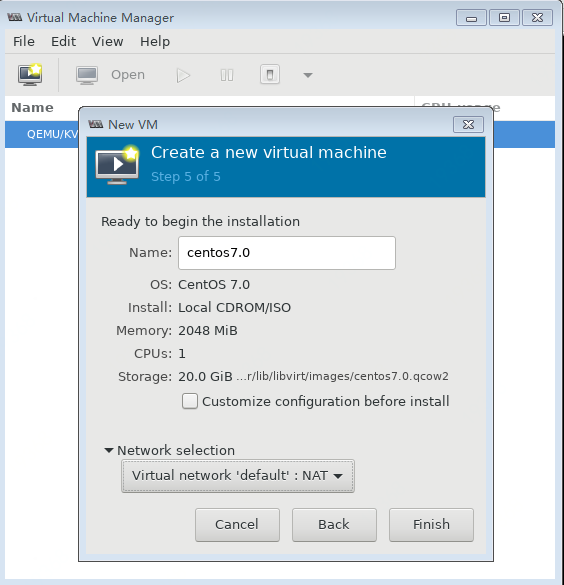<br>
Start setting the partition sheet after choosing the speech. This is an important step. Use one root directory region based on JD Cloud’s requirements. As shown below, click the circled option with yellow identifier in the figure, and choose "I will configure partitioning" in the following interface.
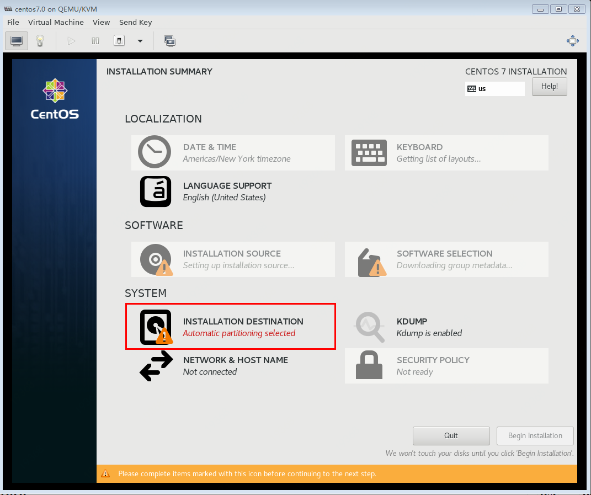<br>
<br>
It is especially noteworthy that the "LVM" mode selected by default must be changed to the traditional partition mode. Please click **Add** to add new attach points, choose the standard partition, and choose the file system type complying with JD Cloud’s requirements (the default file system of CentOS 7 is xfs; the default file system of Ubuntu is ext4; the default file system of Windows is NTFS). Moreover, according to JD Cloud’s image requirement, only one partition of the system disk is required. Both Windows and Linux shall set only one root partition, when setting partitions.

When the Ubuntu system image is made, there is a disk partition setting step, although the installation interface is different. Similarly, we only need to set one main partition. In case the Windows system is slightly different, a hidden partition will be generated after Windows is installed (as shown in the following figure). So, there should be two partitions in the Windows system: One is hidden partition, and the other is default system partition known as disk C.
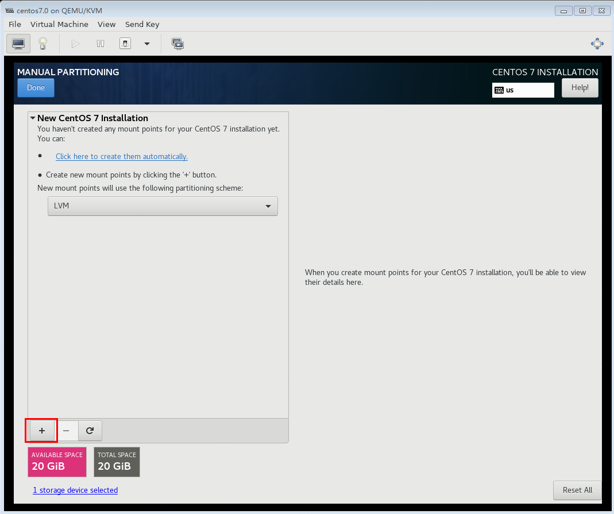<br>
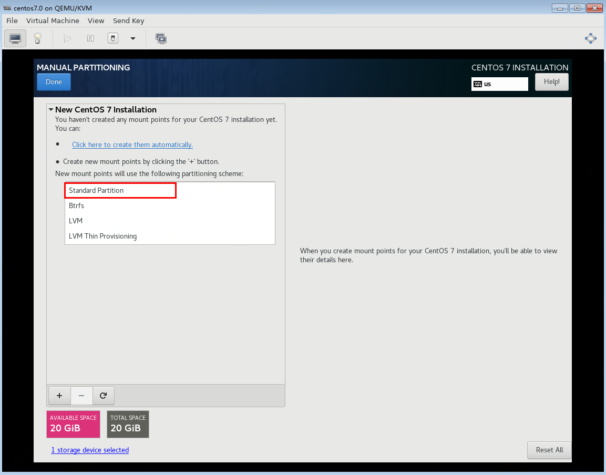<br>
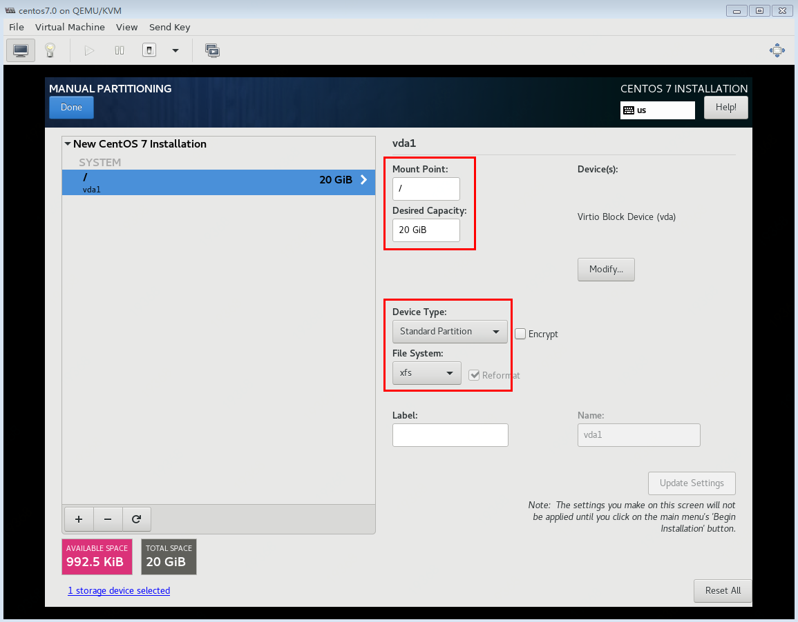<br>
After configuration, click **DONE** to return to the main interface, and then click **Begin Installation** to start installation.
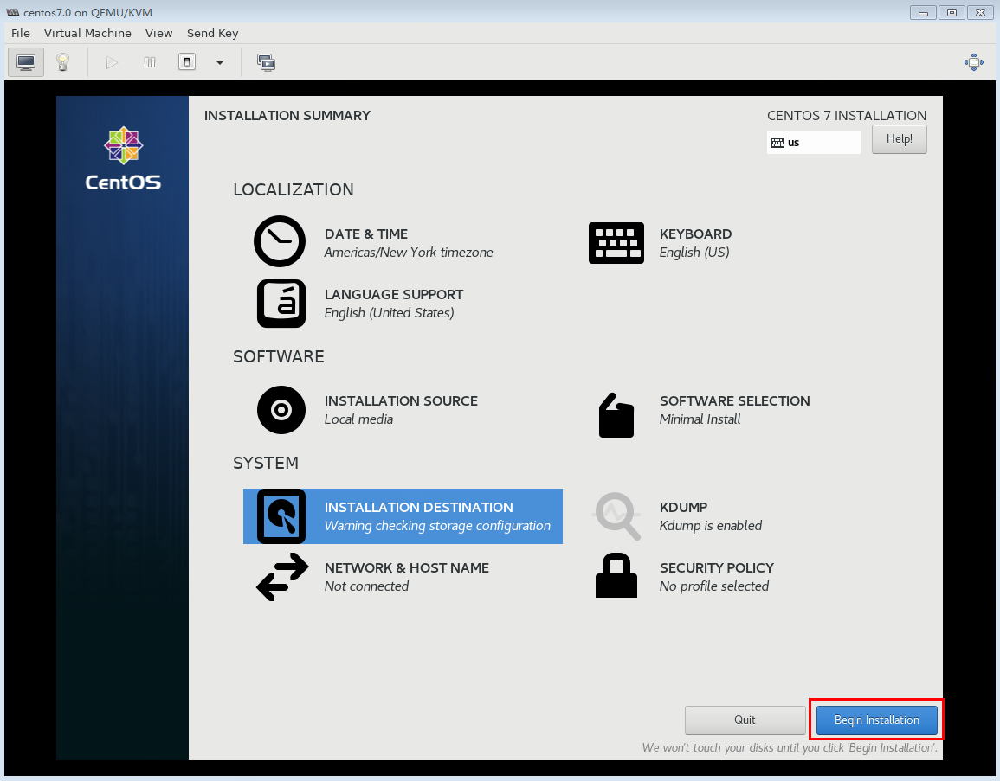<br>
Set the user password and user to complete installation, and then click **reboot** to reboot the system. After system reboot, we enter the CentOS system just installed. Choose the first start option.
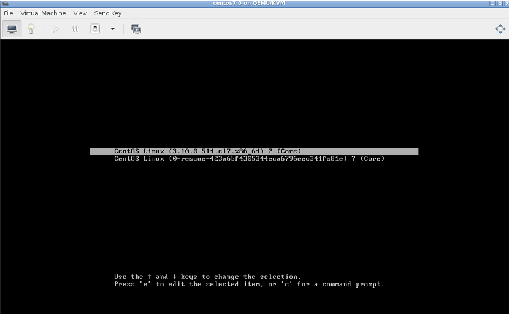<br>
At this point, Centos 7 is completely installed.

### 3. Install VirtIO drive program

For the specific installation method, please refer to [install virtio driver](https://docs.jdcloud.com/en/virtual-machines/install-virtio-driver).

### 4. Configure the software environment required by JD Cloud
Please refer to [private image imporation](https://docs.jdcloud.com/en/virtual-machines/import-private-image), check and configure the system environment, and install the [public image system component](https://docs.jdcloud.com/en/virtual-machines/default-agent-in-public-image).

### 5. Get image files
Open the virt-manager and the hardware configuration page, open the icon with lamp bulb, and choose the left disk option. The right "Source path" is image file path.

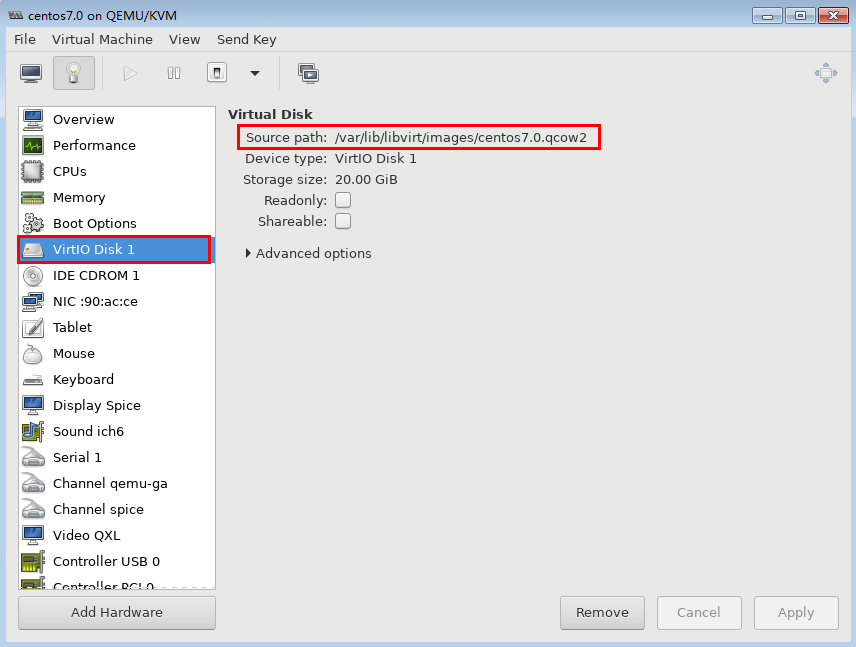<br>

