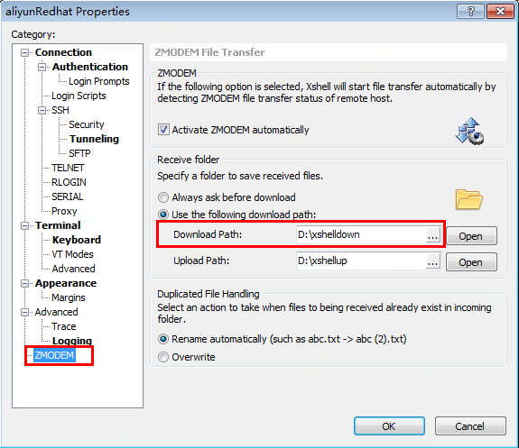
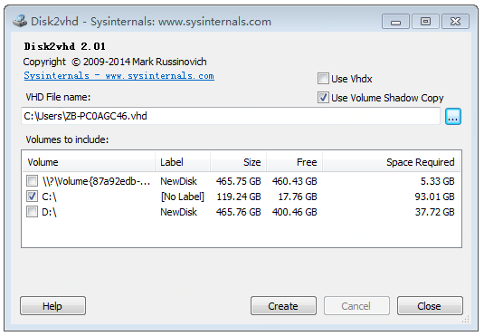

# Convert the image format
The supported formats of imported images are QCOW2, RAW, VHD and VMDK, and if your image file is in other formats, you need to convert the image into any of the above-mentioned four types before importation.

Before exporting an image, please refer to [private image importation](https://docs.jdcloud.com/en/virtual-machines/import-private-image) and use the [image self-inspection tool](https://docs.jdcloud.com/en/virtual-machines/image-check-tool), for ensuring that the current system configuration complies with JD Cloud’s image requirement.

## Linux System
The Linux system can export the system disk image and convert its format with qemu-img. The mutually convertible formats include: raw, qcow2, qcow, cow, vmdk and cloop.

### The exported system disk is an image file
1. Execute  `yum install qemu-img` (CentOS) or `apt-get install qemu-utils` (Ubuntu, and install qemu-img. Also, you can go to https://pkgs.org/download/qemu-img to download the installation package.

2. Through execution of the following instruction, a designated disk can be integrally exported as an image and stored under the designated directory.
```
qemu-img convert -O qcow2 /dev/vda /mnt/vdb/image_out.qcow2
```
Where,
* -O is used to designate the target image format (in the example: qcow2), the source disk exported as image (in the example: /dev/vda), target image file name and storage path (in the example: /mnt/vdb/image_out.qcow2)

3. If Xshell is used as the local remote connect tool, lrzsz can be installed. The file is firstly compressed (the compressed file shall be smaller than 4GB), and then downloaded to the directory set in Xshell.
```
yum -y install lrzsz
tar -zcvf image_out.tar.gz image_out.qcow2
sz image_out.tar.gz
```

<br>

### Convert the image file format
qemu-img can be made to execute the following instruction to convert the format of the designated image file, if the image file format is not within those supported by JD Cloud.
```
qemu-img convert -f raw -O qcow2 image.raw image_out.qcow2
```
Where,
* -f is used to designate the format of the source image file (in the example: raw)
* -O is used to designate the target image format (in the example: qcow2), source image file name (in the example: image.raw) and target image file name (in the example: image_out.qcow2)
2. Execute the following instruction to view the generated image information.
```
qemu-img info image_out.qcow2
```

## Windows System
The Windows system can export the image in VHD format with [Disk2vhd](https://docs.microsoft.com/en-us/sysinternals/downloads/disk2vhd) provided by Microsoft official website, and if the image file is in other formats, qemu-img (for windows) can be used to conduct format conversion.

### The exported system disk is an image file
1. Go to download and install [Disk2vhd](https://docs.microsoft.com/en-us/sysinternals/downloads/disk2vhd)

2. After decompression, execute disk2vhd.exe. So, the following interface is displayed. Designate the storage path and file name, tick the system disk, and untick "use Vhdx", and thereafter click **Create** to export the system disk image in VHD format.

<br>

### Convert the image file format
1. Go to downland [qemu-img-windows](https://cloudbase.it/qemu-img-windows/)

2. Place the decompressed file (including .exe files and .dll files) in the folder of image files

3, In powershell, enter the folder of image files, and execute the following instruction for format conversion. So, the target Image will be saved in the directory of source images.
```
.\qemu-img.exe convert -f raw -O qcow2 image.raw image_out.qcow2
```
Where,
* -f is used to designate the format of the source image file (in the example: raw)
* -O is used to designate the target image format (in the example: qcow2), source image file name (in the example: image.raw) and target image file name (in the example: image_out.qcow2)

4. Execute the following instruction to view the generated image information.
```
.\qemu-img.exe info image_out.qcow2
```
