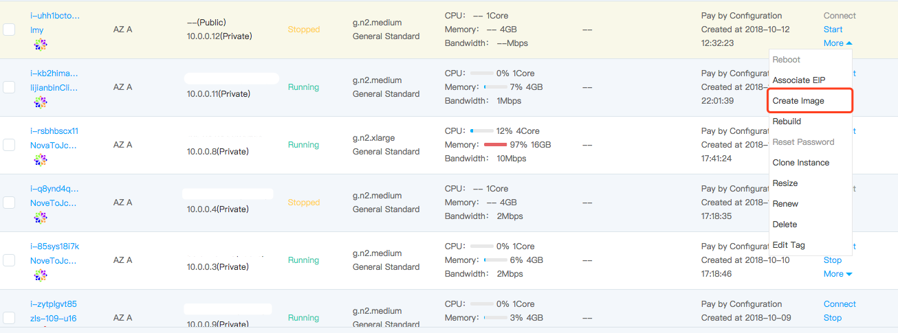
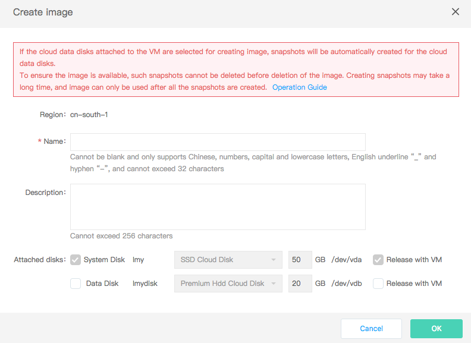

# Create a Private Image Based on an Instance
You can create a private image from an instance created as required, and use this image to launch more instances with the same operating system, pre-installed software, and related configurations as the original instance.

## Precondition
* To ensure data integrity, only instances in the "Stopped" status are supported for creating private images.
* You must ensure that the image and cloud disk snapshot quotas are sufficient, because if the instance system disk is a cloud disk or the instance attaches a data disk, it will take up the private image quotas and the cloud disk snapshot quotas.

		Note:
		* In the Linux system, if the instance has an auto-attach command configured in /etc/fstab, it shall delete the relevant auto-attach command prior to creating the private image, otherwise the instance created from its private image may not start properly.
		If the current instance's system disk is local disk, then the created private image is local system disk image; If the current instance's system disk is cloud disk, then the created private image is cloud system disk image. You can convert a local system disk image to a cloud system disk image by [Image Type Conversion](Convert-Image.md).

## Operation Steps
1. Access [Virtual Machines Console][1] to enter the instance list page. Or access [JD Cloud Console][2] Click navigation bar on the left **Elastic Compute** - **Virtual Machines** - **Instance** to enter the instance list page.
2. Select the instance which you want to create a private image and click**More**-**Create Image**.

3. In the pop-up window of create images, supplement the "Name" and "Description" of the private image，click **OK** to start the creation of the private image.
4. In addition to backing up the system disk, you can choose a data disk currently attached to the backup instance to create an image. The data disk will be associated with the system disk image in the form of a snapshot and displayed in the "Device Mapping Information" on the private image detail page. The "Device Mapping Information" will be the preset configuration of the data disk for instance creation using this private image, which makes it easy to quickly deploy the entire VM. If you want to modify the capacity of the data disk, you can adjust it when you create a VM based on that image. Click here for details on the data disk [Device Name Assignment Rules](../Operation-Guide/Cloud-Disk/Assign-Device-Name.md).
5. It takes a long time to make the entire image that contains data of system disk and data disks. In order to avoid the failure, please stop other operations on the VM and the cloud disk during the production process, and ensure that the current instance and the cloud disk snapshot have sufficient quotas.

6. The submitted private image is created successfully into "Available" status after passing through the two intermediate statuses of "Pending" and "Replicating", then it can be used normally. In the intermediate status, operations of **Share**, **Create instance**, and **Delete** on the image are not allowable.

7. In the process of image creating, any resource's failed creation will cause the image to be in the "Error" status. If data disks attached to the instance are selected to create the image that contains data of system disk and data disks, all the snapshots created by the operation will be automatically deleted after the operation failed, but the private image could be deleted after your confirmation.

 
 
## Related Reference
 
[Image Type Conversion](Convert-Image.md)
 
[Device Name Assignment Rule](../Operation-Guide/Cloud-Disk/Assign-Device-Name.md)

  [1]: https://cns-console.jdcloud.com/
  [2]: https://console.jdcloud.com/
  [3]: ./images/Operation-Guide-Image-create1.png "Operation-Guide-Image-create1.png"
  [4]: ./images/Operation-Guide-Image-create2.png "Operation-Guide-Image-create2.png"
  [5]: ./images/Operation-Guide-Image-create3.png "Operation-Guide-Image-create3.png"

  [6]: ./images/Operation-Guide-Image-create4.png "Operation-Guide-Image-create4.png"