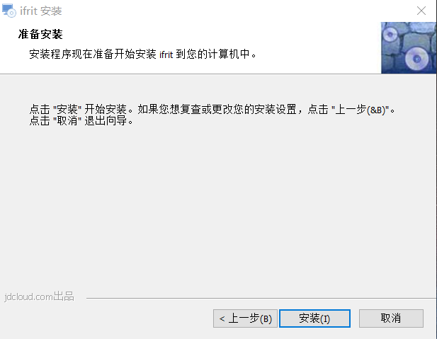
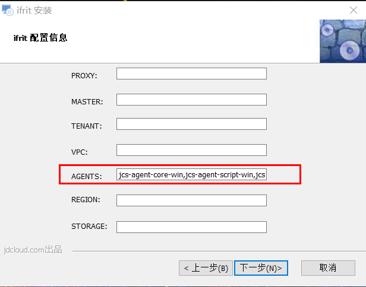
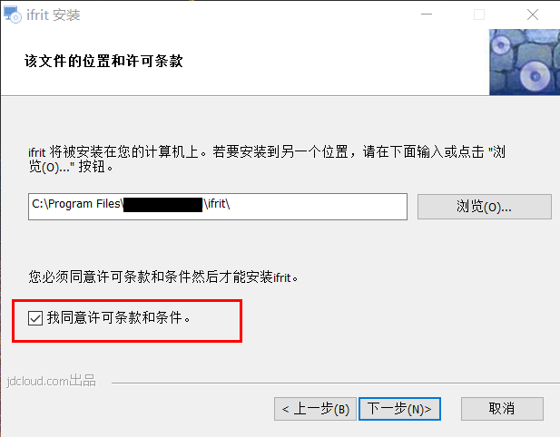
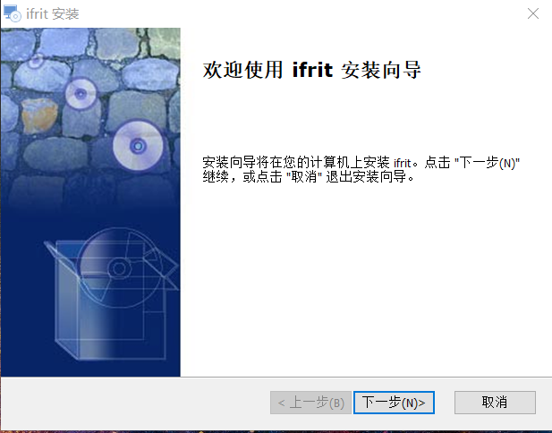
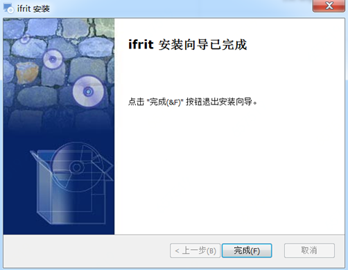

# Components of Public Image System
The following system components are installed by default in the Public Image to provide complete features and security monitoring in conjunction with corresponding services or products. It is recommended not to uninstall or disable the boot operation, otherwise it will cause partial feature loss.

Due to the objective factors of system upgrade and component upgrade, the following components may not be installed in the early Public Image. It is recommended that you check the current system installation status and complete the installation one by one.

    * Notification:
      ifrit can automatically install and update JCS-Agent. In the scenario of importing image/image component update, it is recommended that you refer to the following instructions and install ifrit directly on the premise that the cloud-init and QGA in the Virtual Machines have been uninstalled. After the installation, wait up to 10 minutes for the installation or update of JCS-Agent.
    

| Component Name    | Relevant Process Name    | Main Feature     | Influence when it is not installed    |
| --- | --- | --- | --- |
|   JCS-Agent  | JCSAgentCore <br> MonitorPlugin-‘Version Number’  <br>  UpgradePlugin-‘Version Number’  | General core components provide password key injection, customized script injection, monitoring data reporting and other features  in cooperation metadata service    |  It is impossible to set passwords, keys and customized user data through JD Cloud Console or openAPI, and some VM Monitoring data cannot be obtained   |
| Ifrit    |  ifrit-agent <br> ifrit-supervise   |   General deployment plug-in, realizing automatic upgrade of JCS-Agent	  |  Unable to obtain the capability of  automatic upgrade of JCS-Agent, if you want to use the new feature developed based on JCS-Agent in the future, you need to upgrade JCS-Agent manually   |
|  Jcloudhids   |jcloudhids <br> jcloudhidsupdate    | Security core components provide security protection capability    | Unable to monitor the security hazards and abnormal behavior of Virtual Machines through "Endpoint Security" products   |
| Jdog-Monitor |	jdog-monitor.’Version Number'<br>jdog-watchdog<br>jdog-kunlunmirror| Security auxiliary plug-in, realizing automatic upgrade of Jcloudhids (currently only installed on Linux system|Unable to obtain the capability of automatic upgrade of Jcloudhids, if you want to use the new feature developed based on Jcloudhids in the future, you need to upgrade manually|

* [JCS-Agent](default-agent-in-public-image#user-content-1)
* [Ifrit](default-agent-in-public-image#user-content-2)
* [Jcloudhids](default-agent-in-public-image#user-content-3)
* [Jdog-Monitor](default-agent-in-public-image#user-content-4)


<div id="user-content-1"></div>

## JCS-Agent
### Component Introduction
JCS-Agent is the core component of Virtual Machines developed by JD Cloud, which can provide features such as basic information (password, key) injection of Virtual Machines, user data injection, KSM activation of Windows system, monitoring data report.

Public Image was upgraded from August to December 2018, completing the default installation of JCS-Agent. cloud-init and qemu-guest-agent were installed in the early Public Image. Such images still have features such as the basic endpoint information injection, monitoring and reporting, but the user data injection, KMS activation in Windows system and the following additional features cannot be supported. If you are currently using early agent, it is recommended that you change to JCS-Agent (if the version of JCS-Agent you are currently using is lower than 1.0.728, it is recommended that you follow the following steps to install the new version, so as to obtain the automatic upgrade management feature of Ifrit).

JCS-Agent of Cloud Marketplacet Image Installation depends on the release time of the image (Public Image production based on which version) and the production status of the service provider. If you rely on some special features provided by JCS-Agent, please consult the Cloud Marketplace to confirm the status of agent in image before using.

### Installation Preparation
#### Uninstall conflicting software
***If the image you are using is the imported image of JD Cloud’s external environment, and cloud-init or qemu-guest-agent has been installed before the import, please be sure to install after uninstalling!***

If there is a prompt that the software is not installed when uninstalling, it means that the current system is not installed with the software, and there is no need for subsequent configuration files and log cleaning. It is also recommended to run 'ps-ef' to see if the service has been cleaned up after uninstalling.

② cloudinit uninstall clean:<br>
CentOS：`rpm -e cloud-init`、`rm -rf /etc/conf/cloud/*`、`rm -rf /var/lib/cloud/*`<br>
Ubuntu：` apt-get purge cloud-init`  <br>
Windows: **Control Panel** — **Program**, find loudbase-Init, and right-click **Uninstall

② qemu-guest-qgent uninstall clean:<br>
CentOS：`rpm -e qemu-guest-agent`、`rm -fr /var/log/qemu-ga` <br>
Ubuntu：`apt-get purge qemu-guest-agent` <br>
Windows: **Control Panel** — **Program**, find qemu-guest-agent, and right-click **Uninstall

#### View Current Software Revision
Get JCS-Agent version number by viewing the version of the monitoring plug-in.<br>
Linux：`ps -ef|grep MonitorPlugin`<br>
Windows：`wmic process where caption="MonitorPlugin.exe" get caption,commandline /value`

### Installation Mode
**(It is recommended that you should [Install ifrit](default-agent-in-public-image#user-content-2) which will automatically pull up JCS-Agent. You can skip the following installation steps by this way.)**

**Linux：**<br>
1. Download the following installation package and installation script to the same directory (for example: /root/jcloud).<br>
If the machine is not associated with any EIP, it is necessary to download it in the Intranet environment. Please replace bucket address "bj" and the region parameter "cn-north-1" in the link with codes of region where the machine is located: "gz", "cn-south-1", "sq", "cn-east-1", "sh" and "cn-east-2", and change "s3" in the domain to "s3-internal".<br>
https://bj-jcs-agent-linux.s3.cn-north-1.jdcloud-oss.com/jcloud-jcs-agent-linux-deploy.py <br>
https://bj-jcs-agent-linux.s3.cn-north-1.jdcloud-oss.com/jcloud-jcs-agent-linux.zip <br>

2. Execute the following instructions under the download directory and uninstall the older version。 (**this step is used for updating JCS-Agent and can be skipped if no installation is carried out**)<br>
```
python jcloud-jcs-agent-linux-deploy.py uninstall
```

3. Execute the following instructions under the download directory and install the latest version.<br>
```
python jcloud-jcs-agent-linux-deploy.py install
```

4. Execute `ps -ef` and installation is successful when seeing there processes of UpgradePlugin, MonitorPlugin and JCSAgentCore. After successful installation, you can delete the installation package and the installation script.

**Windows:**<br>
1. Download the installation package, installation script and MD5 tools to the same directory (for example: C:\jcloud).<br>
If the machine is not associated with any EIP, it is necessary to download it in the Intranet environment. Please replace region parameter "cn-north-1" in the link with codes of region where the machine is located: "cn-south-1", "cn-east-1", "cn-east-2" and change "s3" in the domain to "s3-internal".<br>
https://bj-jcs-agent-windows.s3.cn-north-1.jdcloud-oss.com/jcloud-jcs-agent-windows-manual.zip <br>
https://bj-jcs-agent-windows.s3.cn-north-1.jdcloud-oss.com/jcloud-jcs-agent-win-deploy.ps1 <br>
https://bj-jcs-agent-windows.s3.cn-north-1.jdcloud-oss.com/MD5.exe <br>

2. Execute the following instructions when powershell is used in the download directory and uninstall the older version (**this step is used for updating JCS-Agent and can be skipped if no installation is carried out**)<br>
```
.\jcloud-jcs-agent-win-deploy.ps1 uninstall
```
3. Open powershll and go to the directory where the installation package is located (C:\jcloud), execute the following command to install
```
.\jcloud-jcs-agent-win-deploy.ps1 install
```

4. Execute `ps -ef` command and installation is successful when seeing there processes of UpgradePlugin, MonitorPlugin and JCSAgentCore. After successful installation, you can delete the installation package, the installation script and MD5 tools.


<div id="user-content-2"></div>

## Ifrit
### Component Introduction
Ifrit is a lightweight and general deployment, operation and maintenance tool developed by JD Cloud, which can realize the deployment, upgrade, unload and other management operations of its managed components. Ifrit is cooperate with JCS-Agent to realize automatic upgrade of JCS-Agent.

The Public Image will be upgraded from May to July 2019 gradually to complete the default installation of Ifrit. Cloud Marketplacet Image Installation depends on the release time of the image (Public Image production based on which version) and the production status of the service provider. Please consult the Cloud Marketplace for details.

### Installation Mode
**Linux：** <br>
* Public Network/Internet Environment:<br>
```
wget -c http://devops-hb.s3.cn-north-1.jdcloud-oss.com/ifrit/ifrit-agent-external-v0.01.465.534ae3d.20190523181914.bin -O installer && sh installer -- -a jcs-agent-core,jcs-agent-script,jcs-agent-monitor -O /usr/local/share/jcloud/ifrit && rm -f installer
```

* Intranet Environment of JD Cloud<br>
```
curl -fsSL http://deploy-code-vpc.jdcloud.com/dl-ifrit-agents/install_jcs | bash
```

**Windows:** <br>
* Public Network/Internet Environment:<br>
```
($client = new-object System.Net.WebClient) -and ($client.DownloadFile('http://devops-hb.s3.cn-north-1.jdcloud-oss.com/ifrit/ifrit-external-v0.01.461.56ff760.20190517095556.exe', 'c:\ifrit.exe')) -or (Start-Process 'c:\ifrit.exe')
```

* Intranet Environment of JD Cloud<br>

① cn-north-1:<br>
```
($client = new-object System.Net.WebClient) -and ($client.DownloadFile('http://devops-hb.s3-internal.cn-north-1.jdcloud-oss.com/ifrit/ifrit-external-v0.01.461.56ff760.20190517095556.exe', 'c:\ifrit.exe')) -or (Start-Process 'c:\ifrit.exe')
```

② cn-east-2:<br>
```
($client = new-object System.Net.WebClient) -and ($client.DownloadFile('http://devops-hd.s3-internal.cn-east-2.jdcloud-oss.com/ifrit/ifrit-external-v0.01.461.56ff760.20190517095556.exe', 'c:\ifrit.exe')) -or (Start-Process 'c:\ifrit.exe')
```

③ cn-east-1:<br>
```
($client = new-object System.Net.WebClient) -and ($client.DownloadFile('http://devops-sq.s3-internal.cn-east-1.jdcloud-oss.com/ifrit/ifrit-external-v0.01.461.56ff760.20190517095556.exe', 'c:\ifrit.exe')) -or (Start-Process 'c:\ifrit.exe')
```

④ cn-south-1:<br>
```
($client = new-object System.Net.WebClient) -and ($client.DownloadFile('http://devops.s3-internal.cn-south-1.jdcloud-oss.com/ifrit/ifrit-external-v0.01.461.56ff760.20190517095556.exe', 'c:\ifrit.exe')) -or (Start-Process 'c:\ifrit.exe')
```

Click **Next** in the Installation Guide; in the configuration information page, you only need to fill in AGENTS configuration: jcs-agent-core-win,jcs-agent-script-win,jcs-agent-monitor-win, and need not to fill in other configurations, which should be use default values.




Customized installation path is not supported currently. Check "I agree to the terms and conditions of the license" and click **Next**.



Click **Installation** to complete the ifrit installation.





<div id="user-content-3"></div>

## Jcloudhids
### Component Introduction
Jcloudhids is the core component of Endpoint Security provided by JD Cloud, is the core of security monitoring and prevention features realized by "Endpoint Security" products, which can provide security features such as Anti-brute Force, Abnormal Login Detection, High-risk Vulnerability Detection. Please refer to: https://www.jdcloud.com/en/products/endpoint-security for Endpoint Security products

Jcloudhids is installed in Public Image by default. Cloud Marketplacet Image Installation depends on the production status of the service provider. If the feature of image overlaps or conflicts with the feature of Jcloudhidsns, installation of Jcloudhids for the image is not mandatory. Please consult the Cloud Marketplace for details.

### Installation Mode
Please refer to: https://docs.jdcloud.com/en/endpoint-security/getting-started


<div id="user-content-4"></div>

## Jdog-Monitor
### Component Introduction
Jdog-Monitor is the upgrade plug-in provided by JD Cloud for the core security components to realize maintenance and upgrade for security related components.

### Installation Mode
**Linux：**<br>

1. Download installation package: (download after associating EIP for non-north China regional endpoint)<br>
https://iaas-cns-download.s3.cn-north-1.jdcloud-oss.com/JdogMonitor/jdog-op-agent-master-7a35746b-0709091136.tar <br>

2. Run the following instructions for installation.<br>
```
mkdir -p /usr/local/share/jcloud/jdog-monitor
tar zxvf jdog-op-agent-master-7a35746b-0709091136.tar -C /usr/local/share/jcloud/jdog-monitor
/usr/local/share/jcloud/jdog-monitor/scripts/jdog_service install
```

**Windows：**<br>
1. Download installation package: (download after associating EIP for non-north China regional endpoint)<br>
https://iaas-cns-download.s3.cn-north-1.jdcloud-oss.com/JdogMonitor/jdog-monitor.exe <br>

2. Run and install jdog-monitor.exe with the permission of administrator.

