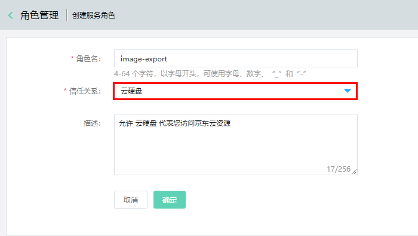
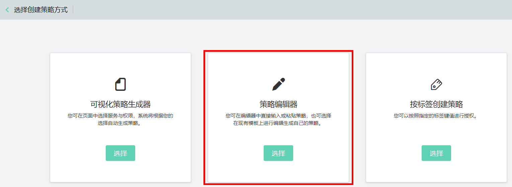
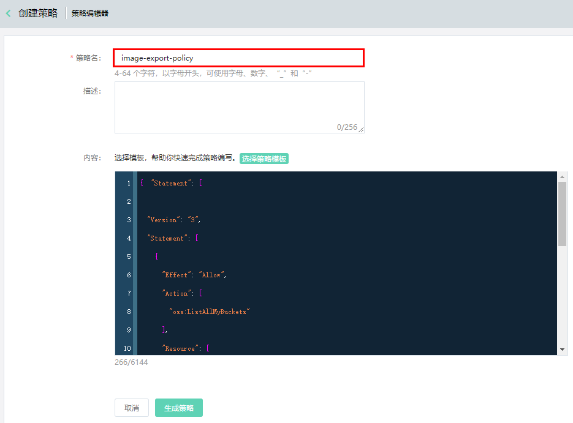
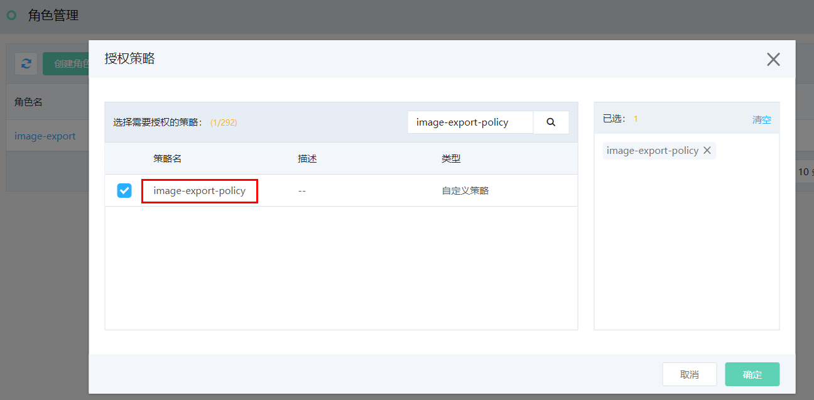
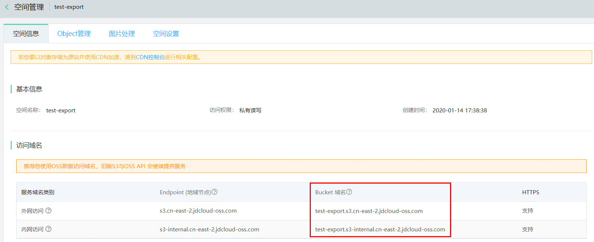

# Private Image Export

## Function Overview
Private image export refers to exporting the private image you make in the JD Cloud & AI environment to the JD Cloud & AI OSS bucket in the same region. After exported, the image file can be downloaded at any time for deployment in other environments.

	* Note:
	  1. The export function is currently only supported in cn-east-2 region. If you need to export images in other regions, please copy the images to cn-east-2 before exporting
	  2. Only the system disk image export is supported. Even if the image is associated with data disk snapshot, only the system disk image file will be exported
	  3. The format of the exported image file is QCOW2

## Preconditions
### Service Role Requirements
* Because the export image needs to operate on your OSS bucket, you need to create a service role and grant corresponding access permission to the system. Please refer to the instructions in the following operation steps to create.

### Image Requirements
* Image must be in "available" status, and images in error or other medium status cannot be exported;
* Images of Windows Server operating system cannot be exported (images derived from import images have no such limitation);
* Images must be your private images. Originals of public images, Cloud Marketplace images or images shared to you by others cannot directly exported even if they have permission;
* Images must be "cloud disk system disk" images. If your images are "local disk system disk" images, you can convert them to "cloud disk system disk" images through function of [Convert Image Type](https://docs.jdcloud.com/en/virtual-machines/convert-image) and then export them.


### OSS Requirements
* Before export operations, please ensure the OSS is enabled and there is available bucket in the **Region** where the image is located in.

## Export Steps


### 1. Confirm OSS bucket<br>
Images can only be exported to OSS bucket in the same region. Therefore, if private images in multiple regions need to be exported, please confirm that there is bucket that can store image files in each region (currently only support cn-east-2 region). <br>For Bucket creation, please refer to [Create Bucket](https://docs.jdcloud.com/en/object-storage-service/create-bucket-2).<br>
### 2. Create service role<br>
Access [Role Management Console](https://iam-console.jdcloud.com/role/list), or access [JD Cloud & AI Console](https://console.jdcloud.com/overview) successively click **Management** - **IAM** - **Role Management** in the top [Cloud Service] menu to go to the role management page.<br>


Click ** Create Role**, select "Service Role", and on the role creation page, customize the service role name, e.g.: image-export, the role name should be provided as a required parameter when exported. <br>In the trust relationship, select "Cloud Disk Service" (Cloud disk system disk is Cloud Disk Snapshot in nature, so the Cloud Disk Service will write image files in OSS on behalf of you in the final export operations).<br>


### 3. Create policy for service role<br>
Access [Policy Management Console](https://iam-console.jdcloud.com/policy/list), or access [JD Cloud & AI Console](https://console.jdcloud.com/overview) successively click **Management** - **IAM** - **Policy Management** in the top [Cloud Service] menu to go to the policy management page.

Click **Create Policy**, select "Policy Editor", and on the policy creation page, customize the policy name, e.g.: image-export-policy. Copy the following policy template in JSON format to the content input area.<br>
  
  

**Note:<br>
  ① Replace "3241xxxx0385" in the template with your account ID (view account ID in [Account Basic Information](https://uc.jdcloud.com/account/basic-info)); <br> ② Replace "image-export-bucket" in the template with the name of bucket you expect to store the image file. If Buckets need authorization for access in multiple areas, you can directly add as per this format.**
  
```
{
  "Version": "3",
  "Statement": [
    {
      "Effect": "Allow",
      "Action": [
        "oss:ListAllMyBuckets"
      ],
      "Resource": [
        "*"
      ]
    },
    {
      "Effect": "Allow",
      "Action": [
        "oss:GetObject",
        "oss:AbortMultipartUpload",
        "oss:PutObject",
        "oss:ListMultipartUploadParts"
      ],
      "Resource": [
        "jrn:oss:*:3241xxxx0385:image-export-bucket/*"
      ]
    }
  ]
}
```

### 4. Authorize policy for service role<br>
Return to role management list, find the service role "image-export" created in Step 2, and click **Authorize** in the operations.
  

In the authorization popup, find and select the policy "image-export-policy" created in Step 3, and click **OK** to complete the authorization. You can go to the role details to confirm if the authorization succeeded.
  

      Notification: If you want to authorize system services only during the export operation, you can retain the service role and policy, make authorization before each export, and release the authorization after the export.
      
### 5. Export image
Since no Console operation entry is provided for the current image export function, please complete import by referring to the openAPI document and using CLI and SDK after completing the above-mentioned operating steps.<br>
After the export task is submitted successfully, remember the 'exportTaskId' returned by the API in order to call task inquiry API to get information of export progress.
* For OpenAPI document, see: [Image Export](https://docs.jdcloud.com/en/virtual-machines/api/exportimage?content=API)<br>
* For CLI installation and configuration, please see [CLI Installation](https://docs.jdcloud.com/en/cli/installation) [CLI Configuration](https://docs.jdcloud.com/en/cli/config) <br>
* Meaning of CLI instruction:

```
jdc vm export-image --region-id cn-east-2 --image-id img-xxxxxxx --role-name image-export --oss-url https://test-export.s3-internal.cn-east-2.jdcloud-oss.com --oss-prefix jdcloud
```

#### APIs Parameter Description:
In terms of parameters, a full **Intranet Domain** (including ‘https://’) of OSS Bucket shall be entered in ossUrl as shown in the following figure; please enter 'https://test-export.s3-internal.cn-east-2.jdcloud-oss.com' in ossUrl.
  

| Parameter                  | Type      |Compulsory or Not     | Description |
| :------------------- |  :------------------- | :------------------- |:------------------- |
| roleName   | string    |Yes   |Service role name created for exporting images
| ossUrl   | string    |Yes   |OSS Bucket internal network Domain used to store image files in the same region as image, please complete URL that has added 'https://'
| ossPrefix   |  string    |No  |Customized prefix of image file to be exported, if '123' is filled in, the exported image Object name is '123_exportImage_*img-xxxxxx*'. Support uppercase and lowercase English and numbers, which cannot exceed 32 characters.
| clientToken	 | string    | No   | Idempotence guarantee for users exporting images. If the uploaded parameter value is the same as a clientToken, it will be considered as the same request and will return the same request result. The length cannot be more than 64 characters

## View export progress
After the image export request is submitted, you can view the export progress via the image task search API.
* For OpenAPI document, see: [Search Image Task](https://docs.jdcloud.com/en/virtual-machines/api/imagetasks?content=API)<br>
* Meaning of CLI instruction:

```
jdc vm image-tasks --region-id cn-east-2 --task-action ExportImage --input-json '{"taskIds":[xxx]}'
```

## Related References

[Convert Image Type](https://docs.jdcloud.com/en/virtual-machines/convert-image)

[Create OSS Bucket](https://docs.jdcloud.com/en/object-storage-service/create-bucket-2)

[Service Role](https://docs.jdcloud.com/en/iam/role)

[Image Export OpenAPI](https://docs.jdcloud.com/en/virtual-machines/api/exportimage?content=API)

[Search Image Task OpenAPI](https://docs.jdcloud.com/en/virtual-machines/api/imagetasks?content=API)

[CLI Installation](https://docs.jdcloud.com/en/cli/installation)   

[CLI Configuration](https://docs.jdcloud.com/en/cli/config)

