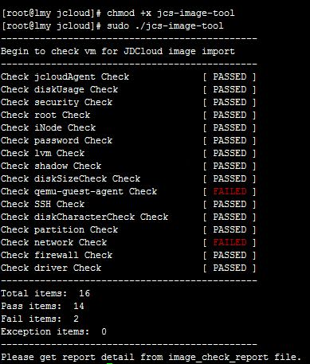

# Image self-inspection tool
For the Linux system, you can use the image self-inspection tool provided by JD Cloud, and before an image is exported from the external environment, test the key system configuration by running the self-inspection tool, and make adjustment based on the test report.

To guarantee the availability and usability of imported images as far as possible, the system tests the key configuration in an image when it is imported, and such importation will fail in case of noncompliance. Therefore, you are suggested to, before producing the imported image, refer to the basic image requirement in [private image importation](https://docs.jdcloud.com/en/virtual-machines/import-private-image) to confirm the system configuration, and use the image self-inspection tool to check the main configurations.

## Applicable System
The definitely supported operating systems are: CentOS, Ubuntu, Debian, SLES (SUSE Linux Enterprise Server), OpenSUSE, RedHat and other Linux released versions.

## Operation Instructions
1. Log in the server which you hope to make and from which images will be exported.<br>
2. Download the image self-inspection tool: https://iaas-cns-download.oss.cn-north-1.jcloudcs.com/jcs-image-tool <br>
3. In a downloaded directory, give the test tool execution permission, and then carry out the test with root accounts. 
```
chmod +x jcs-image-tool
sudo ./jcs-image-tool
```

4. Wait for the test result.



5. After the test is completed, a test report will be automatically generated in the running directory, and will be identified with the specific ending time, for example, image_check_report_2019-03-26_16:02:03. To learn the reason why a test item isn’t passed, view the test report.

## Description about Test Items

| Test Item                  | Test Requirement      |Noncompliant Result     | Suggested Operation |
| :------------------- |  :------------------- | :------------------- |:------------------- |
|jcloudAgent      | Correctly install JCS-Agent     | Passwords, key pairs and customized data cannot be written; the monitoring data of instance machines cannot be reported     | Correctly install JCS-Agent. Please refer to [public image system component](https://docs.jdcloud.com/en/virtual-machines/default-agent-in-public-image)
| iNode       |The utilization rate of inode is no more than 98%	      | the space may be insufficient, if there are other tasks using the system space after an instance is enabled     |reserve sufficient inode resources
|security      |The SELinux service hasn’t been enabled      |instances cannot be anomaly started      |don’t enable SELinux by modifying /etc/selinux/config
| diskSizeCheck    | The system disk cannot be bigger than 500GB      |  images cannot be imported    | adjust the system disk capacity and then create images
| SSH     |The SSH service has been enabled      |  instances cannot be remotely connected from the Console, and instances cannot be remotely logged in to through SSH    |Enable the SSH service
| password     | The passwd command exists     | the user-set password cannot be added     |reserve the passwd command
|root      | The root account exists     |instances cannot be remotely connected with the password or key pairs used during instance creation or be logged in to by SSH	      |reserve the root account
|shadow     |  The file permission root is readable and writable     | passwords, key pairs and customized data cannot be written     |it is guaranteed that the root user has the read-write permission
| diskUsage     | The utilization rate of the disc shall not be more than 98%     |  the space may be insufficient, if there are other tasks using the system space after an instance is enabled     |set a sufficient disk capacity when an instance is created with imported images, for guaranteeing that the service runs normally.
| qemu-guest-agent	     | qemu-guest-agent hasn’t been installed     |  it may be caused that an important system component JCS-Agent cannot run normally    uninstall qemu-guest-agent
| lvm     |LVM isn’t used      | instances cannot be normally enabled     |LVM isn’t used  
| partition     | MBR partition is adopted     | instances cannot be normally enabled     |MBR partition is adopted
|  diskCharacterCheck    |Correctly configure fstab  | instances cannot be normally enabled     | configure automatic mount in the form of /dev/vda or uuid
| network     | NetworkManager	 hasn’t been enabled     |the network may be unavailable due to its conflicting with network service      |disable or delete NetworkManager
| firewall      |The iptables service has been disabled      | if the access policy configured under the JD Cloud environment fails, some internal services may not be able to normally run due to access limitation     |disable the firewall
| driver     | The virtio driver has been compiled into the kernel or as an kernel module     |  instances cannot be normally enabled    |  [install the virtio driver](https://docs.jdcloud.com/en/virtual-machines/install-virtio-driver)

