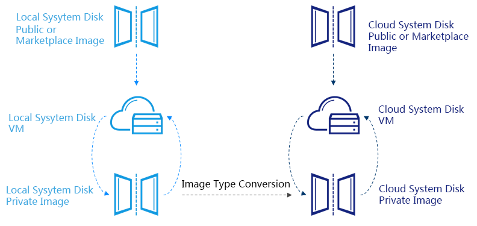

# Image Type
The image can be divided into two types of local system disk image and cloud system disk image from the image architectural pattern;
From the source and the usage rights of image, the image can be divided into four types of public image, private image, shared image and cloud marketplace image.
## Classification of Architectural Pattern
Both the public image and the cloud marketplace image provide two architectural patterns of images, while the architecture of the private image depends on the system disk type (local disk or cloud disk) of the Virtual Machines used to make the image.  
During creating the Virtual Machines by using an image and creating a private image based on the Virtual Machines, the architectural pattern of the image is inherited and cannot be changed. If you want to create the cloud system disk Virtual Machines based on the existing local system disk image, you can generate a cloud system disk image based on the local system disk image through [Image Type Conversion](Convert-Image.md), and then create the Virtual Machines.

### Local System Disk Image
The local system disk image can only be used to create the VMs with a local disk as the system disk. In its device mapping information, /dev/vda references the image file of local system disk, and the rest of the device information references the snapshot file of data disk.
### Cloud System Disk Image
The cloud system disk image can only be used to create the VMs with the system disk as a cloud disk. In its device mapping information, /dev/vda references the snapshot file of cloud system disk, and the rest of the device information references the snapshot file of data disk.

## Classification of Source and Usage Rights
### Public Image
The public Image is provided and maintained by JD Cloud. It provides basic operating system, initialization components and some pre-installed software based on multiple distributions of Linux and Windows(License is currently free for Windows image)provided by the upstream official distributor, which is available to all users.
### Private Image
The private image is a customized image created based on your own instance. You can create the image for an instance deployed with businesses and quickly create multiple instances with the same configuration and software environment based on this image. You can share the private image with other JD Cloud users, and the shared image will be displayed in the shared image list of the target user in the same region. The private image supports deletion and basic information modification.
### Shared Image
The shared image is a class of images that other JD Cloud users share their customized images with you through the image sharing function. The shared image can only be used to create an instance, while the basic information modification and deletion cannot be performed. If the shared user cancels the sharing, the image will be automatically deleted from your shared image list.
### Marketplace Image
The marketplace image is provided by the service providers in the cloud marketplace, integrating the environment or software for different business scenarios to make it easy for users to quickly deploy their businesses.
## Public Image Distributions
|   **Operating System**  |  **System Version**   |
| :--- | :--- |
|   Windows Server  |  2016 Data Center Edition Chinese version 2012 R2 Standard Edition Chinese version 2008 R2 Data Center Edition Chinese version|
|  CentOS   |  7.6、7.4、7.3、7.2、7.1、7.2  NAT Gateway 6.9、6.8、6.6、6.5   |
|   Ubuntu  |  16.04、14.04   |

**Note: The Public images provided by JD Cloud currently are 64-bit images**
## Image Usage Restrictions
Public Image: Available to all users.

Private Image: Only the creator and shared users can use it, and users can create no more than 5 private images in each region; users can share one image to no more than 5 JD Cloud users.

Shared Image: Only creators and shared objects can use it, and users can accept no more than 5 shared images per region.

Marketplace Image: Available to all users. You can create an instance through image selection in the console or cloud marketplace, or you can change the image to a marketplace image through Rebuild(../Instance/Rebuild-Instance.md).

## Related Reference

[Image Type Conversion](Convert-Image.md)

[Rebuild](../Instance/Rebuild-Instance.md)
