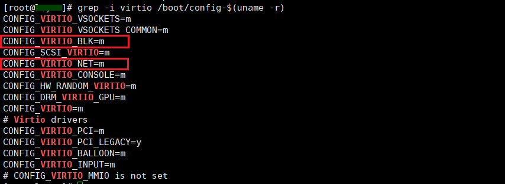
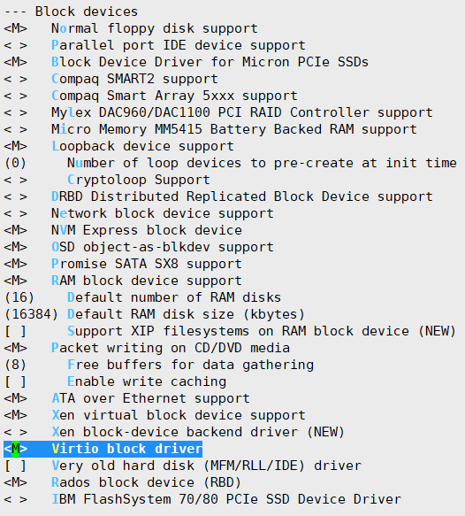
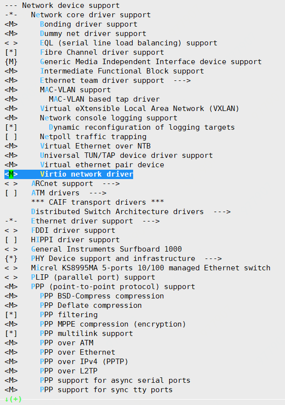
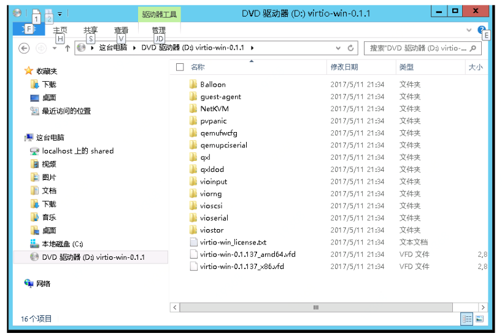
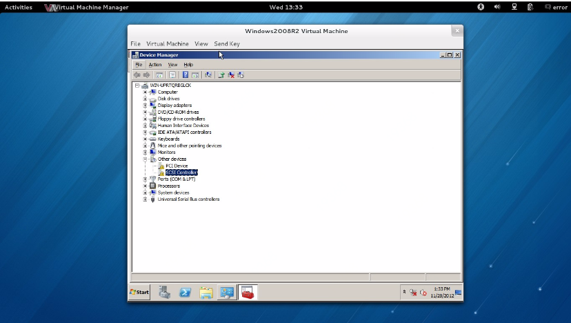
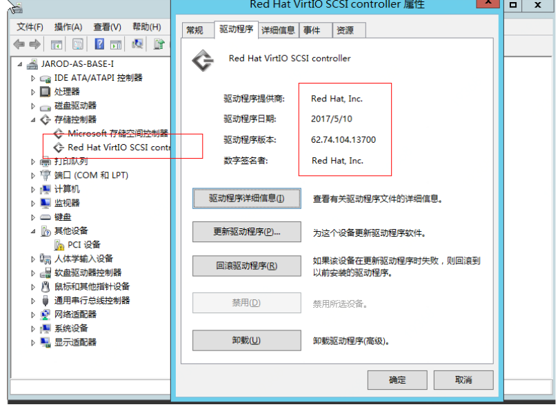

# Install virtio driver
To guarantee that you can successfully start the Virtual Machine after importing the private image, virtio drivers must be compiled in kernel or compiled as kernel module. You must ensure the system has been correctly installed virtio drivers before importing image.
## Linux System
Take CentOS7 series image for example to describe how to confirm that virtio drivers have been correctly installed in current system.<br>
① Run the following commands to check if the server kernel supports virtio drivers:<br>
```
grep -i virtio /boot/config-$(uname -r)
```

<br>
* If the value of parameters `CONFIG_VIRTIO_BLK` and `CONFIG_VIRTIO_NET` is y, it means that drivers have been compiled in kernel and it is unnecessary to execute the following operations, and you can import.
* If the value of parameters `CONFIG_VIRTIO_BLK` and `CONFIG_VIRTIO_NET` is m, it means that drivers have been compiled as kernel module. Please execute the following operation "②" to confirm whether virtio_blk drivers are included in initramfs (or initrd) files. If not, you need to produce the file again.
* If there is no information of `VIRTIO_BLK` and `VIRTIO_NET` in the output information, it means that relevant virtio drivers are not installed in this operating system and you need to compile and install virtio drivers. Please execute the following "③".

② Execute the following commands to confirm whether virtio drivers are included in the temporary file system initramfs or initrd (for Ubuntu system, please replace initramfs with initrd):<br>
```
lsinitrd /boot/initramfs-$(uname -r).img | grep virtio
```

<br>
If initramfs has already included `virtio_blk` drivers and `virtio.ko`, `virtio_pci.ko` and `virtio_ring.ko` on which they depend, it is unnecessary to execute the following operations.<br>
If there is no information of virtio in initramfs, you need to repair the temporary file system:<br>
A. CentOS 7/6
```
cp /boot/initramfs-$(uname -r).img /boot/initramfs-$(uname -r).img.bak
mkinitrd -f --with=virtio_blk --with=virtio_pci /boot/initramfs-$(uname -r).img $(uname -r)
```
B. Ubuntu
```
echo -e "virtio_pci\nvirtio_blk" >> /etc/initramfs-tools/modules
update-initramfs  -u
```

③ Compile and install virtio drivers:<br>
A. Download kernel installation package
* Install and compile necessary component of kernel:
```
yum install -y ncurses-devel gcc make wget
```
* Search kernel version used in current system:
```
uname -r
```
* Go to Linux kernel list page ( https://mirrors.edge.kernel.org/pub/linux/kernel/ ) to find the corresponding kernel version source code.
* Switch directory, download installation package (take 3.0 kernel for example) and decompress:
```
cd /usr/src/
wget https://mirrors.edge.kernel.org/pub/linux/kernel/v3.0/linux-3.10.tar.gz
tar -zxvf linux-3.10.tar.gz
```
* Build link:
```
ln -s linux-3.10 linux
```
* Switch directory:
```
cd /usr/src/linux
```
B. Compile kernel
* Clear files generated during previous compilation:
```
make mrproper
```
* Enter graphic configuration interface
```
make menuconfig
```

<br>
Select **Virtio block driver** in Device Drivers-->Block devices <br>
<br>

Select **Virtio network driver** in Device Drivers-->Network device support

* Complete module compilation (it may take 30~40 minutes, depending on server configuration)
```
make bzImage && make modules && make modules_install
```
* Installation
```
make install
```
* Run the following commands to view installation of virtio drivers. If any one of the commands output file lists such as virtio_blk, virtio_pci.virtio_console, it means that virtio drivers have been correctly installed.
```
find /lib/modules/"$(uname -r)"/ -name "virtio.*" | grep -E "virtio.*"
```

## Windows System
① Go to [Download iso Format virtio Software Package](https://docs.fedoraproject.org/en-US/quick-docs/creating-windows-virtual-machines-using-virtio-drivers/index.html) (take virtio-win-0.1.137.iso for example), various device drivers are included in iso files, such as network interface drivers (NetKVM), Disk drivers (virtsor), etc. <br>

② Copy the virtio-win-0.1.137.iso file to a directory in Windows virtual machines. You can copy ios files to the virtual machines by means of remote connecting sharing folder.<br>

③ Double click iso files and Windows will automatically mount them to DVD devices to read data. The right-side folder in the figure below is contents in iso software package, including various device drivers, e.g. NetKVM is a network interface driver.<br>
<br>

④ Find and open the "Device Manager" window in the control panel and you only need to install the following three set drivers:
* Storage Controller－Red Hat VirtIO SCSI controller
* Network Adapter－Red Hat VirtIO Ethernet Adpater
* Serial Device－Virtio Serial Driver

Open device manager. You will find three devices with yellow exclamation mark indicating no installed drivers, including one SCSI Controller device, one network interface and one PCI simple communication device, as shown in the figure below.<br>
<br>

⑤ Install the storage controller drivers first and click to select **Update Driver Software**. In the pop-up window, click **Browse Computer to Find Driver Software** and then locate to 2k12R2/amd64/folder (Windows Server 2012R2) in "viostor" directory in DVD driver in the pop-up window. Click **OK** button and then click **Next** till this driver is installed according to the commands. If the system notifies of reboot, please select **Reboot Later**. After the three drivers are installed, consider reboot operation again.<br>

⑥ Install network interface drivers and click to select **Update Driver Software**. In the pop-up window, click **Browse Computer to Find Driver Software** and then locate to NetKVM/2k12R2/amd64/folder in DVD driver in the pop-up window. Click **OK** and complete the installation according to notifications.<br>

⑦ Install serial drivers and click to select **Update Driver Software**. In the pop-up window, click **Browse Computer to Find Driver Software** and then locate to vioserial/2k12R2/amd64/folder in DVD driver in the pop-up window. Click **OK** and complete the installation according to notifications.<br>

⑧ Reboot system.<br>

⑨ Open "Device Manager" and check the version number of the three drivers we installed: In the examples in our documents, the target version number is the figure character string ending with 13700.<br>
<br>

⑩ Clean up configuration information. This step is distinctly important. Open the command line window or powershell running window and execute the following command:
```
c:\windows\system32\Sysprep\sysprep.exe /generalize /oobe /shutdown
```
A dialog box will pop up after this command is executed. Wait till it finishes. The system will automatically shut down to complete all processes of upgrading Virtio drivers.

It should be specially noted that the system shall be rebooted after uninstallation and installation to guarantee the effect of updated drivers.

