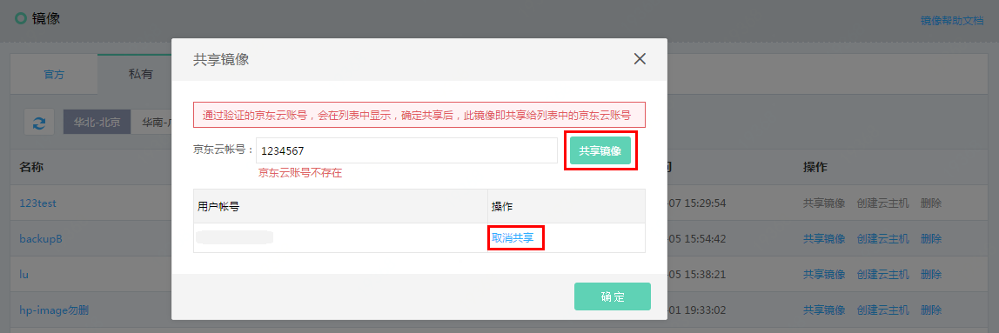

# Share Private Image
A shared image is a private image that you share your private image with other JD Cloud users. You can easily get permission to use the image from other users, get the necessary components and can add custom content, or you can share your private images through the "Image Sharing" feature with other JD Cloud accounts.

Only the owner of the image has permission to share the image, and the shared image cannot be shared again by the user shared to other JD Cloud users.

It is important to note that JD Cloud cannot guarantee the integrity and security of the images that other users share with you, and we recommend that you only use shared images from trusted sources.

## Precondition
* Only private images in the "Available" status support sharing;
* The "Image Share" function now only can be shared via PIN (customer identification code). Sharing via account ID or mobile phone number associated to the account is not supported. Please get correct user PIN via methods below:
    * Click on the user account in the upper right corner and select **Account Management** to enter the user center.
    * View account information in "Basic Material" and use "PIN (Customer Identification Code)" to make sharing operation.

		Note:
		* Private images including encrypted snapshot do not support sharing temporarily.
		* Each image can be shared among other 10 users at most.

## Operation Steps

1. Access [Image Console][2], or access [JD Cloud Console](https://console.jdcloud.com/overview) Click navigation bar on the left **Elastic Compute** - **Virtual Machines** - **Image** to enter the image list page.

2. Select **Private** TAB and the private image you want to share in the list.

3. You can click **Shared Image** in the list operation column, or you can enter the image detail page and click **Add Share** under **Image Sharing** TAB.

4. Enter JD Cloud account PIN of shared object in the shared image popup and click the **Shared Image** button. If account verification succeeded, it means sharing is completed. Otherwise, a notification that "The JD Cloud account does not exist". After sharing, result display may be delayed. Click the **Refresh** button to update the sharing result.

5. The shared accounts will be displayed in the list below, where you can directly click **Cancel Sharing**.

  [1]: ./images/Operation-Guide-Image-share1.png "Operation-Guide-Image-share1.png"
  [2]: https://cns-console.jdcloud.com/host/image/list
 