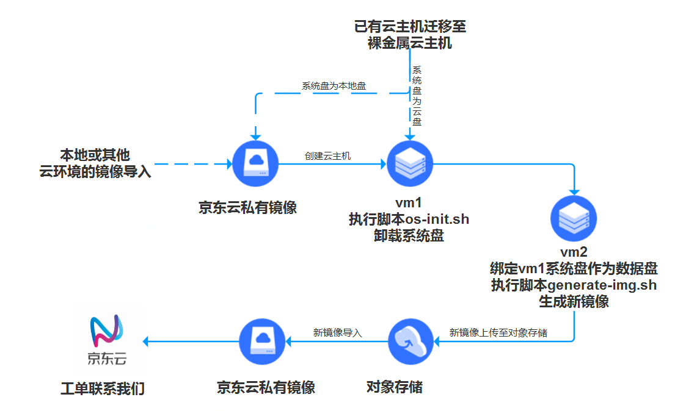

# Create Bare Metal Virtual Machines

## Public Image Creation
You can use the following public images provided on and after January 2, 2020 in cn-north-1 region: CentOS 7.2, CentOS 7.4 and CentOS 7.6 to create Bare Metal Virtual Machines. For specific instance creation operation, please refer to [Create Instance](https://docs.jdcloud.com/en/virtual-machines/create-instance).


## Private Image Creation
The Bare Metal Virtual Machines requires your image to support UEFI start. If you need to create Bare Metal Virtual Machines via a private image on JD Cloud, please convert your private image to an image that supports UEFI start based on the following document. Currently, only private image with an operating system version of CentOS 7.2, CentOS 7.4 or CentOS 7.6 supports the following operation.

If you need to migrate the current instance to a Bare Metal Virtual Machine, please make sure that the operating system version of your current instance is CentOS 7.2, CentOS 7.4 or CentOS 7.6. If the image category of your current instance is cloud disk system disk, then the first step in [Convert the Image to an Image that Supports UEFI Start](Create-BM-Instance#ImageTrans) can be neglected and you can directly take this instance as vm1 in the document and execute the follow-up steps based on document; if the image category of your current instance is local disk system disk, please create image for this instance and complete [Convert Image Type](https://docs.jdcloud.com/en/virtual-machines/convert-image), and then operate step by step according to the following document.

If you want to migrate your application in the local or other cloud environment to JD Cloud Bare Metal Virtual Machine, please save your application as an image and then execute [Private Image Importation](https://docs.jdcloud.com/en/virtual-machines/import-private-image).

### Operation Steps



<div id="ImageTrans"></div>

### Convert the image to an image that supports UEFI start:
1. Use your private image to create a Virtual Machine VM1 with the image category of cloud disk system disk.<br>

2. Download and run script in VM1:
```
  wget https://bm-img-trans.s3.cn-north-1.jdcloud-oss.com/os-init.sh
   
  chmod u+x os-init.sh
   
  ./os-init.sh
```
3. When the script execution is complete, Console will stop the vm1 and detach its system disk. You may refer to [Detach Cloud Disk]](https://docs.jdcloud.com/en/virtual-machines/detach-cloud-disk).
4. Take the detached vm1 system disk as a data disk to attach to Virtual Machine vm2 with the same operating system as vm1. You may refer to the document [Attach Cloud Disk](https://docs.jdcloud.com/en/virtual-machines/attach-cloud-disk). Please make sure that the operating system used by vm1 and vm2 is the same. For example, the operating system of vm1 is CentOS 7.6 and the operating system of vm2 is CentOS 7.4. Both vm1 and vm2 are in CentOS operating system.
5. After attaching is completed, log in Virtual Machine vm2, then you can view disk partition information via the following command:
```
  lsblk
```
 As shown in figure below, the disk device newly attached is /dev/vdb1, and /dev/ prefix is removed from the complete device path of lsblk output. /dev/vdb1 is just the system disk of the original machine vm1.<br>
 
 

6. It requires to execute the following command to create a file to be taken as the mount points of /dev/vdb1 and attach it thereon:
```
mkdir newFile
mount -o nouuid /dev/vdb1 newFile
```
After attaching is completed, you can verify whether it is successful by running the `df -h` command. If the following result occurs, it indicates that /dev/vdb1 has been successfully attached to newFile.<br>


7. Download script in the current directory (parent directory of the mount point) and execute the same; make sure the script file is in the parent directory of the mount point:
```
  wget https://bm-img-trans.s3.cn-north-1.jdcloud-oss.com/generate-img.sh
   
  chmod u+x generate-img.sh
   
  ./generate-img.sh [MountPoint] [OS] [RawSize]
```
Among them, mount point is the mount point of the original machine vm1 system disk in the current machine vm2 (i.e. the newFile in example); OS is the operating system of the original machine vm1 system disk, or it can be said to be the operating system of your private image. Only the operating system here needs to be specified while the system version is not required. For example, it needs to specify as centos7 only in CentOS 7.6. RawSize is the size of the created image in raw format, which will be 10G by default if it is not specified. if specified, RawSize size shall not be less than 10G.

If the mount point is newFile and the operating system of vm1 is CentOS 7.6, the following command can be executed:
```
  ./generate-img.sh newFile centos7 20G
```
If following picture appears, it indicates that the running of bm-generate-img.sh is completed:<br>


You can search for the presence of the image file in the current directory.<br>


This image file is an image file available to the Bare Metal Virtual Machines. Please import the image file in your private image through the following operation.

### Upload the image file
Before operating imports images, it is required to ensure that [the Object Storage Service has been enabled](https://docs.jdcloud.com/en/object-storage-service/sign-up-service-2) and [bucket has been created](https://docs.jdcloud.com/en/object-storage-service/create-bucket-2), and then upload the image file to the bucket in the same region of the image expected to be imported, and get the file downloading link.<br>
For uploading the image file in Virtual Machines to Object Storage Service, please refer to the document [Attach Bucket on Linux instance by using S3fs](https://docs.jdcloud.com/en/object-storage-service/s3fs). It requires long time for uploading steps, please wait patiently. If you need to complete the uploading quickly, you can choose to increase the Elastic IP bandwidth. Get the file downloading link after the uploading is completed.

### Import images
For importing images, please refer to [Private Image Import](https://docs.jdcloud.com/en/virtual-machines/import-private-image#importIMG)

### JD Cloud Processing
After the image import is completed, JD Cloud needs to conduct related processing to your private image, so that it can be used by the Bare Metal Virtual Machines. Please open ticket to contact us after the image import is completed and indicate the private image ID in the ticket.

