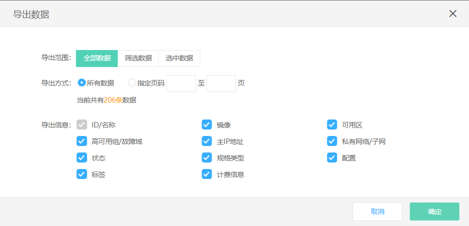
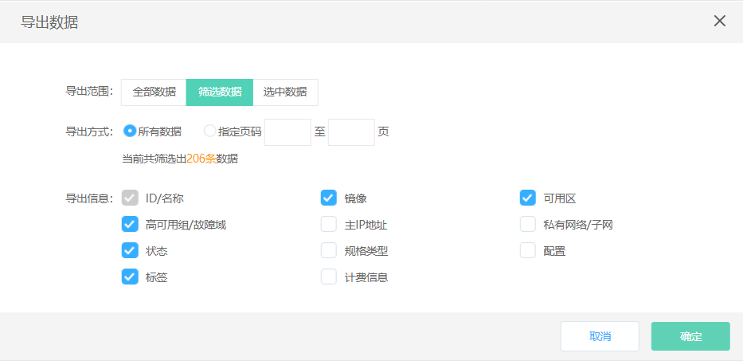

# Export Instance Information

You can output instance lists under designed regions via the Console, customize range, method and relevant information of outputted data and output of maximum 2,000 data is supported. Now, the supported output range covers: all data, filtered data and selected data. The output methods to be designed include: output all data and output designed page. The available output information include: ID, name, image, availability zone, Availability Group, fault domain, status, Instance Type, Private IP, EIP and bandwidth associated to private IP, VPC, subnet, dedicated host machine, associated Cloud Disk Service, billing information, tag, creation time and expiration time (including Virtual Machines in Monthly Package).

## Operation Steps

1. Access [Virtual Machines Console](https://cns-console.jdcloud.com/host/compute/list) and enter the instance list page. Or access [JD Cloud & AI Console](https://console.jdcloud.com) Click navigation bar on the left **Elastic Compute** - **Virtual Machines** to enter the instance list page.
2. Select a region.
3. Click the export list icon on the top right corner of the Instance list page.   
4. Specify output range and output method in the "Output Data" popup: Select **All Data** in the output range and then all resource information under the current region will be outputted; if there are more than 2,000 data, please output them in batches by designating pages in the output method; if you select **Filter Data** in the output range, relevant data obtained by filtering will be outputted; and if you haven’t made any filter operation, all resource information under current region will not be outputted. If there are more than 2,000 data to be outputted, please select to output the data by batches by specifying the page. Select **Select Data** in the output range to output relevant data checked in the Instance List Page.   
5. Designated output information in the "Output Data" popup: The available output information include ID/name (required), image, availability zone, availability group/fault domain, primary IP address, VPC/subnet, status, Instance Type, configuration, tag, dedicated host machine and billing information. You can select or more output data according to your real demands. The associated Cloud Disk Service will be outputted with its region information by default.   
		Note: The export time is affected by the instance items. Please wait patiently if there are more data.
	