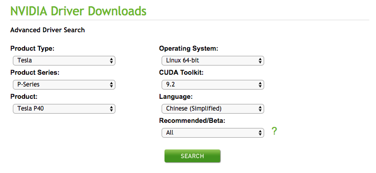
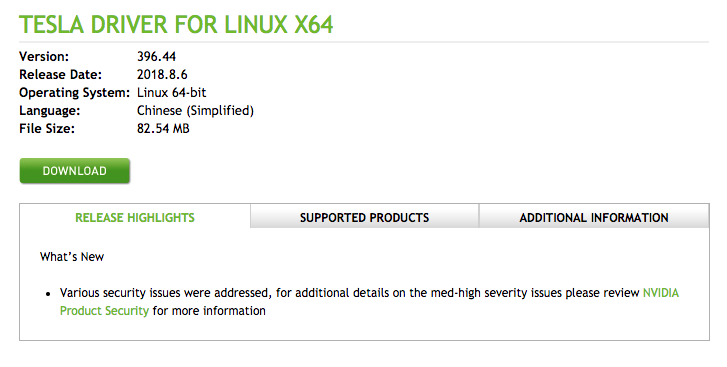

# GPU Virtual Machine


## Download and install GPU Driver

### Windows System

Take Windows 2008 R2 data center version as an example, the steps to install the GPU driver are as follows:

* Get GPU Driver Installation Package:
	* Enter [NVIDIA official website](https://www.nvidia.com/Download/Find.aspx);
	* Manually look up the drive program applicable for the instance, and click **search**. The filter information description is explained as follows. <br>
	* After confirmation, click **Download**, the figure below is the snapshot of Windows Server 2008 R2 Driver. <br>
* Install GPU Driver:
	* In Windows system, double-click directly to install GPU Driver.
* GPU Driver Verification
	* Before installing the GPU driver, the display card information in the device manager is "3D Video Controller", which is shown in the following figure <br>
	* After successful installation of GPU display card driver, the display card will be displayed in the "Display Adapter" drawer, which is shown in the following figure <br>

### Linux System

Take CentOS7.4 as an example, the steps to install the GPU driver are as follows:

* Get GPU Driver Installation Package:
	* Enter [NVIDIA official website](https://www.nvidia.com/Download/Find.aspx);
	* Manually look up the drive program applicable for the instance, and click **search**. The filter information description is explained as follows. <br>
	* After confirmation, click **Download**, the figure below is the snapshot of CentOS7.4 Driver. <br>
	* In centos7.4, the above driver can be directly downloaded through the following commands, wherein the download link can be obtained by right-clicking the download button in the figure above:
	
`wget http://cn.download.nvidia.com/tesla/396.44/NVIDIA-Linux-x86_64-396.44.run`
	
* Install GPU Driver:
	* Download and install the kernel-devel and kernel-header packages in the corresponding versions of kernel:
		* Via the "uname -r" command, the kernel version in centos7.4 is 3.10.0-693.17.1.el7.x86_64.
		* Download link of corresponding Kernel-devel: http://vault.centos.org/7.4.1708/updates/x86_64/Packages/kernel-devel-3.10.0-693.17.1.el7.x86_64.rpm
		* Download link of corresponding kernel-header: http://vault.centos.org/7.4.1708/updates/x86_64/Packages/kernel-headers-3.10.0-693.17.1.el7.x86_64.rpm
		* The above two packages can be downloaded via the wget command and then be installed via yum install.
		* Please note that the download versions of kernel-devel and kernel-header shall be identical to that of the running kernel. Otherwise, the gpu driver cannot be normally installed and used.
After installation, the indication is as shown below:
```
	# uname –r
	3.10.0-693.17.1.el7.x86_6
	# rpm -qa | grep 693.17.1
	kernel-devel-3.10.0-693.17.1.el7.x86_64
	kernel-headers-3.10.0-693.17.1.el7.x86_64
	kernel-3.10.0-693.17.1.el7.x86_64
```

* gpu Driver Installed and Downloaded
```	
	# Chmod +x NVIDIA-Linux-x86_64-396.44.run
	# ./ NVIDIA-Linux-x86_64-396.44.run
```
The correct installation is shown as follows: <br><br><br><br>
* GPU Driver Verification
	* Please run nvidia-smi after completing installation. Installation is successfully done, if the following picture is shown. 
	
