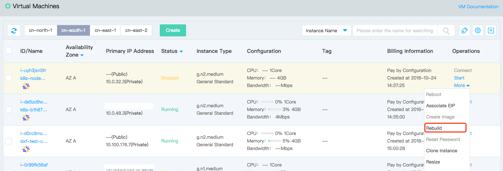
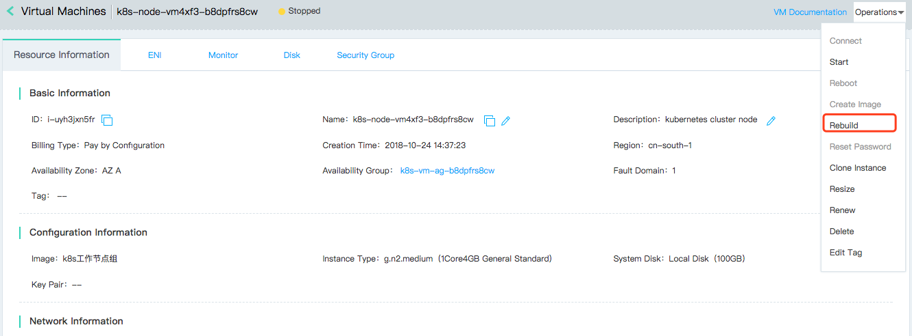
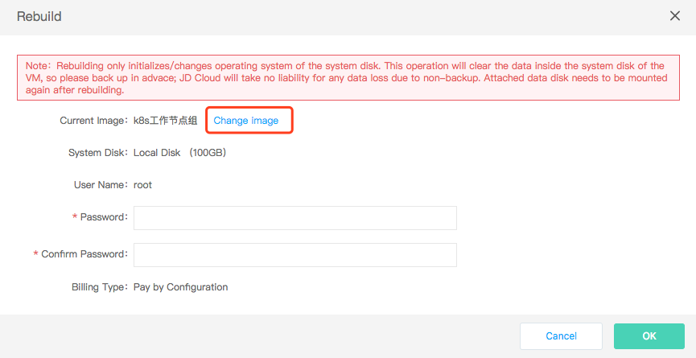
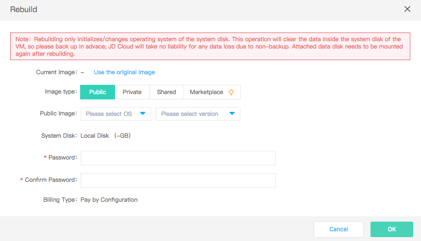

# Rebuild Instance

You can restore instance to the original system status by rebuild operation, which is a means of recovering when instance encounters a software failure. Also, you can replace the operating system while using current instance type by rebuild. You can choose to rebuild the instance to Linux system or  to Windows system.

It shall be noted that reinstalling the system will result in the loss of all contents of system disk, and the data of data disk will not be affected (but need to be re-identified). Therefore, in the case of the need to retain system operating data, it is strongly recommended that you [Create Private Image](http://docs.jdcloud.com/en/virtual-machines/create-private-image) before rebuilding, and then select private image when rebuilding to achieve the retention of system operating data.

## Precondition

* The instance must be in "Stopped" status. If the instance is in the "Running" status, please run [Stop Instance](Stop-Instance.md) first; if the instance is in other unstable status, please wait for the pre-order operation to complete before resizing.
	
		Please note that :
		* If instance is created based on private image and private image has been deleted, you cannot use original image to rebuild, that is, you cannot restore to the original system status. It is recommended to keep private image referenced by instance;
		* You need to reset password when rebuilding. For Linux system you can also reassign key pair;

* For cloud disk serving as instance of system disk, corresponding system disk snapshot capacity of images selected for rebuilding shall not be greater than the current system disk size. System disk snapshot capacity refers to size of corresponding system disk file system when the image is making.
* For rebuilding, images consistent to current instance system disk type can be selected only. For example, if current instance system disk is a local disk, only the local disk images can be selected for rebuilding.

## Operation Steps
1. Access [Virtual Machines Console](https://cns-console.jdcloud.com/host/compute/list) and enter the instance list page. Or access [JD Cloud & AI Console](https://console.jdcloud.com) Click navigation bar on the left **Elastic Compute** - **Virtual Machines** to enter the instance list page.
2. Select a region.
3. In the instance list, select the instance that needs rebuilding and confirm that its status is "Stopped".
4. Click **Operate** - **More** - **Rebuild**, or click instance name to enter the details page and click **Operate** - **Rebuild**.
 
5. In the "Rebuild" pop-up window, select the image used when you create instance by default which means you can restore to the system status at the time of creation. If you need to change to another image, click **Change Image** in the pop-up window to switch to the select image interface. You can select the image as needed 
6. Set a new login password and click **OK** to trigger rebuilding.

After that, the instance will enter the "Rebuilding" status. After the reset is completed, it will be restored to the "Stopped" status. After the "Start" instance is operated, the instance can be used normally.
## Related Reference

[Make Private Image](http://docs.jdcloud.com/en/virtual-machines/create-private-image)

[Stop Instance](Stop-Instance.md)
