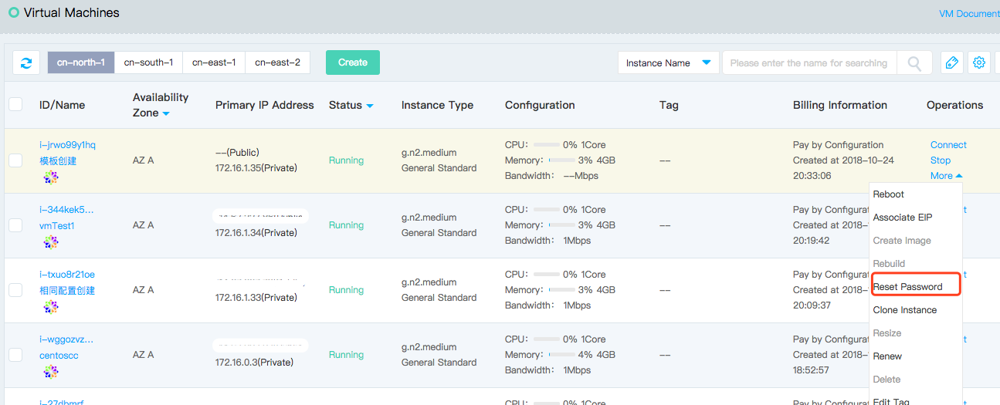
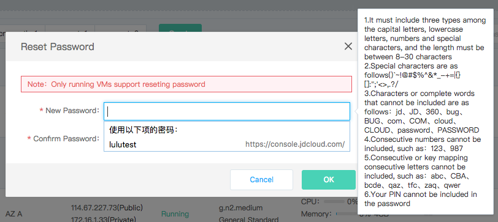

# Reset Password

If you choose not to set the password  when creating instance or the password lost temporarily or need to change password regularly due to business and data safety concerns, you can reset the login password of instance by resetting password on the console.

## Precondition

The instance must be in the "Running" status. If the instance is in the "Stopped" status, please operate [Start Instance](Start-Instance.md) first; if the instance is in other unstable status, please wait for the pre-order operation to complete before resetting password.
	
	Note: After password resetting, you need to reboot the VMs on the console to make the new password take effect. Rebooting will interrupt your business, so it is recommended that you plan your operating time to reduce the impact of your operations.

## Operation Steps
1. Access [Virtual Machines Console](https://cns-console.jdcloud.com/host/compute/list) and enter the instance list page. Or access [JD Cloud & AI Console](https://console.jdcloud.com) Click navigation bar on the left **Elastic Compute** - **Virtual Machines** to enter the instance list page.
2. Select a region.
3. In the Instance list, select the instance that the password needs resetting and confirm that its status is "Running". If you need to operate multiple instances at the same time, you can complete through multiple selection.
4. Single Operation: Click **Operate** - **More** - **Reset Password**, or click instance name to enter the details page and click **Operate** - **Reset Password**
 Batch operation: Click **More** - **Reset Password** below the list

5. In the "Reset Password" pop-up window, enter the new password that meets the requirements, click **OK** to submit the modification, and then the new password will take effect after rebooting the instance in the console.

## Related Reference

[Start Instance](Start-Instance.md)
