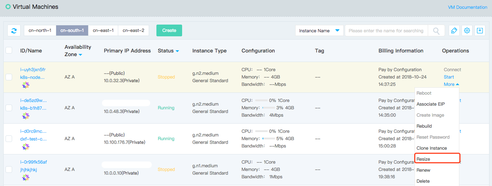

# Resize Instance

At the beginning of the application, you can use small instance type when the request volume is smaller, and you can quickly resize the instance type when the application and the service request volume increases rapidly, thus enhancing the processing speed of the service and better meeting your needs.

## Precondition

* The instance must be in "Stopped" status. If the instance is in the "Running" status, please run [Stop Instance](Stop-Instance.md) first; if the instance is in other unstable status, please wait for the pre-order operation to complete before resizing.
	
		Please note that ::
		* The first generation Virtual Machines are not allowed to be resized to the second generation Virtual Machines;
		* For Virtual Machines billing paid by configuration, after resizing, it will be billed according to the new instance types. The fee for current instance types will be immediately settled before resizing (that is, the bills incurred from the last settlement time to the current time will be settled);
		* For the monthly package billing Virtual Machines:
			* If the price of instance types after resizing is lower than that before  resizing, the expiration time of VMs will be extended;
			* If the price of instance types after resizing is higher than that before resizing, you need to pay the difference before the expiration.

## Operation Steps
1. Access [Virtual Machines Console](https://cns-console.jdcloud.com/host/compute/list) and enter the instance list page. Or access [JD Cloud Console](https://console.jdcloud.com) Click navigation bar on the left **Elastic Compute** - **Virtual Machines** to enter the instance list page.
2. Select a region.
3. In the instance list, select the instance that needs resizing and confirm that its status is "Stopped".
4. Click **Operate** - **More** - **Resize**, or click instance name to enter the details page and click **Operate** - **Resize** to enter the resizing page.
 
5. Select the new instance type and click **Resize Now**. The resizing is triggered by the paid by configuration billing instance; for the monthly package instance, the payment needs to be paid, and the resizing is triggered after payment completion. 

After that, the instance will enter the "Resizing" status. After the resizing is completed, it will be restored to the "Stopped" status. After the "Start" instance is operated, the instance can be used normally.
## Related Reference

[Stop Instance](Stop-Instance.md)
