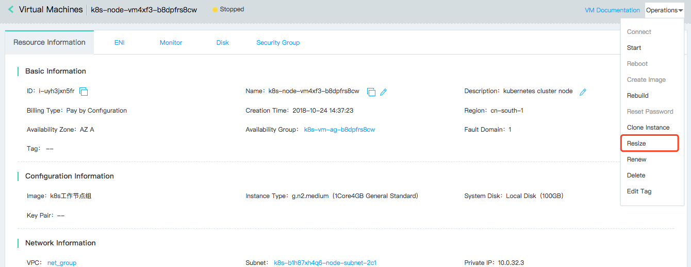

# Resize Instance

At the beginning of the application, you can use small instance type when the request volume is smaller, and you can quickly resize the instance type when the application and the service request volume increases rapidly, thus enhancing the processing speed of the service and better meeting your needs.

## Precondition

* The instance must be in "Stopped" status. If the instance is in the "Running" status, please run [Stop Instance](Stop-Instance.md) first; if the instance is in other unstable status, please wait for the pre-order operation to complete before resizing.
	
		Please note that ::
		* If the current instance system disk is the local disk, intergenerational deployment is not allowed, e.g. the Virtual Machines of Generation I are not allowed to be deployed with the Virtual Machines of Generation II and adjustment to Generation I storage optimization big data type s.d1 and Generation II storage optimization big data type s.d2 is not allowed;
		* Where the current instance is in the Availability Group, it is allowed to adjust it to any Generation I Virtual Machines, except the GPU type and is subject to specification supported by Availability Group;
		* Where the current instance is attached with an encrypted cloud disk, it is not allowed to be adjusted to the Generation I Virtual Machines and is subject to specification supporting encrypted disk;
		* For instance paid by configuration, the billing shall be made by new specification after resizing. Before adjustment, specification will be immediately billed and settled (i.e., cost is settled from last integral settlement time to the current time);
		* If there is a local data disk in the current instance, to resize, you need to clear the data in the local disk first, and please operate carefully;
		* The target Instance Type can support the elastic network interface count which is no less than that currently-configured elastic network interface.
		* For the monthly package billing Virtual Machines:
			* If the price of instance types after resizing is lower than that before  resizing, the expiration time of VMs will be extended;
			* If the price of instance types after resizing is higher than that before resizing, you need to pay the difference before the expiration.
		

## Operation Steps
1. Access [Virtual Machines Console](https://cns-console.jdcloud.com/host/compute/list) and enter the instance list page. Or access [JD Cloud & AI Console](https://console.jdcloud.com) Click navigation bar on the left **Elastic Compute** - **Virtual Machines** to enter the instance list page.
2. Select a region.
3. In the instance list, select the instance that needs resizing and confirm that its status is "Stopped".
4. Click **Operate** - **More** - **Resize**, or click instance name to enter the details page and click **Operate** - **Resize** to enter the resizing page.
 
5. Select the new instance type and click **Resize Now**. The resizing is triggered by the paid by configuration billing instance; for the monthly package instance, the payment needs to be paid, and the resizing is triggered after payment completion. 

After that, the instance will enter the "Resizing" status. After the resizing is completed, it will be restored to the "Stopped" status. After the "Start" instance is operated, the instance can be used normally.
## Related Reference

[Stop Instance](Stop-Instance.md)
