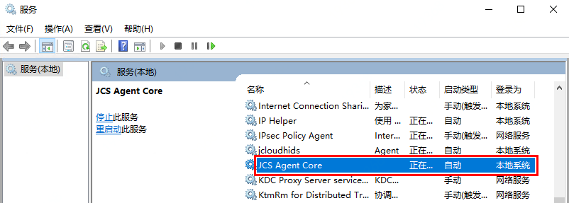
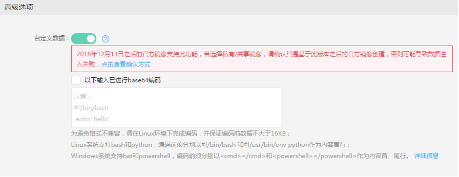

# Customized Data

Instance customized data means that when an instance is created, the user can pass on the executable script to the instance in the specified data format to implement customization of the instance startup behavior. With this function, you can automatically complete operations such as downloading/upgrading/installing software, enabling services, modifying system configuration, and initializing the service environment after the instance is started.<br>

* [Format Requirement](Userdata#user-content-1)
* [Execution Description](Userdata#user-content-2)
* [Image Support Situation](Userdata#user-content-3)
* [Operation Steps](Userdata#user-content-4)

<div id="user-content-1"></div>

## Format Requirement
The instance customized data needs to be imported after the Base64 encoding, and the data before encoding cannot exceed 16 KB (not greater than 21848 Byte after encoding). If the instance is created through the Console, the data may not be encoded by Base64; select the corresponding tooltip and the system will complete the encoding. If it is created through the API, you must complete the encoding yourself.<br>
Instance customized data currently supports multiple script types. Linux system supports bash and python. Before encoding, you must use `#!/bin/bash` and `#!/usr/bin/env python` as the first line of the content; Windows system supports Bat and PowerShell, before the encoding you must use `<cmd>`, `</cmd>` and `<powershell>`, `</powershell>` as the first and last line of the content. The following are examples of declarations for different types of scripts:
```
#!/bin/bash 
echo 'launch-1a' >> /root/text1.txt
```

```
#!/usr/bin/env python
# -*- coding: utf-8-*-
import random
seq = list(range(1,10))
tempstr = random.sample(seq,3)
f1 = open('/root/python2-text1.txt', 'a+')
f1.writelines([str(tempstr)])
f1.close()
```

```
<cmd>
echo %random%>cmd-text1.txt
</cmd>
```
```
<powershell>
"hello" | Out-File text1.txt -Encoding utf8
</powershell>
```

      Note:
      * To avoid format incompatibility, when using bash or python format scripts, please complete the encoding in the Linux environment and debug it before entering.
      * python format is as follows: if there is any Chinese Character, please be sure to add '# -*- coding: utf-8 -*-' after the first line. If no, please ignore this line.

<div id="user-content-2"></div>

## Execution Description
* After the instance system starts and completes the basic initialization configuration such as the network (create a new instance or rebuild), the system will execute the customized data with root or administrator permissions;
* Subsequent startup operations after the first start will not execute the customized data again;
* Customized data is only executed when the instance starts up for the first time/the rebuilding system starts up. If images are created for the instance, although the customized data remains in the image, when creating a new instance with images, it will be created with the newly specified customized data. If not specified, the original customized data in the image will not be executed again;
* If the customized data does not execute as expected, go to the specified directory to view the execution log for causes. Linux system log path: /var/log/jcloud/agent; Windows system log path: C:\ProgramData\JD.com\jCloud\Agent\Logs.

<div id=image-support></div>

<div id="user-content-3"></div>

## Image Support Situation
The implementation of the customized data function depends on the system component JCS-Agent installed by default in the public image. Due to historical reasons, the public image system component has undergone the evolution of multiple versions and multiple components. Only the JCS-Agent with the specified version can guarantee the normal use of the function.

* Public Image: This function can be used normally when using the public image to create an instance after December 14, 2018;<br>
* Private/shared Image: If an instance of a private image is created using a public image and created no earlier than December 14, 2018, then this function can be normally used when using the private/shared image to create instances;<br>
* Cloud Marketplace Image: The frequency of Cloud Marketplace image update depends on the service provider. Different images support different types of customized data functions. Please open ticket or contact JD Cloud & AI technical support personnel for consulting.

You can confirm whether the private image created based on the current instance supports this function by viewing the version of JCS-Agent in the instance by the following means. If the agent installed in the current instance is other early-stage components or the version of JCS-Agent is too low, please refer to [Public Image System Component](http://docs.jdcloud.com/en/virtual-machines/default-agent-in-public-image) for installation.<br>

### Linux System<br>
1. Confirm that the JCS-Agent is installed in the current instance and is running.
Enter the command:
```
systemctl status jcs-agent-core.service
```
The following figure shows that the service is enabled and the status is active, indicating that the current instance has installed and is using JCS-Agent.


2. Confirm that the JCS-Agent version is not a version of "1.0.675.56819b0", which means that the customized data function is supported. Enter the following command as shown in the figure to view the version number:
```
 ps -ef|grep MonitorPlugin
```


### Windows system: <br>
1. Confirm that the JCS-Agent is installed in the current instance and is running.
    Execute `services.msc` in "Running" to view the windows running service. The following figure shows that JCSAgentCore is running, and the enabling type is automatic, indicating that the current instance has installed and is using JCS-Agent.


2. Confirm that the JCS-Agent version is not a version of "1.0.641.fc127b7", which means that the customized data function is supported.
    Execute the following code in the command line tool, as shown in the figure to get the current version.
```
wmic process where caption="MonitorPlugin.exe" get caption,commandline /value
```


      Note:
      * If you do not have JCS-Agent installed in your current instance or the current version does not support customized data, please open ticket to have it installed by the technical service personnel.

<div id="user-content-4"></div>

## Operation Steps
1. Access [Instance Console](https://cns-console.jdcloud.com/host/compute/list), or access the [JD Cloud & AI Console)(https://console.jdcloud.com/) andAz click on the left navigation bar **Elastic Compute** - **Virtual Machines** - **Instance** to enter the instance list page and click **Create** to enter the Virtual Machines purchase page.
2. Select the region where the instance belongs and click **Create** to enter the VM instance purchase page.
3. After selecting image and completing other basic configurations, turn on the "Customized Data" function in the "Advanced Options" area.

4. Enter the customized data in the text box. If the data has been encoded by Base64, please select "the following input has been encoded by Base64". If the data is plaintext that has not been encoded, please leave it unchecked.

5. In order to ensure the correct execution of the script, please be sure to check whether the declaration format of the first/last line of the data is correct according to the [Format Requirements] above.
6. After the instance is running, log in the instance to view the running result of the customized data. If the execution fails, check the related log positioning problem. Linux system log path: /var/log/jcloud/agent; Windows system log path: C:\ProgramData\JD.com\jCloud\Agent\Logs.

<div id="user-content-4"></div>


## Related References

[Create Linux Instance](https://docs.jdcloud.com/virtual-machines/create-linux-instance)

[Create Windows Instance](http://docs.jdcloud.com/virtual-machines/create-windows-instance)

