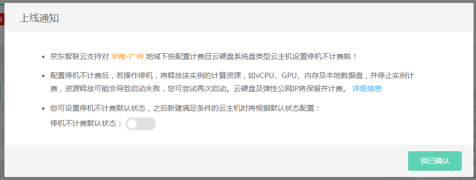
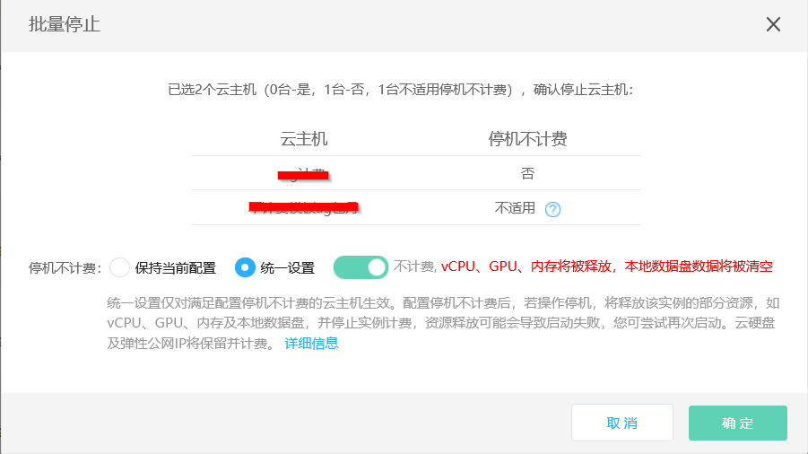

# No Fees for Stopped Instances (closed beta)

The No Fees for Stopped Instances feature can be enabled for instances with automatic selection of host machine as the instance scheduling method, pay by configuration as the billing method, and cloud disk service as the system disk. For those instances enabling No Fees for Stopped Instances, their vCPU, GPU, memory and local data disk resource will be released and JD Cloud & AI will stop its billing of such instances. The cloud disks and Elastic IP associated with instances will retain the associated status and billing of them will be maintained normal and will not be stopped. When you re-enable the turned-off instances enabling the No Fees for Stopped Instances feature, you may fail to enable the instances due to insufficient inventory of resource database.

	
	Please note:
	* Since instances’ partial resources have been released, you may fail to re-enable the instances due to insufficient computing resources; if such scenario happens, you can choose try again the enabling operation later or resize configuration of the instances as specification of sufficient inventory.
	* Certain operations such as rebuilding and resizing may require you to stop instances, and under such scenarios, you are suggested to operate after disabling the No Fees for Stopped Instances feature so as to ensure that the instance resources will not be released and the instances can be normally enabled after the operation.
	* The instances enabling No Fees for Stopped Instances will be no longer billed after the disabling operation is triggered by such instances. However, failure of stopping may occur and lead to continuous running of instances, at that time, billing of the instances will return to normal. Please confirm that your instances have become "stopped" status after completion of "stopping" status and will not be billed any longer. If you fail to stop instances, please re-conduct the stopping operation.
	* Disabling instance in the instance operating system can also trigger No Fees for Stopped Instances and whether such instance can be halted without billing depends on the current No Fees for Stopped Instances status of the instance. In the case that the No Fees for Stopped Instances feature is not applicable to your instances or such function has been disabled, your instances will be normally billed.

## Applicable Conditions for No Fees for Stopped Instances

Instances with automatic selection of host machine as the instance scheduling method, pay by configuration as the billing method, and cloud disk service as the system disk.

In the case that you instances are the types with Monthly Package as the billing method, Local Disk as the system disk or that have been created in special resource pool/special host machines, No Fees for Stopped Instances will not be applicable.

	

## Operation Steps

### Set No Fees for Stopped Instances as a default status for instances

You can set the default status of No Fees for Stopped Instances feature in the popup for notification of launching No Fees for Stopped Instances feature. After that, the instances newly created by you will be configured at first in accordance with the default status you have selected and your operation will be simplified. If you need instances that are different from the default status of No Fees for Stopped Instances, you can modify the No Fees for Stopped Instance status of current instances every time when you create or stop instances.

### Enable/Disable No Fees for Stopped Instances feature when creating an instance.

1. Access [Instance Console](https://cns-console.jdcloud.com/host/compute/list), or access [JD Cloud Console](https://console.jdcloud.com) and log in the instance list page by clicking **Elastic Compute** - **Virtual Machine** - **Instance** on the left navigation bar.

2. Select the region of the created instance and click the **Create** button to enter the Virtual Machine purchase page.

3. Set enabling/disabling No Fees for Stopped Instances feature for your instances in the advanced options. If there is no modification, the No Fees for Stopped Instances status of your instances is the default No Fees for Stopped Instances status you have set previously.

### Enable/Disable No Fees for Stopped Instances feature when creating an instance.

### Enable/Disable No Fees for Stopped Instances feature when creating an instance template.

1. Access [Instance Console](https://cns-console.jdcloud.com/host/compute/list), or access [JD Cloud Console](https://console.jdcloud.com) and log in the instance list page by clicking **Elastic Compute** - **Virtual Machine** - **Instance Template** on the left navigation bar.

2. Select regions, and click **Create** to enter the Instance Template Creation Page.

3. Set enabling/disabling No Fees for Stopped Instances for the instances in your instance template in the Advanced Option. If there is no modification, the No Fees for Stopped Instances status of your instances is the default No Fees for Stopped Instances status you have set previously.

4. In the case that No Fees for Stopped Instances feature is not applicable to the instances in your current instance template, such feature cannot be set here.

	
	Please note:
	* If you use instance template with No Fees for Stopped Instances feature to create instance with Monthly Package as the billing method, the Monthly Package billing status will be maintained for the created instances and the No Fees for Stopped Instances feature will not be applicable.

### Enable/Disable No Fees for Stopped Instances when stopping an instance.

	
	Please note:
	* Only after an instance is stopped, the instance enabling the No Fees for Stopped Instances feature will be no longer billed; during the stopping operation, you can confirm once again the No Fees for Stopped Instances status of the instance.

1. Access [Virtual Machine Console](https://cns-console.jdcloud.com/host/compute/list) and log in the instance list page. Or access [JD Cloud Console](https://console.jdcloud.com) and enter the instance list page by clicking **Elastic Compute** - **Virtual Machine** on the left navigation bar.

2. Select region.

3. Select the instances that are required to be stopped and can be applied with No Fees for Stopped Instances from the Instance List, click **Operate** - **Stop** button, or click **Instance Name** to enter the Details, click **Operate** - **Stop** button, and select enabling/disabling the No Fees for Stopped Instances feature in the **Stop** popup. In the case that the No Fees for Stopped Instances feature is not applicable to your current instances, information related to set of No Fees for Stopped Instances will not be displayed and such feature cannot be set.

4. Operation of multiple instances at the same time can be achieved through MultiSelect. Check the instances required to be stopped from the Instance List, click the **Stop** button beneath the List and select unified enabling/disabling of the No Fees for Stopped Instances feature in the "Stopping" popup. Check **Maintain Current Configuration** and whether each instance will be billed after halt will be subject to the current configuration; check **Unified Setting**, the setting result will be effective to the instances meeting the configuration of No Fees for Stopped Instances; if the instances you have selected include those not supporting No Fees for Stopped Instances feature, such instances will be displayed as "not applicable" in the "No Fees for Stopped Instances" line and you cannot set the No Fees for Stopped Instances feature as enabling/disabling for such instances.

5. Confirm relevant information in the "Stop" popup and click **Confirm** to submit stopping operation, instances will enter "stopping" status. Upon completion of stopping status, the instances will enter "stopped" status. At that time, if the instances’ function of No Fees for Stopped Instances feature is enabled, the computing resources of the instances will not be charged until they are re-enabled next time, while if such function is disabled/not enabled, the instances will be normally billed as per Pay by Configuration.

	
The No Fees for Stopped Instances feature is currently a closed beta function and if you want to enable such function, please apply for through opening ticket or contacting customer service.

