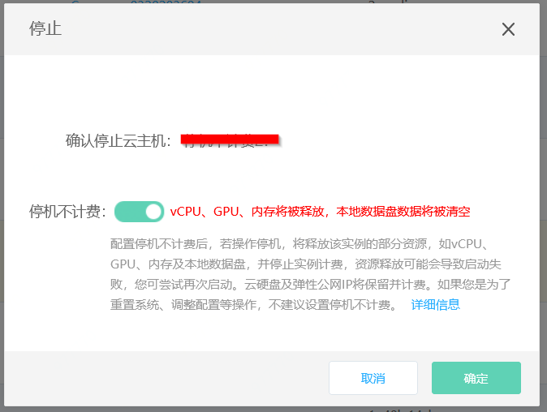

# Enable/Disable the No Fees for Stopped Instances feature

The feature of No Fees for Stopped Instances can be enabled for Cloud Disk System Disk instances with billing method of pay by configuration. No fees for stopped instances feature will release your computing resources (such as vCPU, GPU, memory and local data disk) on the premise of retaining instances, stop charging for such resources, but maintain normal billing on Cloud Disks, Elastic IPs and etc. associated with the instances. When you re-enable the instances after enabling No Fees for Stopped Instances feature, you may fail to enable your instances due to insufficient inventory of the computing resource; if you do not wish occurrence of such scenario, you are suggested to disable the function of No Fees for Stopped Instances feature.

## Preconditions

The billing method for instances is pay by configuration and the system disk is cloud disk.

	
	Please note:
	* Since your computing resources have been released, you may fail to enable the instances due to insufficient computing resources at the time of re-enabling; if such scenario occurs, you can choose to try again the enabling operation later or resize the configuration as currently available instance type.
	* Under certain business scenarios of possible instance stopping and re-running in a short time, you are suggested to disable the function of No Fees for Stopped Instances feature so as to ensure that the computing resources of the instance will not be released and the instance can be normally enabled.
	* For all instances, failure of stopping may occur, which will cause continued running. Please confirm that your instances have become "stopped" status after completion of "stopping" status and finish the billing. If you fail to stop instances, please re-conduct the stopping operation.
	* Disabling instances in the instance operating system can also lead to the effect of No Fees for Stopped Instances feature, and whether such instances can be halted without billing depends on the No Fees for Stopped Instances feature status you have set for you instances. In case that the function of No Fees for Stopped Instances feature is not applicable to your instances or such function has been disabled, your instances will be normally billed.

## Operation Steps

### Enable/Disable No Fees for Stopped Instances feature when creating an instance.

1. Access [Instance Console](https://cns-console.jdcloud.com/host/compute/list), or access [JD Cloud Console](https://console.jdcloud.com) and log in the instance list page by clicking **Elastic Compute** - **Virtual Machine** - **Instance** on the left navigation bar.

2. Select the region of the created instance and click the **Create** button to enter the Virtual Machine purchase page.

3. Set enabling/disabling No Fees for Stopped Instances feature for your instances in the advanced options.

### Enable/Disable No Fees for Stopped Instances feature when creating an instance.

1. Access [Virtual Machine Console](https://cns-console.jdcloud.com/host/compute/list) and log in the instance list page. Or access [JD Cloud Console](https://console.jdcloud.com) and enter the instance list page by clicking **Elastic Compute** - **Virtual Machine** on the left navigation bar.

2. Select region.

3. Select the instances required to be stopped and No Fees for Stopped Instances feature from the instance list and confirm that they are in "running" status. Click **Operate** - **Stop** button, or click **Instance Name** to enter the Details, click **Operate** - **Stop** button, and select enabling/disabling the function of No Fees for Stopped Instances feature in the **Stop** popup. In case that your current instances do not support the function of No Fees for Stopped Instances feature, such function cannot be set.

4. Operation of multiple instances at the same time can be achieved through MultiSelect. Check instances required to be operated in the Instance List and confirm that they are in "running" status, then click the **Stop** button beneath the List and select unified enabling/disabling of the function of No Fees for Stopped Instances feature in the **Stop** popup. Check **Maintain Current Configuration** and whether each instance will be billed after halt will be subject to the current configuration; check **Unified Setting**, the setting result will be effective to the instances meeting the configuration of No Fees for Stopped Instances feature; if the instances you have selected include those not supporting No Fees for Stopped Instances feature, such instances will be displayed as "not applicable" in the "No Fees for Stopped Instances feature" line and you cannot set the function of No Fees for Stopped Instances feature as enabling/disabling for such instances.

5. Confirm relevant information in the "Stop" popup and click **Confirm** to submit stopping operation, instances will enter "stopping" status. Upon completion of stopping status, the instances will enter "stopped" status. At that time, if the instances’ function of No Fees for Stopped Instances feature is enabled, the computing resources of the instances will not be charged until they are re-enabled next time, while if such function is disabled/not enabled, the instances will be normally billed as per Pay by Configuration.

	
If you want to enable the function of No Fees for Stopped Instances feature, please apply for it by opening ticket or contacting customer service.

