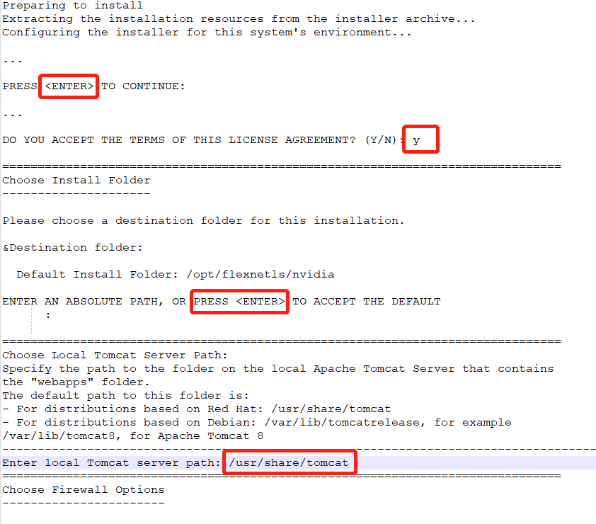
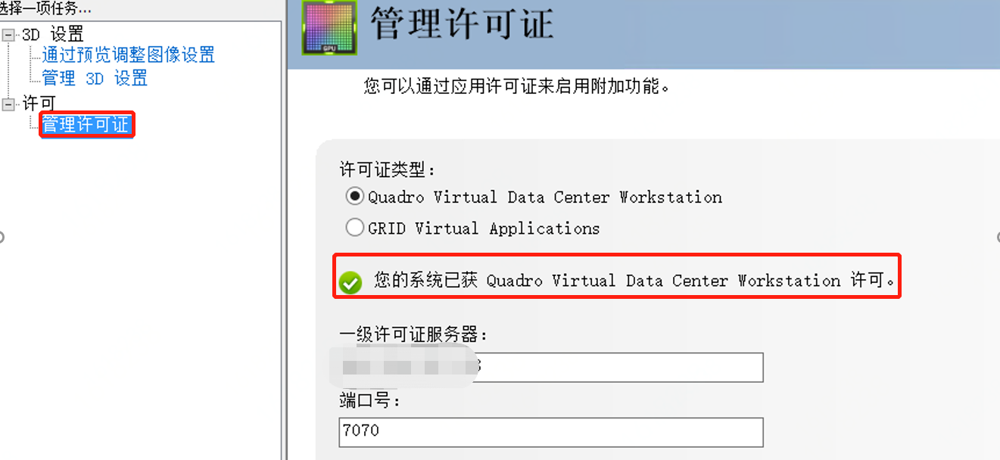

# vGPU Virtual Machine


## Installation of vGPU driver

### Linux System

		vGPU Types under Mode C and Mode Q both support Linux operating system.
    
#### 1. Confirm that Linux operating system has been installed with the following software

* gcc 
* kernel-devel (please ensure that the version of kernel-devel is consistent with that of kernel, i.e. CentOS7.6 is corresponding with kernel-devel-3.10.0-957.el7.x86_64)

#### 2. Disable nouveau

If the system has been installed with nouveau (view it by use of ‘lsmod | grep nouveau’), the following steps shall be carried out; if the system is not installed with nouveau, the third step installation of driver shall be directly conducted.<br>
* Open /etc/modprobe.d/blacklist.conf and add ‘blacklist nouveau’ into the file. <br>
* Execute the following instructions in sequence

```
mv /boot/initramfs-$(uname r).img /boot/initramfs-$(uname -r)-nouveau.img
dracut /boot/initramfs-$(uname -r).img $(uname -r)
reboot
```

#### 3. Installation of driver

* [Download Linux System Driver (download it through intranet)](https://vgpu-driver.s3-internal.cn-north-1.jdcloud-oss.com/NVIDIA-Linux-x86_64-430.46-grid.run)<br>
* Execute the commands below in download directory

```
sh ./NVIDIA-Linux-x86_64-430.46-grid.run
reboot
```

### Windows System

		Windows Operating System can only be supported by vGPU Type under Mode Q and cannot be supported by that under Mode C.

#### Driver downloading and installation

* Please download corresponding driver programs in accordance with the version of Windows System:<br>
  * [Driver Version Applicable to Win10 and Windows Server2016 (downloading through Intranet)](https://vgpu-driver.s3-internal.cn-north-1.jdcloud-oss.com/431.79_grid_win10_server2016_server2019_64bit_international.exe) <br>
  * [Driver Version Applicable to Win7, Win8, Windows Server2008 and Windows Server2012 (downloading through Intranet)](https://vgpu-driver.s3-internal.cn-north-1.jdcloud-oss.com/431.79_grid_win7_win8_server2008R2_server2012R2_64bit_international.exe) <br>
  
* After completion of downloading, double-click the installation package and complete the installation as per the notification; after completion of installation, please reboot Windows Virtual Machine.


## Verification of vGPU’s License

The computing and image displaying function of vGPU depends on GRID driver and corresponding Licenses; each vGPU Machine will apply for a license from Server during running and when the Machine is disabled, license will be released to server.<br>
Licenses of all vGPU instances on cloud are not activated, and you need to [Purchase from Nvidia](https://www.nvidia.cn/data-center/buy-grid/). Meanwhile, Nvidia provides enterprise customers with a 90-days rights for test of License for free. For enterprises’ registration or free trial, please [Log in NVIDIA Offical Website](https://enterpriseproductregistration.nvidia.com/?LicType=EVAL&ProductFamily=vGPU).<br>
* Mode C is a mode for computing, which is applicable to scenarios such as AI, deep learning and scientific computing, and needs License of vCS type<br>
* Mode Q is a mode for image displaying, which is applicable to scenarios such as professional image processing and games rendering, and needs License of vDWS type<br>

### Build license server  

License Server must ensure that vGPU virtual machine can be accessed through intranet and Internet and you are suggested to build the Server on the Virtual Machine in your VPC. One License Server can provide up to 150,000 license requests (which requires at least 4C16G in configuration and you can adjust the configuration of servers in accordance with the quantity of requests); here taking the Linux Virtual Machine deployed on JD Cloud as an example, we will use a 8G16G CentOS 7.6 Virtual Machine to build License Server.

#### 1. Installation of graphics interface to Virtual Machine

License Server can manage through remote web and can also manage locally. If you want to choose local management (access management on Virtual Machine installed with License Server), you need to install graphics interface for the Virtual Machine (if you only need management through remote web, you can skip over this step) in accordance with the following instructions:            

```
yum groupinstall "GNOME Desktop" "Graphical Administration Tools" -y
ln -sf /lib/systemd/system/runlevel5.target /etc/systemd/system/default.target                
reboot
```

#### 2. Download License Server installation file

```
wget https://vgpu-driver.s3-internal.cn-north-1.jdcloud-oss.com/setup.bin
```

#### 3. Install License Server software

##### 3.1 Install Java and tomcat

In Linux, java has been installed by default, so separate installation of it is not needed.
Execute the following instructions in sequence to install tomcat:  

```
yum install tomcat tomcat-webapps
systemctl enable tomcat.service
systemctl start tomcat.service
```

##### 3.2 Install License Server

Run ‘ sh setup.bin -i console ’

Install License Server in accordance with the graph as below:


Execute instructions below after installation:

```
wget https://vgpu-driver.s3-internal.cn-north-1.jdcloud-oss.com/producer-settings.xml
cp producer-settings.xml /opt/flexnetls/nvidia/producer-settings.xml
systemctl stop flexnetls-nvidia.service
systemctl start flexnetls-nvidia.service
```

##### 3.3 Configure License Server
* Open the configuration page on the Virtual Machine installed with License Server (for remote access through intranet/Internet, please replace localhost with/Public IP Address) http://localhost:8080/licserver, and keep record of the MAC Address demonstrated in the graph below.<br>


* Log in"NVIDIA SOFTWARE LICENSING CENTER"page in NVIDIA official website, enter Register License Server page, enter the acquired MAC address to "MAC Address", and click **Create**.
* After creation, enter license allocation page, and click **Map Add-Ons** on the View Server page will display the quantity of assignable Licenses in your current account.
* Fill out the quantity in Qty to Add frame and click **Map Add-Ons* to complete allocation of License to Server.
* After allocation, click **Download License File** to obtain the license file (.bin format)
* Open license server configuration page http://localhost:8080/licserver and click the following items in sequence: **LicenseServer -> License Management**, and import the above license file to complete configuration of License with certain quantity.

### Certification of vGPU Virtual Machine
#### Linux System
* Execute ‘cp gridd.conf.template gridd.conf’ under the /etc/nvidia directory, and fill out IP and port of license server in the following locations of gridd.conf file:

```
ServerAddress = Machine IP
# Description: Set License Server port number
# Data type: integer
# Format: <port>, default is 7070
ServerPort=7070
# Description: Set Backup License Server Address
# Data type: string
# Format: "<address>"
BackupServerAddress = Standby Machine IP
# Description: Set Backup License Server port number
# Data type: integer
# Format: <port>, default is 7070
BackupServerPort=7070
```

* Re-enable service<br>
` systemctl restart nvidia-gridd.service `

* Confirm whether verification of license is successful<br>
`grep gridd /var/log/messages`

* If it is displayed as the following graph, the verification of vGPU Virtual Machine is successful. <br>


#### Windows System
* Right-click on the desktop and select **NVIDIA Control Panel**.<br>
* Select **Management License** on the left menu of the popped-up page and fill out the IP address of License Server (fill out in the same VPC and the Intranet IP address of License Server Machine) and the port No. 7070.<br>

