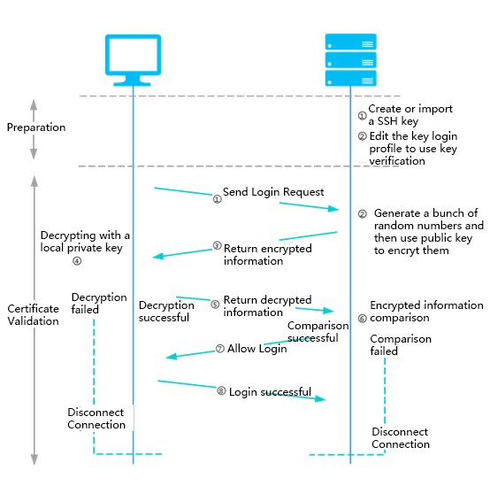

# Key Pair Overview
JD Cloud & AI provides you with two ways to log in instances safely and reliably: password login and key pair login. Only Linux system instances support the use of key pair.

Key pair login refers to the use of key pair technology to encrypt and decrypt the login information, providing a more secure login mode for the Virtual Machines compared with password login, which further enhances the security of Virtual Machines.

For key pair login, you need to create a unique matching key pair: "public key" and "private key":

* The public key needs to be stored on JD Cloud & AI to encrypt the data. The public key is public and can be configured to the target server as needed to associate with the username you use.
* The private key needs to be stored in a secure location. The private key can only decrypt the data encrypted by the matching public key. The SSH client uses the private key to prove your legal identity to the server.

## Principle Process
The login process using a key pair is as follows:

### Preparation Phase:
1. You create a key pair (newly generated or imported) and save the private key locally.
2. Edit the remote VM key pair login configuration file and write the public key information to the corresponding directory file.

### Certificate Verification Interaction Phase:

1. The user sends a login request to the remote VM.
2. The remote VM reads the valid public key of the VM in the corresponding user directory and file, generates a string of random numbers, and encrypts it with the public key.
For key pair login, you need to create a unique matching key pair: "public key" and "private key":
4. The user decrypts it by the local private key.
5. The user returns the decrypted result to the remote VM for information comparison. If the matching is successful, the user logs in successfully, otherwise the login fails.

JD Cloud & AI provides the operation  access of key pair creation and corresponding management of instance injection on the console. In addition, it also allows you to configure the instance correspondingly on your own. For details, please refer to [Create Key Pair](Create-Keypair.md).

## Related Reference

[Create Key Pair](Create-Keypair.md)

  [1]: ./images/Operation-Guide-keypair-overview1.png "Operation-Guide-keypair-overview1.png"