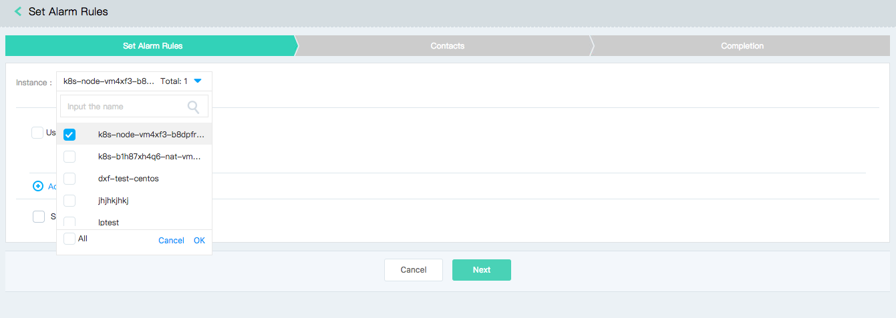
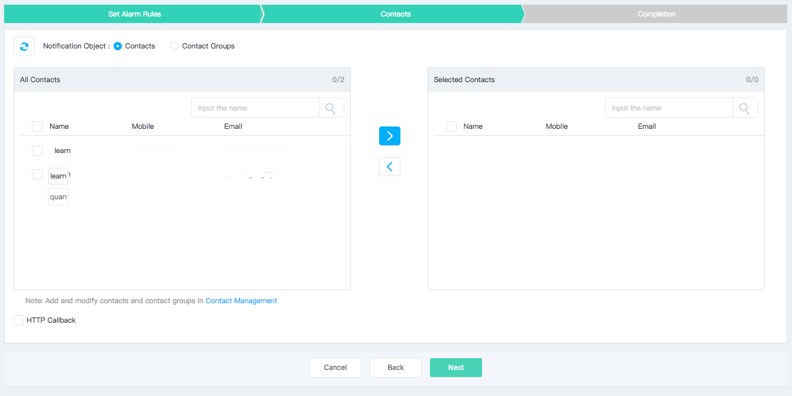

# Set Alarm Rules
You can set different alarm rules for different monitoring items of the instance. When the rules are satisfied, the alarm will be triggered to send you emails and SMS.

## Operation Steps
1. Access [Monitoring - VM Monitoring Console](https://cms-console.jdcloud.com/serverMonitor) or visit [JD Cloud Console](https://console.jdcloud.com/) click the left navigation bar **Management** - **Monitoring** - **Resource Monitoring** - **VM Monitoring** to enter the instance monitoring list page.
2. Find the instance of the monitoring data you need to view, click **Operate** - **Monitoring Table** to enter the monitoring details page
3. Click **Alarm Rules** tab to switch to the alarm rule option and click Add Alarm.
4. Support for setting alarm rules simultaneously for multiple instances.

5. You can choose to use the current existing alarm rule template or create a new alarm rule, or set the configured rule to a new alarm rule template in convenience for your next use.

6. If you choose to create a new alarm rule, you need to configure the monitoring items, statistics period, statistics method, calculation mode, threshold, and duration.

	For the examples, the above support is as follows:

| Configuration Items | Configuration Requirements |
| :--- | :---   |
| **Monitoring Items**   | CPU Usage, Memory Usage, Disk Read Traffic, Disk Write Traffic, Network Inbound Traffic and Network Outbound Traffic |
| **Statistical Cycle** | 2 minutes, 5 minutes, 15 minutes, 30 minutes and 1 hour, 2 minutes by default  |
| **Statistics Method** | Average, Maximum, Minimum, and Sum, Average by default |
|  **Calculation Method**   |  ＞、≥、＜、≤、＝and≠，＞by default   |
|  **Threshold**   |    Depending on the monitoring item, the minimum value is 0% and the maximum value is 100% for usage  |
**Continuous Period** | 1, 2, 3, and 5, the default is 1. When the monitored item continues to exceed the threshold during the statistical period, the count is incremented by one. Otherwise, it is cleared. If the count exceeds the set value, the alarm will be triggered.

7. Set the alarm to notify contact, and support setting the contact or contact group. After the configuration is complete, the instance running status can be monitored normally.
