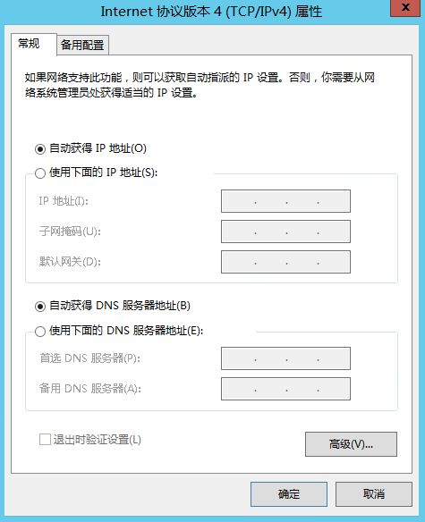
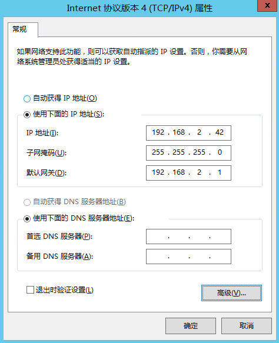
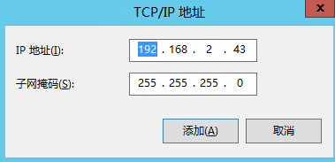
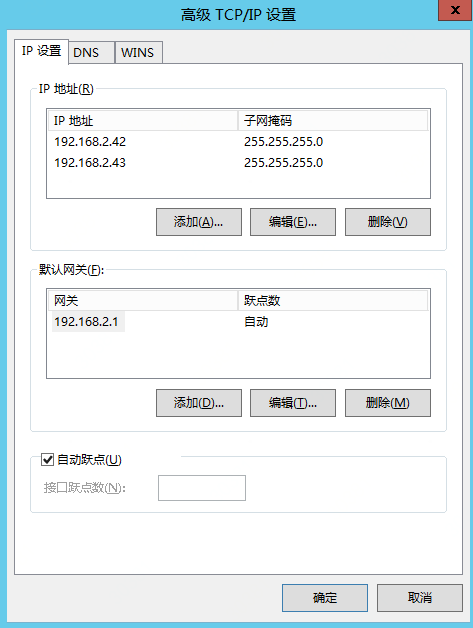
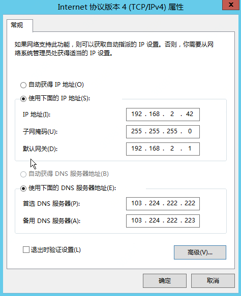

# Assign Secondary Private IP

The private IP of JD Cloud is an IP address that cannot be accessed through the Internet. JD Cloud supports you to assign multiple private IP addresses to different elastic network interface of the instance, which are the main private IP and secondary private IPs of the corresponding ENI. Each private IP can be associated to an elastic IP:

Primary private IP address: The first private IP address assigned when elastic network interface is created can be specified by the user or assigned by the system but not supported for release.

Secondary Private IP Address: The private IP address other than the primary IP assigned by the elastic network interface can be assigned by the user or distributed by the system to support release.

## Precondition

The single elastic network interface can have an upper limit of 21 private IP addresses, that is, 20 secondary private IPs can be assigned in addition to the primary private IP. When the number of allocated private IPs has not reached the upper limit, you can operate to assign the secondary private IP.
	
	Note: the actual number of private IPs that can be assigned is also limited by the number of remaining IPs in the subnet where the ENI is located.

## Operation Steps

1. Access [Virtual Machines Console](https://cns-console.jdcloud.com/host/compute/list) and enter the instance list page. Or access [JD Cloud Console](https://console.jdcloud.com) Click navigation bar on the left **Elastic Compute** - **Virtual Machines** to enter the instance list page.
2. Select a region.
3. In the instance list, select the instance that needs to be assigned the secondary private IP and click the name to enter the details page.
4. Click ENI Tab, select the ENI that needs to be assigned IP, and click Assign Private IP.
5. Add private IP in the pop-up window. You can choose the private IP address assigned by the system automatically or the customized private IP address. Note that the private IP should be within the CIDR scope of the subnet where the ENI is located and cannot conflict with an occupied address. Support multiple assignments at the same time, click OK.
		
		Please note:
		* After the console operation is completed, you need to log in to the instance for configuration to take effect.

In addition, you can also perform the assignment from the ENI console. For details, see Elastic Network Interface Side Assign Secondary IP(../../../../Networking/Elastic-Network-Interface/Operation-Guide/ Private-IP-Management/Assign-Secondary-IP.md).

## Configure Instance

### Linux System

CentOS 7.2 is used as an example for the Linux system and the detailed operation is as follows:

1. Log in to the instance. For details, please refer to [Login Linux Instance](../../Getting-Start-Linux/Connect-To-Instance.md)

2. In the example of the primary network interface, if it is a secondary network interface, the corresponding modifications are eth1, eth2, etc. Executing command 

		vim /etc/sysconfig/network-scripts/ifcfg-eth0

	Example: If the current Private IP that the instance queried on the console is 192.168.0.4 and 192.168.0.5, wherein 192.168.0.4 is the primary IP and the subnet mask is 255.255.255.0, the file content shows:

	```
	TYPE="ETHERNET"  
	BOOTPROTO="dhcp"
	DEFROUTE="yes"
	PEERDNS="yes"
	PEERROUTES="yes"
	IPV4_FAILURE_FATAL="no"
	IPV6INIT="yes"
	IPV6_AUTOCONF="yes"
	IPV6_DEFROUTE="yes"
	IPV6_PEERDNS="yes"
	IPV6_PEERROUTES="yes"
	IPV6_FAILURE_FATAL="no"
	NAME="eth0"
	UUID="dd73a4ea-8f6b-409b-a271-5f7882a3ae53"
	DEVICE="eth0"
	ONBOOT="yes"</pre>
	```
	Modify to the following and save:

	```
	TYPE="ETHERNET"
	#BOOTPROTO="dhcp"
	DEFROUTE="yes"
	PEERDNS="yes"
	PEERROUTES="yes"
	IPV4_FAILURE_FATAL="no"
	IPV6INIT="yes"
	IPV6_AUTOCONF="yes"
	IPV6_DEFROUTE="yes"
	IPV6_PEERDNS="yes"
	IPV6_PEERROUTES="yes"
	IPV6_FAILURE_FATAL="no"
	NAME="eth0"
	UUID="dd73a4ea-8f6b-409b-a271-5f7882a3ae53"
	DEVICE="eth0"
	ONBOOT="yes"
	IPADDR="192.168.0.4"
	IPADDR1="192.168.0.5"
	NETMASK="255.255.255.0"
	NETMASK1="255.255.255.0"
	GATEWAY="192.168.0.1"
	```
	Please note that BOOTPROTO="dhcp" is to be annotated.

3. Reboot the Network Interface

		systemctl restart network

4. Check if the eth0 network interface has joined the IP address.
		
		ip addr
		
5. Complete the private IP configuration.
	
		Note: Private IP configured in this mode will still take effect after instance rebooting. However, if you create a customized image for this instance, private IP of other instances based on this private image needs to update the configuration on its own according to the above configuration method.

### Windows System

Windows Server 2012 R2 Standard edition [Chinese] is used as an example for Windows system. The detailed operation is as follows:

1. Log in to the instance. For details, please refer to [Login Windows Instance](../../Getting-Start-Windows/Connect-To-Instance.md).

	Example: If it needs to be configured in IP 192.168.2.43 (secondary IP) in subnet 192.168.2.0/24, the current primary private IP is IP 192.168.2.42.

2. Right click "Start" in the lower-left corner and select network connection. 
3. When the network connection appears, right click and select "Attribute". 
4. After opening the distributes, select "Internet Protocol Version 4 (TCP/IPv4)" and click "Attribute".
5. After opening the attributes, the display is as follows<br><br>Modify the content to the image below, then click "Advanced"<br>
6. Click **Advanced** to display the following image
<br>Click **Add**, fill in as bellow, click **Add** and confirm<br><br>Click **OK** to return to the attribute page<br><br>Fill in the DNS server address and write "103.224.222.222" and "103.224.222.223"  and complete after clicking "Confirm"

## Related Reference

[Elastic Network Interface Side Assign Secondary IP](../../../../Networking/Elastic-Network-Interface/Operation-Guide/Private-IP-Management/Assign-Secondary-IP.md)

[Log in to Linux Instance](../../Getting-Start-Linux/Connect-To-Instance.md)

[Log in to Windows instance](../../Getting-Start-Windows/Connect-To-Instance.md)
