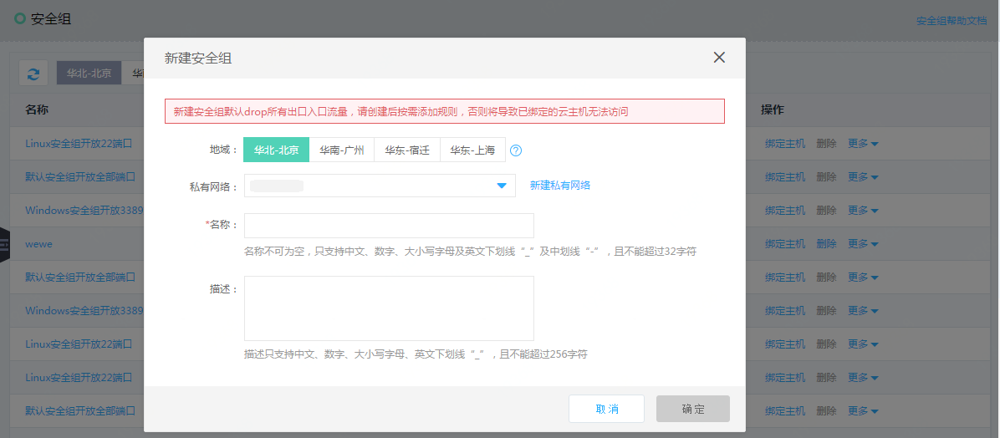

# Create Security Group
Security group can act on any instance of the same VPC in the same region. Before creating security group, you need to create VPC.

## Operation Steps
1. Access Security Group Console, or visit JD Cloud & AI Console Click on the left navigation bar [Elastic Compute] - [Virtual Machine] - [Security Group] to enter the security group list page, click [Create], then pop up the creation window.

2. First, you need to select the region where the security group is located and VPC. The security group can only be applied to instances under the same VPC. You can create a security group for the VPC you have created. You can also click **Create VPC** to go to the VPC creation page and create a new VPC.
    
	A maximum of 50 security groups can be created under a single VPC. If the number of security groups under the selected VPC has reached 50, "The number of security groups under selected VPC resource has reached 50" will be prompted, and you need to select other VPC.

3. Enter the security group name and description which is the additional instructions for the security group rules, such as "Allow port 80 and port 443 in inlet direction"; it is recommended that you use the customer scenario or the function of this security group as the security group name, such as " Web server cluster allows port 80".

4. Click **OK** to complete the security group creation. As the new security group rejects all inlet and outlet traffic by default, it is recommended to go to the details page to set the outbound/inbound rules as soon as the security group is successfully created.

  [1]: https://cns-console.jdcloud.com/host/netSecurity/list
  [2]: https://console.jdcloud.com/