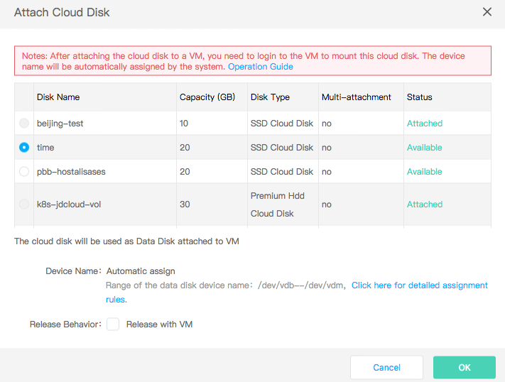
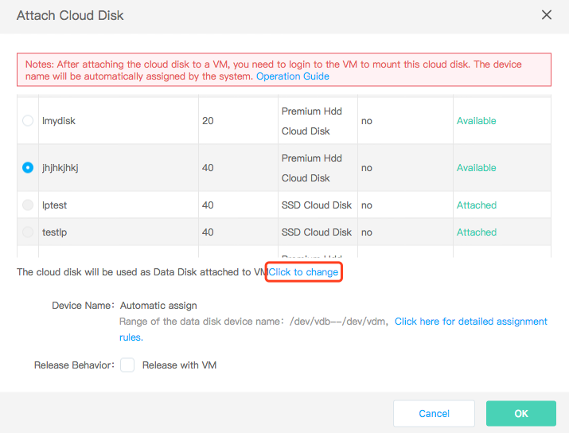
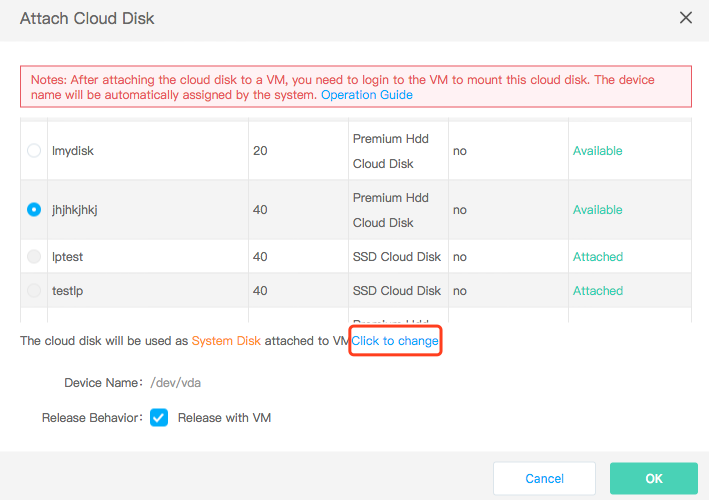

# Attach Cloud Disk

## Precondition
* The number of cloud disks currently attached to the instance cannot reach the upper limit, that is, 8 cloud disks. If the instance's system disk is a cloud disk, 7 cloud disks can be attached as data disks.
* If you want to attach the cloud disks to the instance as a system disk, the instance currently should not have attached a system disk with the device name of /dev/vda. In addition, the instance needs to be in the "Stopped" status and the capacity of the disk to be attached is between 40GB~500GB.
* Multi-attachment cloud disks can only be attached as data disks and can be attached to up to 16 instances(Multi-point attached cloud disk is only provided in cn-east-2 region).
* If the instance is in the specification of the first generation, only non-encrypted cloud disks can be attached.

## Operation Steps

### Attached as A Data Disk

The cloud disk is attached to the instance as a data disk by default. The detailed steps are as follows:

1. Access [Virtual Machines Console](https://cns-console.jdcloud.com/host/compute/list) and enter the instance list page. Or access [JD Cloud Console](https://console.jdcloud.com) Click navigation bar on the left **Elastic Compute** - **Virtual Machines** to enter the instance list page.
2. Select a region.
3. In the Instances list, select the instance to which the cloud disk is to be attached and click on the name to go to the details page.
4. Click **Disk** tab - **Attach**.
5. In the pop-up window, select a cloud disk. If you select a non-multi-attachment cloud disk that is billed by configuration, you can set its attribute as to be deleted on Virtual Machines termination (release behavior). If such attribute is ticked, the corresponding cloud disk will be deleted when the instance is deleted. If such attribute is not ticked, the cloud disk will remain when the instance is deleted. Deletion attribute cannot be specified for the cloud disk under monthly package or multi-point attached disk, so the disk will remain when the instance is deleted. 

### Attached as System Disk

If the instance currently has not attached a system disk with the device name of /dev/vda, you can attach the cloud disk as the system disk of the instance. The detailed steps are as follows:

1. Access [Virtual Machines Console](https://cns-console.jdcloud.com/host/compute/list) and enter the instance list page. Or access [JD Cloud Console](https://console.jdcloud.com) Click navigation bar on the left **Elastic Compute** - **Virtual Machines** to enter the instance list page.
2. Select a region.
3. In the Instances list, select the instance to which the cloud disk is to be attached and click on the name to go to the details page.
4. Click **Disk** tab - **Attach**.
5. In the pop-up window, select a cloud disk. 
Click Change to attach it as a system disk to the Virtual Machine

The multi-attachment cloud disk cannot be attached as a system disk. If you select a non-multi-attachment cloud disk that is billed by configuration, you can set the attribute as to be deleted on instance termination (release behavior) along with the instance. If it is a system disk, by default, it will be deleted on instance termination, and the attribute can be modified. If such attribute is ticked, the corresponding cloud disk will be deleted when the instance is deleted. If such attribute is not ticked, the cloud disk will remain when the instance is deleted. Deletion attribute cannot be specified for the cloud disk under monthly package, so the disk will remain when the instance is deleted.

		Please note:
		* The instance needs to be in the "Stopped" status;
	    * The capacity of the disk to be attached needs to be between 40GB~500GB.

In addition, you can also perform attaching operation from the cloud disk console. Refer to [Cloud Disk Side Attaching](http://docs.jdcloud.com/cn/cloud-disk-service/attach-cloud-disk) for detailed steps.

The attaching state of the cloud disk in the tab page will be changed into "Attaching". It takes some time to attach the cloud disk. Please wait patiently and refresh the page. After the attaching succeeds, the attaching state will be changed into "Attached". After the cloud disk is attached, it also needs to be partitioned, formatted, etc. For details, see: [Linux System Data Disk Partitioning and Formatting](http://docs.jdcloud.com/cn/cloud-disk-service/linux-partition), [Windows System Disk Partitioning and Formatting](http://docs.jdcloud.com/cn/cloud-disk-service/windows-partition)

## Related Reference

[Cloud Disk Side Attaching](http://docs.jdcloud.com/cn/cloud-disk-service/attach-cloud-disk)

[Linux System Data Disk Partitioning and Formatting](http://docs.jdcloud.com/cn/cloud-disk-service/linux-partition)

[Windows System Data Disk Partitioning and Formatting](http://docs.jdcloud.com/cn/cloud-disk-service/windows-partition)