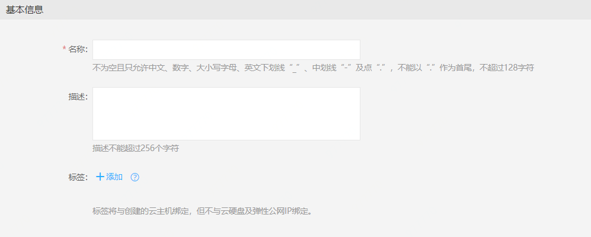
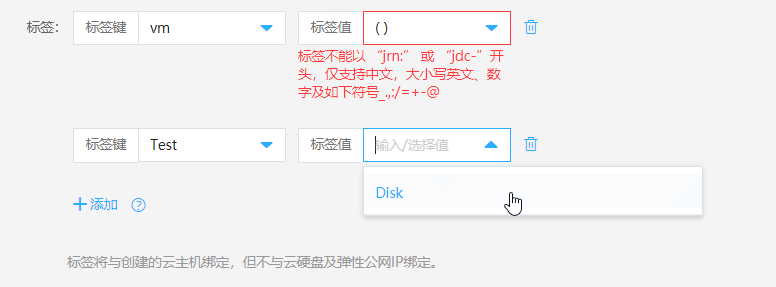

# Edit Tag
When you create a new machine instance or have the machine instance, you can associate the instance with a tag by editing the tag. For the instance associated with a tag can, such tag association can be changed by editing the tag.

## Associate tags when the instance is created

### Operation Steps

1. Access [Virtual Machines Console](https://cns-console.jdcloud.com/host/compute/list) to log in the instance list page. Or, access [JD Cloud Console](https://console.jdcloud.com) and log in the instance list page by clicking [Elastic Compute]-[Virtual Machines] on the left navigation bar.
2. Select the region of the created instance and click the **Create** button to enter the Virtual Machines Purchase Page. Click the **+Add** button on the Basic Information-Tag to add tags for your resources of Virtual Machines.   
3. Key-Value can be added for the added tags in the added tag key and tag value input box or be added by directly selecting from a drop-down menu of existing tag or selecting corresponding tag Key-Value after fuzzy match. If the tag parameter is illegal, please make corresponding modification according to notification below the label box. Each resource can associate 10 tags at most.   

		Note:
		* When a new tag key or a new tag value is added and after you manually add the new contents, please trigger your addition operation by enter or selection with the mouse, and make sure the new contents can be saved and displayed in the current input box.
		* The same resource shall have the unique tag key.
		* The tag shall be associated with the created resources of Virtual Machines rather than Cloud Disk Service and Elastic IP.

After the tag is edited and other information is completed on the page of creating VM instances, click **Buy Now** to create resources. After creation, you can check whether the tag is successfully associated through the Instance List Page/Details, or click the **Tag Filter** button **Filter Instance** (Filter-by-Tag.md) above the instance list. Please note if the list page does not display tag information items, you can select tags to be displayed by editing culumns. See [View Instance](../Instance/Query-Instance-Info.md) for detailed operation steps. If you find that the created resources are not successfully associated with tags, please refer to [Edit Tag after Instance Creation](Edit-Tag#user-content-1) to conduct the tag association operation again.

## Edit Tag after Instance Creation

### Precondition
The instance state needs to be "Running" or "Stopped".

## Operation Steps

1. Access [Virtual Machines Console](https://cns-console.jdcloud.com/host/compute/list) and enter the instance list page. Or access [JD Cloud Console](https://console.jdcloud.com) Click navigation bar on the left **Elastic Compute** - **Virtual Machines** to enter the instance list page.
2. Select a region.
3. Select the instance with tag to be edited from the instance list and confirm that its status is either "Running" or "Stopped".
4. Single Operation: Click **Operation** - **More** - **Edit Tag**, or click instance name to enter the details page and then click **Operation** - **Edit Tag**.
5. In the pop-up "Edit Tag" window, the current tag displays the currently bound tags of the VMs by default. If there are 10 tags in the current tag of the current instance, **Add** is grayed out.
6. Users can select the corresponding tag key/value (Key-Value) according to the existing tags from the pull-down menu or after fuzzy matching according to the input and click **Add]. Then, it will display in the current tag
7. Click **OK** to complete the tag editing according to the display in the current tag.

		Please note:
		* The tag key of same resource cannot be repeated, and if the tag key (Key) is the same before and after editing and the value is different, the original value will be replaced by the new value.
		* Clicking **Add** does not trigger the tag editing, and the tag editing will be triggered only after **OK** is clicked. Unnecessary tags of current Virtual Machines will be unbound first according to the edited tags, and then new tags will be bound/ original tags will be replaced. For example: if currently the Virtual Machines is bound with the following tags: "Owner: Product R&D, Purpose: Test, Operator: Administrator, Environment: Pre-release", and it needs to be edited into: "Owner: Product R&D, Purpose: Development, Operator: Administrator", you will first unbind the tag "Environment: Pre-release", and then bind a new tag/ replace the original tag: "Purpose: Development". Please edit tag again, if the unbinding is successful while the binding/ replacement is not due to network jittering.

After a tag is edited, you can check whether the tag is successfully edited through the instance list page/ details page, or Click Tag Filter above the instance to filter instances. Please note that if the tag item is not displayed on the list page, you can select to display tags through edit columns. For details, refer to [Query Instance](../Instance/Query-Instance-Info.md).

## Related Reference
[Filter Instances by Tag](Filter-by-Tag.md)

[Query Instance](../Instance/Query-Instance-Info.md)

